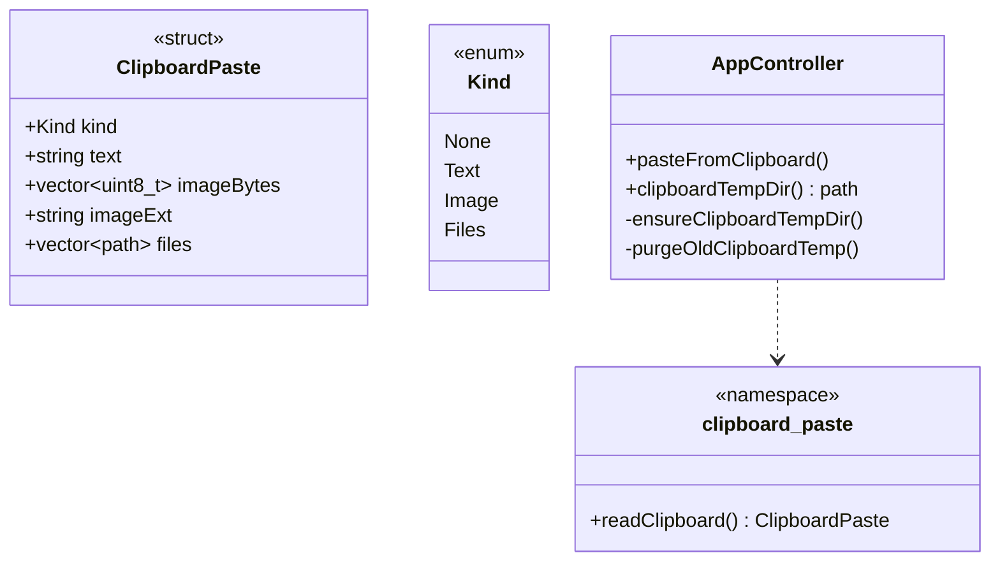
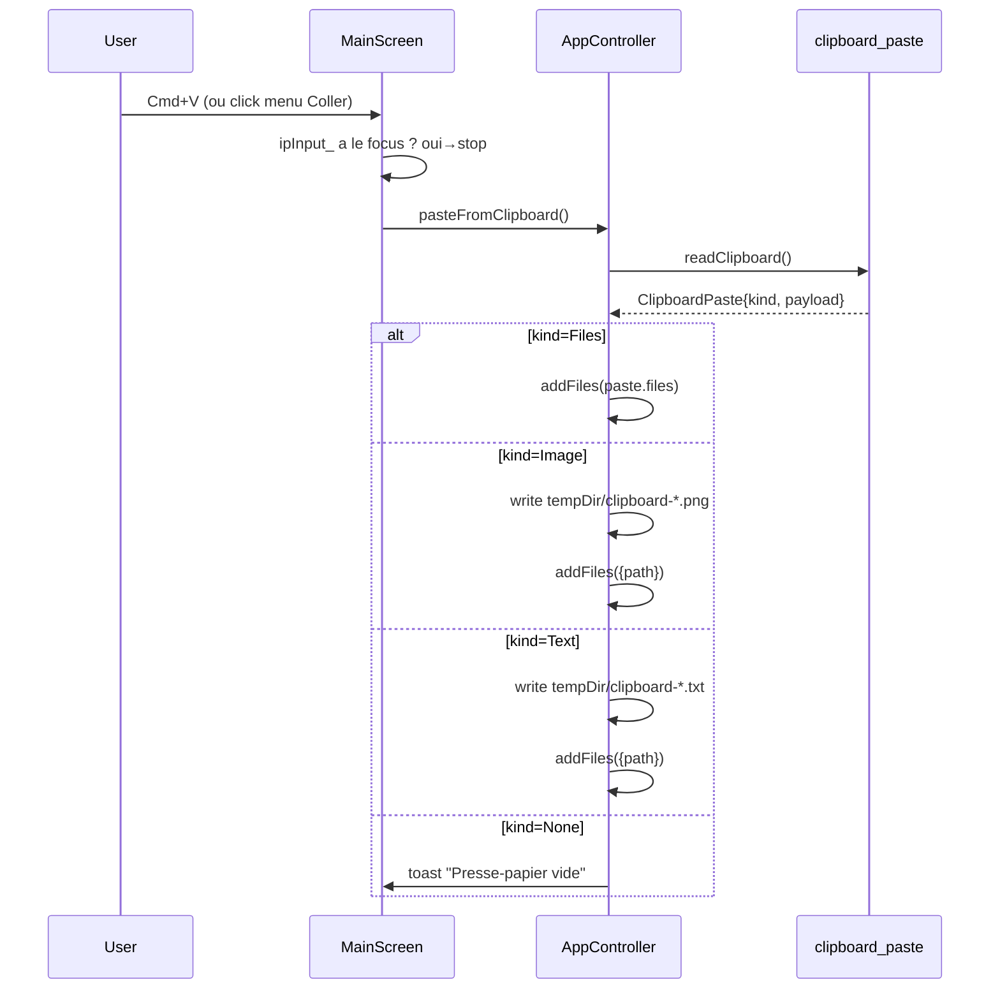

# Architecture — Sprint Clipboard Paste (V1.4)

**Date :** 2026-05-02
**Statut :** ✅ Validée

---

## Vue d'ensemble

Pattern compile-time identique à `drag_drop_*` : 1 header public,
3 implémentations natives sélectionnées par OS via `LTR_CLIPBOARD_SRC`.

## Diagramme de séquence

## CONTRAT D'IMPLÉMENTATION

### Wave 1 — Backend desktop natif

#### Nouveau header
- [ ] `include/ltr/ui/clipboard_paste.hpp` (API uniforme)

#### Implémentations natives
- [ ] `src/ui/clipboard_paste_mac.mm` (APPLE) — NSPasteboard
  - `NSPasteboardTypeFileURL` → vector<path>
  - `NSPasteboardTypePNG` → bytes (TIFF → conv via NSBitmapImageRep)
  - `NSPasteboardTypeString` → UTF-8
  - Priorité Files > Image > Text
- [ ] `src/ui/clipboard_paste_win.cpp` (WIN32)
  - `OpenClipboard` retry 3× × 10 ms
  - `CF_HDROP` → vector<path>
  - `CF_DIB` → conversion DIB→PNG via miniz
  - `CF_UNICODETEXT` → UTF-16→UTF-8
- [ ] `src/ui/clipboard_paste_stub.cpp` (Linux)
  - sf::Clipboard::getString → Kind::Text si non vide
  - sinon Kind::None

#### CMakeLists pattern
- [ ] Bloc `if(APPLE)/elseif(WIN32)/else` → LTR_CLIPBOARD_SRC
- [ ] add_library(ltr_ui ... ${LTR_CLIPBOARD_SRC})

#### AppController
- [ ] `pasteFromClipboard()` + helpers tempDir/ensure/purge
- [ ] Boot : ensureClipboardTempDir + purgeOldClipboardTemp (>24 h)
- [ ] Auto-clean post-TransferDone : remove fichier si parent_path
      est tempDir

#### MainScreen
- [ ] 3e entrée menu addMenu_ : "Coller"
- [ ] Cmd+V (Mac) / Ctrl+V (Win) handler — skip si ipInput_ focus

#### Test
- [ ] `tests/test_clipboard_stub.cpp` — vérifie Kind::None et
      priorité

### Wave 2 — Web

- [ ] index.html : bouton paste-btn (hidden par défaut)
- [ ] upload.js : check `navigator.clipboard.read` → show button
- [ ] Handler async : items.getType('image/png') ou readText
- [ ] Toast erreur si permission refusée

## Fichiers AJOUTER (5)
- include/ltr/ui/clipboard_paste.hpp
- src/ui/clipboard_paste_mac.mm
- src/ui/clipboard_paste_win.cpp
- src/ui/clipboard_paste_stub.cpp
- tests/test_clipboard_stub.cpp

## Fichiers MODIFIER (6)
- CMakeLists.txt + tests/CMakeLists.txt
- include/ltr/app/app_controller.hpp + .cpp
- src/ui/screens/main_screen.cpp
- assets/web/html/index.html
- assets/web/js/upload.js

## Choix d'architecture

| Question | Choix | Raison |
|---|---|---|
| Module séparé | OUI | Pattern drag_drop éprouvé |
| Image Windows | DIB→PNG via miniz | miniz déjà linké, ~80 LOC encodeur PNG |
| Linux stub | Texte via sf::Clipboard | Évite Kind::None systématique |
| Cleanup post-send | Auto-clean étendu | Réutilise sessionPaths_ |
| Cmd+V champ focus | Skip si ipInput_ focus | UX standard |

UI_REQUIRED: true
