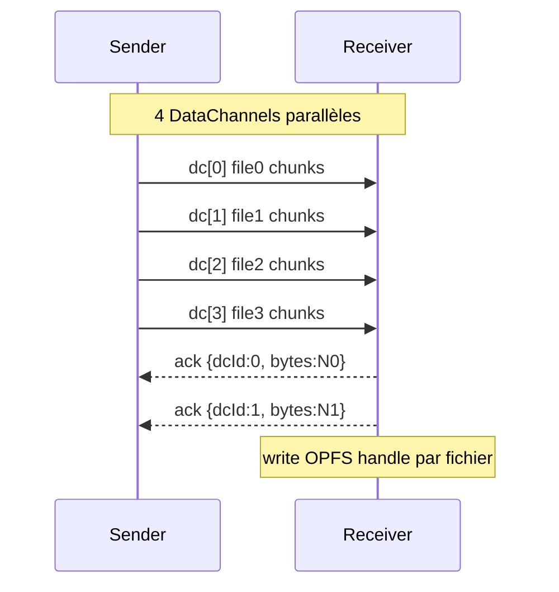
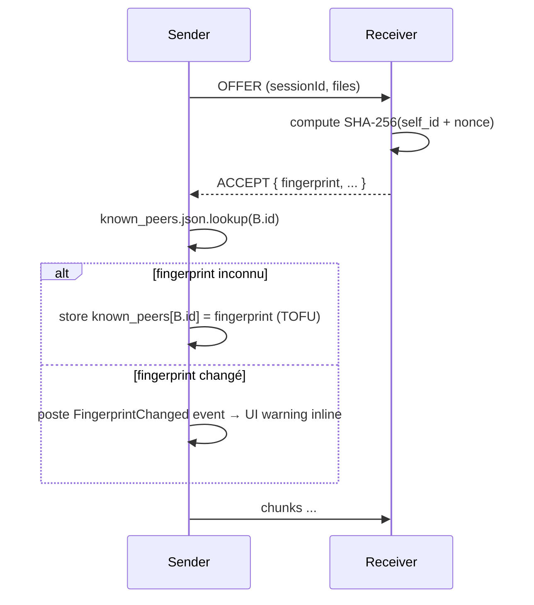

# Architecture — Sprint Hardening & Polish (V1.5)

**Date :** 2026-05-03
**Statut :** ✅ Validée

---

## Vue d'ensemble

Sprint en 4 vagues séquentielles. Chaque vague = ~3-4 livrables
cohérents. Wave 1 pose les fondations (split p2p.js, helpers
réutilisés en Wave 3 ; png_encoder réutilisable). Waves 2-4
indépendantes côté code mais dépendent de Wave 1 pour le refactor
P2P.

## Diagrammes clés

### Multi-stream P2P (Wave 3)


### TOFU natif (Wave 4)


## CONTRAT D'IMPLÉMENTATION

### WAVE 1 — Tech debt (foundation)

**1.1 Split p2p.js**
- Nouveau `assets/web/js/p2p_transport.js` (RTCPeerConnection
  lifecycle, onicecandidate, oniceconnectionstatechange, postSignal,
  cancelOutgoing, makeRtcConfig)
- Nouveau `assets/web/js/p2p_session.js` (sendNextFile, awaitDrain,
  safeSend, fileStatuses, ack timer/watchdog, handleReceiverControl,
  finalizeReceivedFile)
- Nouveau `assets/web/js/p2p_ui.js` (showIncomingModal, modalQueue,
  markCardSending, setCardPhase, updateProgress, refreshSticky,
  toast, sticky bar)
- L'ancien `p2p.js` devient un thin orchestrator qui re-expose
  `window.LTR.p2p = { startSendTo, handleSignal, cleanupAll, toast }`
- IIFE en cascade : chaque fichier expose ses helpers via
  `window.LTR.p2pTransport`, `p2pSession`, `p2pUi` privés
- index.html : 4 `<script defer>` (transport, session, ui, p2p)
- CMakeLists + static_routes : embed 3 nouveaux fichiers
- Préservation API publique stricte

**1.2 png_encoder**
- Nouveau `include/ltr/core/png_encoder.hpp` :
  ```cpp
  namespace ltr::core {
    std::vector<std::uint8_t> encodePng(
        std::uint32_t w, std::uint32_t h,
        const std::vector<std::uint8_t>& rgba);
  }
  ```
- Nouveau `src/core/png_encoder.cpp` — extrait l'encodeur de
  `clipboard_paste_win.cpp` (IHDR + IDAT zlib via miniz + IEND)
- `clipboard_paste_win.cpp` réécrit pour utiliser le nouveau
  helper (réduction ~80 LOC)
- Nouveau test `tests/test_png_encoder.cpp` : encode 4×4 RGBA →
  vérifie signature PNG (89 50 4E 47), ouverture via STL ifstream

**1.3 skipFailedFile**
- Dans `p2p_session.js`, helper local :
  ```js
  function skipFailedFile(state, fs, errorTag) {
    fs.status = 'failed'; fs.error = errorTag;
    syncFileStatus(state, fs);
    state.currentFileIdx += 1;
    sendNextFile(state).catch(() => {});
  }
  ```
- Remplace les 4 occurrences du pattern dupliqué

**1.4 Logging JSON**
- Étendre `include/ltr/core/logger.hpp` :
  ```cpp
  enum class LogFormat { Text, Json };
  void set_log_format(LogFormat);
  void log_event(LogLevel, std::string_view name,
                 std::initializer_list<std::pair<std::string_view, std::string>>);
  ```
- `src/core/logger.cpp` : implémente JSON `{"ts","level","event","fields":{}}`
  via nlohmann::json
- Toggle via env `LTR_LOG_FORMAT=json` ou cfg.json `logFormat`
- Cap 200 chars par valeur de field pour éviter inflation

### WAVE 2 — UX

**2.1 Aperçu image**
- Web : dans `staging-row`, ajouter ``
  généré par URL.createObjectURL(blob) si MIME image/*
- CSS : `.staging-thumb { width:40px; height:40px; border-radius:6px;
  object-fit:cover; }`
- Lazy : `loading="lazy"`, revokeObjectURL au removeStaging
- Desktop : nouveau widget `ImageThumb` dans `ui/widgets/` qui charge
  un fichier image via `sf::Image::loadFromFile` puis sf::Texture +
  sf::Sprite ; affiché dans `file_row.cpp` à gauche du nom si
  extension dans {png, jpg, gif, webp, bmp}
- Desktop : cache LRU 20 thumbs max (RAM control)

**2.2 Notifications natives**
- Nouveau `include/ltr/ui/notif.hpp` :
  ```cpp
  namespace ltr::ui {
    void notifyReceived(std::string_view title, std::string_view body);
  }
  ```
- `src/ui/notif_mac.mm` : UNUserNotificationCenter
  (UserNotifications.framework). Demande perm au boot, affiche notif
  avec title+body
- `src/ui/notif_win.cpp` : Win32 toast via Shell_NotifyIconW
  (NIF_INFO, NIIF_INFO) — simple et marche sans WinRT
- `src/ui/notif_stub.cpp` : no-op
- CMakeLists : LTR_NOTIF_SRC pattern, link UserNotifications.framework
  sur Mac
- AppController : sur `TransferDoneEvent` direction Incoming →
  `ui::notifyReceived(peerName, fileName)`

**2.3 QR avec PIN**
- SharePanel : nouvelle checkbox « Inclure PIN dans le QR » (toggle,
  default OFF). État dans cfg.json `shareQrIncludesPin`
- `qr_code.cpp` : QR encode `<url>?pin=<pin>` au lieu de `<url>` si
  flag activé
- `assets/web/login.html` : si `URLSearchParams.get('pin')` présent,
  pré-remplit les 6 cases. Si valid (6 digits), bouton « Se connecter »
  enabled mais on ne submit PAS automatiquement (l'utilisateur garde
  le contrôle)
- CSS bandeau jaune si pin pré-rempli : « PIN détecté dans le QR »

### WAVE 3 — Performance P2P

**3.1 OPFS receveur**
- Dans `p2p_session.js` reception :
  - Au file-meta : `const root = await navigator.storage.getDirectory();
    const handle = await root.getFileHandle(uid, {create: true});
    const writable = await handle.createWritable();`
  - À chaque chunk binaire : `await writable.write({type:'write',
    position: cur.received, data: chunk})`
  - À file-end : `await writable.close()` puis `const file =
    await handle.getFile()`, créer ObjectURL et trigger download
  - Fallback Blob si OPFS indispo (Firefox <119, Safari <17)
- Memory cap : avec OPFS, plus de chunks en RAM. Sans OPFS, fallback
  V1 actuel.

**3.2 Multi-stream K=4**
- `p2p_transport.js` : crée 4 DataChannels au `pc.createOffer` côté
  sender (`ltr-0`, `ltr-1`, `ltr-2`, `ltr-3`)
- `pc.ondatachannel` côté receveur → 4 channels reçus, indexés par label
- `p2p_session.js` :
  - State a `dc[0..3]` au lieu d'un dc unique
  - `sendNextFile` : assigne `file → dc[fileIdx % 4]`
  - `bytesSent` agrégé sur tous les channels
  - ack `{kind:'ack', dcId, bytes}` ; `bytesAckedByReceiver` sommé
- Backpressure par-channel mais drain final attend tous
- Cleanup : itère sur les 4 dc.close()

**3.3 Resume WebRTC**
- IndexedDB DB `ltr-p2p-resume` :
  - Object store `partials` : `{key: sessionId+fileIdx, name, size,
    bytesReceived, opfsHandleKey}`
  - Update à chaque ack côté receveur (throttle 1 s)
- À `dc.onopen` côté receveur, AVANT de répondre aux file-meta :
  - Lookup `partials` pour le sessionId
  - Si existe, send `{kind:'resume-offer', sessionId, partials:[
    {fileIdx, name, bytesReceived}]}` au sender
- Sender reçoit `resume-offer` :
  - Pour chaque partial qui matche un file en attente, skip les
    `bytesReceived` premiers bytes au sendNextFile (ifstream.seekg)
- Cleanup : à TransferDone, supprime les partials du sessionId

**3.4 Re-négo disconnected**
- Dans `wirePcCommon` (transport), sur `pc.connectionState ===
  'disconnected'` :
  - Démarre `state.reNegoTimer = setTimeout(() => triggerReNegotiate(state), 5000)`
- Si retour à `connected` avant 5 s → clear timer
- Sinon `triggerReNegotiate` :
  - Sender : `pc.createOffer({iceRestart: true})` →
    `setLocalDescription` → postSignal('offer')
  - Receveur : reçoit offer, `setRemoteDescription` → createAnswer →
    postSignal('answer')
  - ICE re-checked, transfert reprend depuis `bytesAckedByReceiver`
- Si encore disconnected après 15 s → cleanup comme V1.3

### WAVE 4 — Sécurité

**4.1 HTTPS coexistant**
- `cmake/Dependencies.cmake` : ajoute openssl via `find_package(OpenSSL REQUIRED)`
- `CMakeLists.txt` : `target_compile_definitions(ltr_core PUBLIC
  CPPHTTPLIB_OPENSSL_SUPPORT)` + `target_link_libraries(ltr_core PUBLIC
  OpenSSL::SSL OpenSSL::Crypto)`
- Nouveau `include/ltr/web/cert_manager.hpp` :
  ```cpp
  struct CertPair { std::string certPem, keyPem, fingerprintSha256; };
  CertPair loadOrGenerate(const std::filesystem::path& cfgDir);
  ```
- `src/web/cert_manager.cpp` : si `cfgDir/cert.pem` + `key.pem` existent,
  load. Sinon génère un cert RSA 2048 auto-signé via openssl C API,
  sauve, retourne. Calcule SHA-256 du DER cert.
- `WebService` : démarre 2 servers cpp-httplib :
  - `httplib::Server` sur 45456 (HTTP, comme avant)
  - `httplib::SSLServer(certPem, keyPem)` sur 45457 (HTTPS)
  - Routes registrées sur les deux
- Nouveau endpoint GET `/api/cert-info` → JSON `{fingerprint}`
- `assets/web/login.html` : si chargé sur https, fetch /api/cert-info,
  affiche bandeau jaune avec fingerprint + checkbox « J'ai vérifié
  cette empreinte avec le host (cf. SharePanel desktop) ». Bouton
  Se connecter disabled tant que checkbox non cochée
- SharePanel desktop : nouvelle ligne « Empreinte SHA-256 :
  AB:CD:EF:... » sous le PIN, avec bouton Copier
- `cfg.json` : nouveau flag `httpsEnabled` (default true). Si false,
  HTTP only (compat 100 % V1.4)

**4.2 TOFU natif**
- Nouveau `include/ltr/infra/known_peers.hpp` :
  ```cpp
  struct PeerFingerprint { std::string peerId, fingerprint; };
  class KnownPeers {
    std::optional<std::string> get(std::string_view peerId) const;
    void set(std::string_view peerId, std::string_view fingerprint);
    bool save();
  };
  ```
- Stockage : `~/Library/Application Support/LocalTransfer/known_peers.json`
  (Mac), `%APPDATA%\LocalTransfer\known_peers.json` (Win)
- `transfer_server` : à l'OFFER reçu, calcule SHA-256 d'un nonce + sa
  clé éphémère + envoie dans ACCEPT message
- `transfer_client` : reçoit ACCEPT, lookup KnownPeers :
  - Si absent → store TOFU
  - Si présent + match → OK
  - Si présent + mismatch → poste `FingerprintChangedEvent{peerId,
    oldFp, newFp}` mais **continue** le transfert (décision BA #3 :
    inline non bloquant)
- AppController : sur `FingerprintChangedEvent`, set
  `peerById[id].fingerprintWarning = true`
- DeviceListItem : si `peer.fingerprintWarning`, affiche pictogramme
  ⚠ orange + tooltip « Empreinte changée — vérifie l'identité du pair »
- Nouveau test `tests/test_known_peers.cpp` : roundtrip JSON OK,
  TOFU first set, change detection

## Fichiers AJOUTER (~12)

- assets/web/js/p2p_transport.js, p2p_session.js, p2p_ui.js
- include/ltr/core/png_encoder.hpp + src/core/png_encoder.cpp
- include/ltr/ui/notif.hpp + src/ui/notif_mac.mm + notif_win.cpp + notif_stub.cpp
- include/ltr/web/cert_manager.hpp + src/web/cert_manager.cpp
- include/ltr/infra/known_peers.hpp + src/infra/known_peers.cpp
- tests/test_png_encoder.cpp + test_known_peers.cpp

## Fichiers MODIFIER (~15)

- assets/web/js/p2p.js (devient orchestrator), upload.js (preview), login.js (auto-fill PIN)
- assets/web/html/index.html (4 scripts), login.html (bandeau cert)
- assets/web/css/style.css (thumb + bandeau cert)
- src/ui/clipboard_paste_win.cpp (use png_encoder)
- include/ltr/core/logger.hpp + src/core/logger.cpp (log_event JSON)
- src/web/web_service.cpp + .hpp (2 servers)
- src/web/qr_code.cpp + share_panel.cpp (QR avec PIN)
- src/network/transfer_server.cpp + transfer_client.cpp (TOFU)
- src/app/app_controller.cpp (notif on TransferDone, fingerprintWarning)
- src/ui/widgets/device_list_item.cpp (warning pictogramme)
- include/ltr/core/event_bus.hpp (FingerprintChangedEvent)
- CMakeLists.txt + tests/CMakeLists.txt
- cmake/Dependencies.cmake (openssl)
- docs-agents/WEB.md + .ai-outputs/docs/web-interface.html

## Choix d'architecture

| Question | Choix | Raison |
|---|---|---|
| Modules JS | IIFE en cascade, globals namespacés | Pas d'ES modules (compat browsers anciens) |
| HTTPS lib | openssl | Universel, supporté par cpp-httplib |
| OPFS fallback | Blob V1.3 actuel | Compat Firefox <119, Safari <17 |
| Multi-stream K | 4 fixe | LAN typique saturé à 1-2 streams parallèles, 4 = marge |
| TOFU stockage | known_peers.json infra séparé | Pas dans Config (state vs known) |
| Re-négo timer | 5 s avant offer, 15 s avant cleanup | Conservatif, évite re-neg trop tôt |

UI_REQUIRED: true (mais inline dans le contrat, pas de phase UI/UX
séparée vu l'ampleur)
