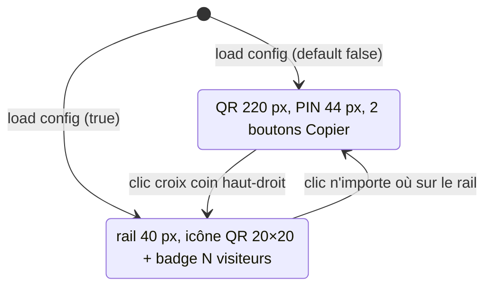

# Architecture — Sprint UX-4 SharePanel collapsible

**Date :** 2026-04-24
**NEW_PROJECT :** false
**UI_REQUIRED :** true (mockups déplié + collapsed + toggle)

---

## 1. Vue d'ensemble

3 axes :
1. **SharePanel widget** : ajout état `collapsed_` + `visitorCount_` +
   toggle hit-area. Rendering différent selon état. QR agrandi,
   PIN agrandi, 2 boutons Copier séparés.
2. **MainScreen layout** : `kSharePanelW` devient dynamique —
   240 px déplié, 40 px collapsed. Méthode
   `sharePanelWidth()` appelée depuis `rebuildLayout`.
3. **Persistance** : champ `bool sharePanelCollapsed` dans `infra::Config`,
   chargé au démarrage, sauvegardé au toggle via
   `AppController::toggleSharePanel()`.

### Fichiers à toucher

| Fichier | Action |
|---------|--------|
| `include/ltr/infra/config.hpp` | Ajout `bool sharePanelCollapsed{false}` |
| `src/infra/config.cpp` | Load/save du champ JSON (optionnel, default false) |
| `include/ltr/app/app_controller.hpp` | Ajout `toggleSharePanel()` + `isSharePanelCollapsed() const` |
| `src/app/app_controller.cpp` | Impl + persist via `cfg_.save()` |
| `include/ltr/ui/widgets/share_panel.hpp` | API : `setCollapsed`, `setVisitorCount`, `onToggle` callback, bounds helpers |
| `src/ui/widgets/share_panel.cpp` | Rendu dual (collapsed rail vs panel déplié) + 2 boutons Copier + QR 220 + PIN 44 |
| `include/ltr/ui/screens/main_screen.hpp` | `sharePanelWidth()` helper |
| `src/ui/screens/main_screen.cpp` | Layout dynamique + wire toggle callback → `controller_.toggleSharePanel()` |
| `scripts/generate_icons.py` | + icône `qr.png` (24×24) pour le rail collapsed |
| `CMakeLists.txt` | Embed `icon_qr.png` |
| `include/ltr/ui/icon_library.hpp` | Ajout `Id::QrCode` |
| `src/ui/icon_library.cpp` | Load `icon_qr.png` |

---

## 2. Diagramme d'état SharePanel



---

## 3. Config — ajout de champ

### config.hpp
```cpp
struct Config {
    // ... existant ...

    // V1.1.8-UX4 : SharePanel réduit au lancement ?
    bool sharePanelCollapsed{false};
};
```

### config.cpp (extrait — load)
```cpp
if (j.contains("sharePanelCollapsed")) {
    c.sharePanelCollapsed = j.at("sharePanelCollapsed").get<bool>();
}
```

### config.cpp (extrait — save)
```cpp
j["sharePanelCollapsed"] = sharePanelCollapsed;
```

Rétro-compat : champ optionnel, absent = default `false`.

---

## 4. AppController

```cpp
void AppController::toggleSharePanel() {
    state_.sharePanelCollapsed = !state_.sharePanelCollapsed;
    cfg_.sharePanelCollapsed   = state_.sharePanelCollapsed;
    cfg_.save();
    core::log_info("sharePanel: " +
        std::string(state_.sharePanelCollapsed ? "collapsed" : "expanded"));
}

bool AppController::isSharePanelCollapsed() const noexcept {
    return state_.sharePanelCollapsed;
}
```

Pourquoi dupliquer dans `state_` ? Pour que MainScreen n'ait pas à
accéder à `cfg_` qui est privé. Nouveau champ dans `AppState` :

```cpp
struct AppState {
    // ... existant ...
    bool sharePanelCollapsed{false};  // synchronisé avec cfg au démarrage
};
```

---

## 5. SharePanel refonte

### API publique

```cpp
class SharePanel {
public:
    SharePanel();

    SharePanel& setBounds(const sf::FloatRect& r);
    SharePanel& setUrl(const std::string& url);
    SharePanel& setPin(const std::string& pin6);
    SharePanel& setQrImage(const sf::Image& img);

    // V1.1.8-UX4
    SharePanel& setCollapsed(bool c);
    SharePanel& setVisitorCount(int n);
    SharePanel& onToggle(std::function<void()> cb);

    const sf::FloatRect& bounds() const { return bounds_; }
    bool collapsed() const { return collapsed_; }

    void handleEvent(const sf::Event& e);
    void draw(sf::RenderTarget& target) const;

private:
    // Hit areas
    sf::FloatRect collapseBtnRect() const;      // croix haut-droit (déplié)
    sf::FloatRect railRect() const;              // toute la zone (collapsed)

    // Rendus
    void drawExpanded(sf::RenderTarget& t) const;
    void drawCollapsed(sf::RenderTarget& t) const;

    // existants
    Button copyUrlBtn_;   // renommé ; avant copyBtn_
    Button copyPinBtn_;   // NOUVEAU
    QrCodeView qr_;

    sf::FloatRect bounds_;
    std::string url_;
    std::string pin_;
    bool collapsed_{false};
    int  visitorCount_{0};
    float copiedUrlUntil_{0.f};
    float copiedPinUntil_{0.f};
    std::function<void()> toggleCb_;
};
```

### Rendu déplié (nouvelles dimensions)

```
Largeur 240 px, hauteur = bounds_.height

Overline « PARTAGE WEB »             [×]   ← croix haut-droit, 16×16
                                              Colors::textSecondary hover
                                              → toggleCb_()
QR code 220 × 220 centré horizontalement
URL (overline + text body)
[ Copier URL ]    ← 32 × pleine largeur (zone - 2*lg)
[ Copier PIN ]    ← 32 × pleine largeur
CODE D'ACCÈS (overline)
4 7 2 9 3 1  ← PIN 44 px bold accent, kerned (espace 1 char entre chiffres)
Scan QR ou tapez l'URL.  ← hint bas
```

**PIN size 44 px** : `setSize(44)` (entre FontSize::h1=24 et FontSize::pin=56).
**Kerning** : déjà implémenté via insertion de `' '` entre chiffres
(c'est du kerning logique simple, suffisant).

### Rendu collapsed

```
Largeur 40 px, hauteur = bounds_.height
Fond sidebar (match style du rail)

Icône QR verticale 20×20 centrée horizontalement, ~80 px du top
Badge numérique pill 24×18 si visitorCount_ > 0, ~20 px sous l'icône

Tout le rail est une hit-area : clic = toggleCb_()
```

### Bouton Copier PIN

```cpp
copyPinBtn_.setLabel("Copier PIN")
            .setVariant(Button::Variant::Secondary)
            .onClick([this]{
                if (!pin_.empty()) {
                    sf::Clipboard::setString(utf8(pin_));
                    copiedPinUntil_ = monotonicSeconds() + 2.f;
                }
            });
```

Même pattern que `copyUrlBtn_`. Pendant `copiedPinUntil_`, afficher un
label éphémère « Copié ! » à la place du label normal.

---

## 6. MainScreen layout dynamique

```cpp
// main_screen.cpp
constexpr float kSharePanelExpandedW = 240.f;
constexpr float kSharePanelCollapsedW = 40.f;

float MainScreen::sharePanelWidth() const {
    return controller_.isSharePanelCollapsed()
        ? kSharePanelCollapsedW : kSharePanelExpandedW;
}

// Dans rebuildLayout :
const float spW = sharePanelWidth();
sharePanelRect_ = {w - spW, kHeaderH, spW, h - kHeaderH - kBottomH};
centerRect_     = {kSidebarW, kHeaderH,
                   w - kSidebarW - spW,
                   h - kHeaderH - kBottomH};

sharePanel_.setBounds(sharePanelRect_);
sharePanel_.setCollapsed(controller_.isSharePanelCollapsed());
// visitorCount : compter state.peers kind==Web
int webPeers = 0;
for (const auto& p : controller_.state().peers)
    if (p.kind == domain::PeerKind::Web) ++webPeers;
sharePanel_.setVisitorCount(webPeers);
```

### Re-layout au toggle

`sharePanel_.onToggle([this]{ controller_.toggleSharePanel(); rebuildLayout(); })`

`rebuildLayout()` recalcule tous les rects avec la nouvelle largeur.

### Update

Dans `update(state, dt)` : appeler `setCollapsed` + `setVisitorCount` à
chaque frame (peu coûteux) ou uniquement sur changement. V1 : à chaque
frame pour simplicité.

---

## 7. Nouvelle icône `qr.png`

Ajout dans `scripts/generate_icons.py` :

```python
def draw_qr(size=24):
    """Pictogramme QR : 3 carrés de positionnement + quelques pixels."""
    img = new_image(size)
    d = ImageDraw.Draw(img)
    # 3 coins de QR (haut-gauche, haut-droit, bas-gauche)
    for x, y in [(2, 2), (17, 2), (2, 17)]:
        d.rectangle([x, y, x+5, y+5], outline=WHITE, width=1)
        d.rectangle([x+2, y+2, x+3, y+3], fill=WHITE)
    # quelques pixels au centre pour évoquer les données
    for px, py in [(10, 10), (12, 10), (10, 12), (14, 14), (11, 15)]:
        d.rectangle([px, py, px+1, py+1], fill=WHITE)
    return img

ICONS["qr"] = (draw_qr, 24)
```

Embed CMake :

```cmake
ltr_embed_file(${CMAKE_SOURCE_DIR}/assets/icons/qr.png
               IconQrCode "image/png" icon_qr)
# Ajouter icon_qr_GEN à LTR_WEB_GEN_HEADERS
```

IconLibrary :
```cpp
enum class Id { ..., QrCode };
// switch : case Id::QrCode: return web::assets::IconQrCode;
```

---

## 8. Tests

Aucun test unitaire nouveau (purement visuel + config persistance).
Smoke tests manuels :
- Lancer → panneau déplié, QR gros, PIN gros
- Clic croix → collapsed, zone centrale élargie de 200 px
- Fermer + rouvrir app → toujours collapsed
- Clic rail → déplié de nouveau
- Se connecter avec un browser → badge 1 visible sur rail
- Clic Copier URL → clipboard contient l'URL
- Clic Copier PIN → clipboard contient le PIN

---

## 9. CONTRAT D'IMPLÉMENTATION

### Fichiers à créer
- [ ] `assets/icons/qr.png` (24×24)

### Fichiers à modifier
- [ ] `scripts/generate_icons.py` — draw_qr + entrée
- [ ] `CMakeLists.txt` — embed qr.png
- [ ] `include/ltr/ui/icon_library.hpp` — `Id::QrCode`
- [ ] `src/ui/icon_library.cpp` — case QrCode
- [ ] `include/ltr/infra/config.hpp` — `sharePanelCollapsed`
- [ ] `src/infra/config.cpp` — load/save JSON
- [ ] `include/ltr/app/app_state.hpp` — `sharePanelCollapsed` dans AppState
- [ ] `include/ltr/app/app_controller.hpp` — `toggleSharePanel`, `isSharePanelCollapsed`
- [ ] `src/app/app_controller.cpp` — impl + sync depuis cfg au démarrage
- [ ] `include/ltr/ui/widgets/share_panel.hpp` — API collapsed + setVisitorCount + onToggle + 2 boutons
- [ ] `src/ui/widgets/share_panel.cpp` — refonte rendu + hit areas
- [ ] `include/ltr/ui/screens/main_screen.hpp` — `sharePanelWidth()`
- [ ] `src/ui/screens/main_screen.cpp` — layout dynamique + wire toggle + visitorCount
- [ ] `.ai-outputs/specs/host-ui-improvements/PROGRESS.md` — UX-4 ✅

---

UI_REQUIRED: true (mockups à valider)
