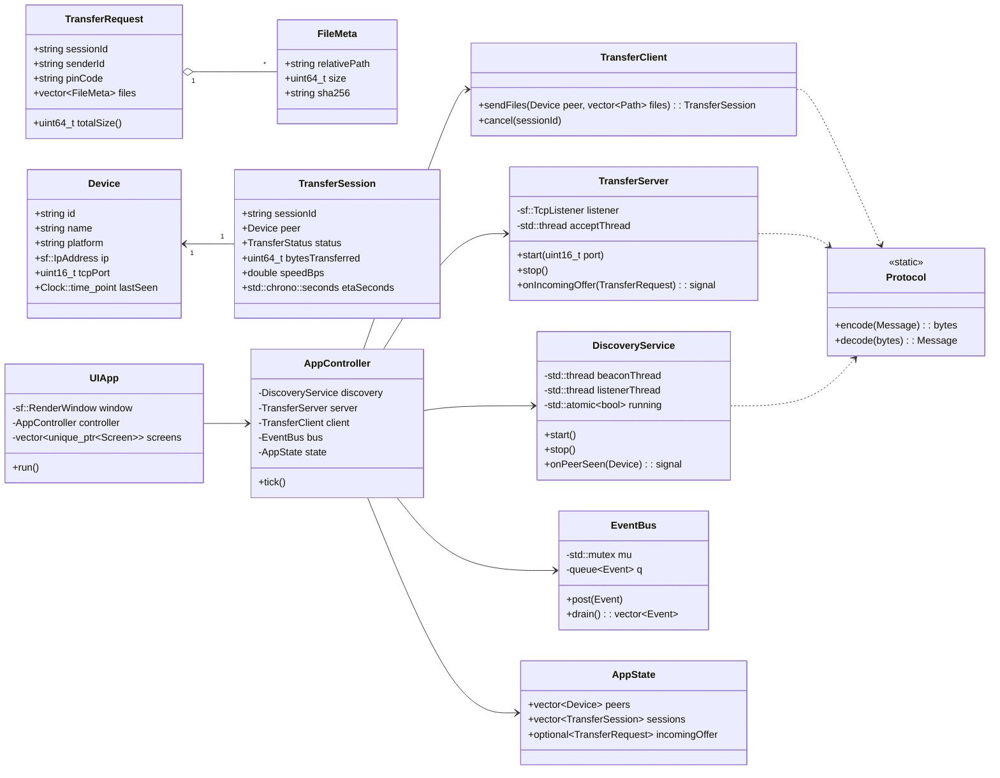
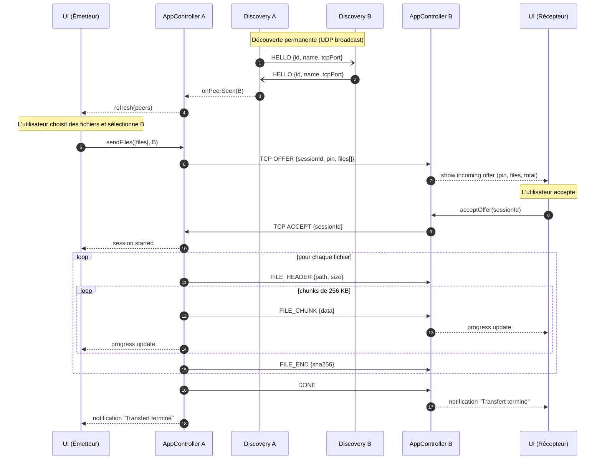
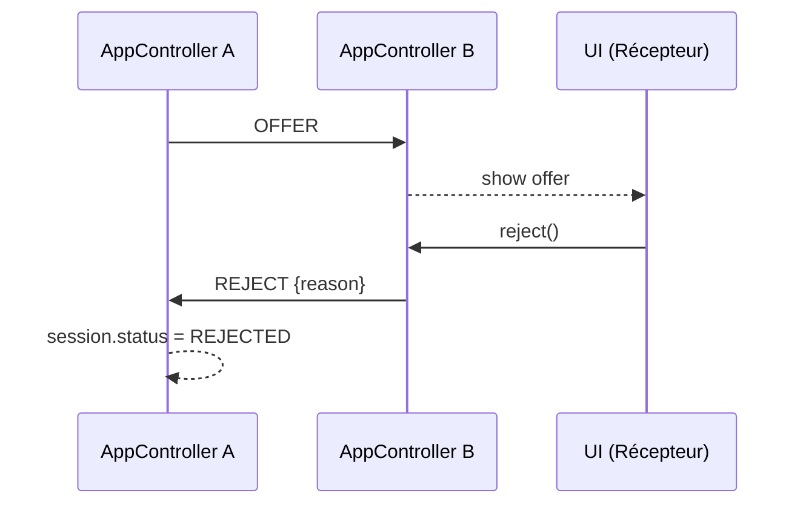
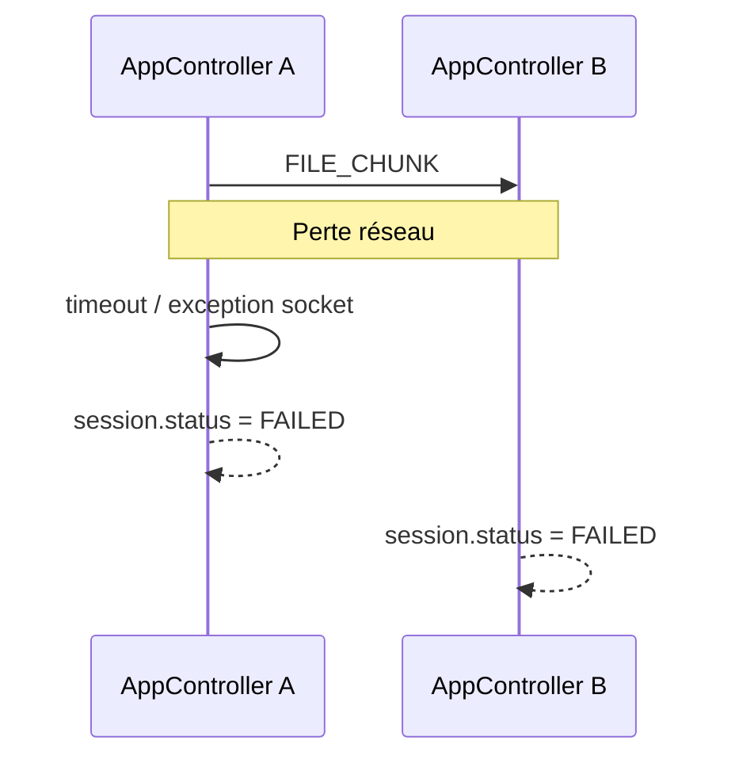

# 🏗️ Architecture Technique — `local-file-transfer`

**Stack** : C++17 / SFML 2.6.x / CMake 3.20+ / Cross-platform Mac ↔ Windows
**Mode** : Nouveau projet
**Validé le** : _en attente_

---

## 1. Vue d'ensemble

### 1.1 Objectif
Concevoir une application desktop modulaire, cross-platform (Mac/Windows),
capable de :
- découvrir automatiquement d'autres instances sur le LAN (UDP broadcast),
- transférer fichiers et dossiers en TCP direct,
- afficher une interface graphique réactive (SFML),
- rester simple à builder (CMake) et à étendre.

### 1.2 Dépendances retenues

| Dépendance | Version | Rôle | Intégration |
|-----------|---------|------|-------------|
| **SFML** | 2.6.x | Fenêtre, graphique, sockets, system | `find_package(SFML)` |
| **tinyfiledialogs** | dernière | Dialogues natifs (file picker) | single-header |
| **picosha2** | dernière | Hash SHA-256 | single-header |
| **nlohmann/json** | 3.11+ | Sérialisation JSON (config, protocole discovery) | single-header |
| **{fmt}** *(optionnel)* | 10.x | Formatage string | single-header / CMake |

Toutes les dépendances externes sont **header-only** sauf SFML, pour simplifier la
build cross-platform.

### 1.3 Principes d'architecture

- **Architecture en couches** (Clean Architecture allégée) :
  `UI → App (Controllers) → Domain → Infra/Network`
- **RAII partout** — aucun `new`/`delete` manuel, `std::unique_ptr`/`shared_ptr`
- **Thread-safety** via `std::mutex` + file d'événements thread-safe
  (`EventBus`) entre threads I/O et thread UI
- **Pas d'héritage profond** — préférer la composition et les interfaces fines
- **Modules indépendants** — chaque dossier `include/ltr/<module>` expose une
  API publique claire ; l'implémentation vit dans `src/<module>/`

### 1.4 Modèle de concurrence

```
┌──────────────────────────────────────────────────────────────┐
│ Thread UI (main) — boucle SFML, OpenGL context              │
│   ▲                                                          │
│   │ événements (EventBus thread-safe)                        │
│   │                                                          │
│ ┌─┴─────────────┬──────────────┬──────────────────┐         │
│ │ Discovery     │ TransferSrv  │ TransferWorker(s)│         │
│ │ (UDP listener │ (TCP accept  │ (TCP I/O par     │         │
│ │  + beacon)    │  loop)       │  session)        │         │
│ └───────────────┴──────────────┴──────────────────┘         │
└──────────────────────────────────────────────────────────────┘
```

- **UI thread** : `sf::RenderWindow`, input, rendu (OpenGL doit être mono-thread)
- **Discovery thread** : émet un beacon UDP toutes les 2s, écoute les beacons
  des autres pairs
- **TransferServer thread** : `accept()` les connexions TCP entrantes, délègue
  chaque session à un thread worker
- **TransferWorker thread(s)** : une session = un thread ; stream les chunks
  en E/S bloquante, publie la progression via `EventBus`
- **Communication inter-threads** : `EventBus` (mutex + queue), pas d'accès
  direct aux objets UI depuis les threads réseau

---

## 2. Diagramme de classes



---

## 3. Diagramme de séquence — Cas principal (envoi réussi)



### 3.1 Cas alternatif — Refus



### 3.2 Cas d'erreur — Déconnexion pendant transfert



---

## 4. Protocole réseau

### 4.1 Discovery (UDP, port 45454)

Beacon JSON diffusé en **broadcast** (`255.255.255.255:45454`) toutes les **2 s** :

```json
{
  "proto": "LTR1",
  "kind": "HELLO",
  "id": "uuid-v4",
  "name": "Mac de Serge",
  "platform": "macOS",
  "tcpPort": 45455
}
```

### 4.2 Transfert (TCP, port 45455)

Framing binaire : `[magic(4)="LTR1"][msgType(1)][payloadLen(4, BE)][payload]`

| Type | Code | Payload |
|------|------|---------|
| OFFER | 0x01 | JSON : `{sessionId, pin, files:[{relativePath, size}]}` |
| ACCEPT | 0x02 | JSON : `{sessionId}` |
| REJECT | 0x03 | JSON : `{sessionId, reason}` |
| FILE_HEADER | 0x04 | JSON : `{index, relativePath, size}` |
| FILE_CHUNK | 0x05 | **Binaire brut** (jusqu'à 256 KB) |
| FILE_END | 0x06 | JSON : `{index, sha256}` (optionnel) |
| DONE | 0x07 | vide |
| CANCEL | 0x08 | JSON : `{reason}` |
| ERROR | 0x09 | JSON : `{code, message}` |

**Invariant** : après un `FILE_HEADER` de taille `N`, on lit exactement `N`
octets via des `FILE_CHUNK` avant tout autre message.

---

## 5. Structure des fichiers

```
tranfert_local/
├── CMakeLists.txt                    # build principal
├── README.md
├── cmake/
│   ├── FindSFML.cmake                # si besoin
│   └── Dependencies.cmake            # fetch ou find deps
├── assets/
│   └── fonts/
│       └── Inter-Regular.ttf         # font UI
├── external/                         # headers tiers
│   ├── tinyfiledialogs/
│   ├── picosha2/
│   └── json/
├── include/
│   └── ltr/
│       ├── core/
│       │   ├── event_bus.hpp
│       │   ├── logger.hpp
│       │   └── types.hpp
│       ├── domain/
│       │   ├── device.hpp
│       │   ├── file_meta.hpp
│       │   ├── transfer_request.hpp
│       │   ├── transfer_session.hpp
│       │   └── transfer_status.hpp
│       ├── network/
│       │   ├── protocol.hpp
│       │   ├── discovery_service.hpp
│       │   ├── transfer_server.hpp
│       │   └── transfer_client.hpp
│       ├── infra/
│       │   ├── config.hpp
│       │   ├── filesystem_service.hpp
│       │   └── hash_service.hpp
│       ├── app/
│       │   ├── app_controller.hpp
│       │   └── app_state.hpp
│       └── ui/
│           ├── ui_app.hpp
│           ├── screen.hpp
│           ├── screens/
│           │   ├── main_screen.hpp
│           │   ├── incoming_offer_screen.hpp
│           │   └── transfer_screen.hpp
│           ├── widgets/
│           │   ├── button.hpp
│           │   ├── label.hpp
│           │   ├── progress_bar.hpp
│           │   └── device_list_item.hpp
│           └── theme.hpp
├── src/
│   ├── main.cpp
│   ├── core/
│   │   ├── event_bus.cpp
│   │   └── logger.cpp
│   ├── domain/
│   │   └── transfer_session.cpp
│   ├── network/
│   │   ├── protocol.cpp
│   │   ├── discovery_service.cpp
│   │   ├── transfer_server.cpp
│   │   └── transfer_client.cpp
│   ├── infra/
│   │   ├── config.cpp
│   │   ├── filesystem_service.cpp
│   │   └── hash_service.cpp
│   ├── app/
│   │   └── app_controller.cpp
│   └── ui/
│       ├── ui_app.cpp
│       ├── screen.cpp
│       ├── screens/
│       │   ├── main_screen.cpp
│       │   ├── incoming_offer_screen.cpp
│       │   └── transfer_screen.cpp
│       ├── widgets/
│       │   ├── button.cpp
│       │   ├── label.cpp
│       │   ├── progress_bar.cpp
│       │   └── device_list_item.cpp
│       └── theme.cpp
└── tests/
    ├── CMakeLists.txt
    ├── test_protocol.cpp
    ├── test_discovery.cpp
    └── test_hash.cpp
```

---

## 6. Interfaces clés (C++ — contrats)

### 6.1 `EventBus` — file thread-safe entre threads I/O et UI

```cpp
// include/ltr/core/event_bus.hpp
namespace ltr::core {

struct PeerSeenEvent      { Device device; };
struct PeerLostEvent      { std::string deviceId; };
struct IncomingOfferEvent { TransferRequest request; };
struct TransferProgress   { std::string sessionId;
                            uint64_t bytes;
                            double speedBps;
                            std::chrono::seconds eta; };
struct TransferDone       { std::string sessionId; };
struct TransferFailed     { std::string sessionId; std::string reason; };

using Event = std::variant<
    PeerSeenEvent, PeerLostEvent,
    IncomingOfferEvent,
    TransferProgress, TransferDone, TransferFailed>;

class EventBus {
public:
    void post(Event e);
    std::vector<Event> drain();
private:
    std::mutex mu_;
    std::queue<Event> q_;
};

} // namespace ltr::core
```

### 6.2 `DiscoveryService`

```cpp
// include/ltr/network/discovery_service.hpp
class DiscoveryService {
public:
    DiscoveryService(core::EventBus& bus, Device self);
    ~DiscoveryService();
    void start();
    void stop();
private:
    void beaconLoop();
    void listenLoop();
    core::EventBus& bus_;
    Device self_;
    std::atomic<bool> running_{false};
    std::thread beaconThread_;
    std::thread listenerThread_;
    sf::UdpSocket socket_;
};
```

### 6.3 `TransferServer`

```cpp
// include/ltr/network/transfer_server.hpp
class TransferServer {
public:
    TransferServer(core::EventBus& bus, uint16_t port);
    ~TransferServer();
    void start();
    void stop();
    void acceptOffer(const std::string& sessionId);
    void rejectOffer(const std::string& sessionId, const std::string& reason);
private:
    void acceptLoop();
    void sessionLoop(std::unique_ptr<sf::TcpSocket> sock);
    /* ... */
};
```

### 6.4 `TransferClient`

```cpp
// include/ltr/network/transfer_client.hpp
class TransferClient {
public:
    TransferClient(core::EventBus& bus);
    std::string sendFiles(const Device& peer,
                          const std::vector<std::filesystem::path>& files);
    void cancel(const std::string& sessionId);
private:
    void workerLoop(TransferSession session,
                    std::vector<std::filesystem::path> files);
    /* ... */
};
```

### 6.5 `AppController`

```cpp
// include/ltr/app/app_controller.hpp
class AppController {
public:
    AppController();
    void start();
    void stop();
    void tick();                               // appelé chaque frame UI
    const AppState& state() const { return state_; }

    void requestSend(const std::vector<Device>& peers,
                     const std::vector<std::filesystem::path>& files);
    void acceptIncoming(const std::string& sessionId);
    void rejectIncoming(const std::string& sessionId);
    void cancelSession(const std::string& sessionId);
private:
    core::EventBus bus_;
    AppState state_;
    std::unique_ptr<DiscoveryService> discovery_;
    std::unique_ptr<TransferServer>   server_;
    std::unique_ptr<TransferClient>   client_;
};
```

### 6.6 `Screen` (UI base)

```cpp
// include/ltr/ui/screen.hpp
class Screen {
public:
    virtual ~Screen() = default;
    virtual void handleEvent(const sf::Event& e) = 0;
    virtual void update(const AppState& state, sf::Time dt) = 0;
    virtual void draw(sf::RenderTarget& target) const = 0;
};
```

---

## 7. Flux d'erreurs & robustesse

| Scénario | Gestion |
|----------|---------|
| Port UDP/TCP déjà occupé | Retry sur ports adjacents (45454-45464) puis échec propre |
| Pair se déconnecte pendant transfert | Thread worker capture exception, publie `TransferFailed` |
| Conflit fichier côté destinataire | Écrit dans `<filename>.part`, renomme à la fin ; si `<filename>` existe, ajoute suffixe `-1`, `-2`, etc. |
| Espace disque insuffisant | Vérification `std::filesystem::space()` avant `ACCEPT` → `REJECT` avec `ERR_NO_SPACE` |
| Message malformé | Protocole : en cas d'erreur de parsing, envoyer `ERROR` puis fermer la socket |
| Plusieurs sessions simultanées | Chaque session = thread worker dédié, isolation par `sessionId` |

---

## 8. Build & cross-platform

### 8.1 Stratégie
- **CMake 3.20+** avec `FetchContent` pour les deps single-header, `find_package(SFML)` pour SFML
- **Toolchains** :
  - macOS : Clang via Xcode Command Line Tools
  - Windows : MSVC 2022 (Visual Studio) OU Clang-cl
- **Génération** : `cmake -S . -B build && cmake --build build`

### 8.2 Fichiers CMake à produire
- `CMakeLists.txt` racine (projet, options, target principal)
- `cmake/Dependencies.cmake` (fetch tinyfiledialogs, picosha2, json)
- `tests/CMakeLists.txt` (tests unitaires, optionnel mais recommandé)

---

## 9. Contrat d'implémentation

### Fichiers à créer (racine & build)
- [ ] `CMakeLists.txt` — projet, C++17, cibles `ltr_app` + `ltr_tests`
- [ ] `cmake/Dependencies.cmake` — récupération deps
- [ ] `README.md` — build instructions Mac/Windows

### Domain (`include/ltr/domain/`, `src/domain/`)
- [ ] `device.hpp` — struct `Device` + helpers (sérialisation JSON via nlohmann)
- [ ] `file_meta.hpp` — struct `FileMeta`
- [ ] `transfer_request.hpp` — struct `TransferRequest`
- [ ] `transfer_session.hpp/.cpp` — classe `TransferSession` (calcul vitesse/ETA glissant)
- [ ] `transfer_status.hpp` — enum `TransferStatus`

### Core (`include/ltr/core/`, `src/core/`)
- [ ] `types.hpp` — alias, constantes (ports, chunk size, timeout)
- [ ] `event_bus.hpp/.cpp` — file thread-safe d'événements typés
- [ ] `logger.hpp/.cpp` — logger minimal (stdout + fichier)

### Network (`include/ltr/network/`, `src/network/`)
- [ ] `protocol.hpp/.cpp` — encode/decode messages (magic + type + len + payload)
- [ ] `discovery_service.hpp/.cpp` — UDP beacon + listener, TTL des pairs (5 s)
- [ ] `transfer_server.hpp/.cpp` — accept loop + gestion sessions entrantes
- [ ] `transfer_client.hpp/.cpp` — worker thread par session sortante

### Infra (`include/ltr/infra/`, `src/infra/`)
- [ ] `config.hpp/.cpp` — lecture/écriture `config.json` (nom appareil, dossier download)
- [ ] `filesystem_service.hpp/.cpp` — énumération de dossier, création arborescence, écriture `.part`
- [ ] `hash_service.hpp/.cpp` — SHA-256 streaming (via picosha2)

### App (`include/ltr/app/`, `src/app/`)
- [ ] `app_state.hpp` — struct contenant liste des pairs, sessions actives, offre entrante
- [ ] `app_controller.hpp/.cpp` — orchestrateur principal, drain `EventBus` chaque frame

### UI (`include/ltr/ui/`, `src/ui/`)
- [ ] `theme.hpp/.cpp` — palette couleurs + font chargée depuis `assets/fonts/`
- [ ] `widgets/button.hpp/.cpp`
- [ ] `widgets/label.hpp/.cpp`
- [ ] `widgets/progress_bar.hpp/.cpp`
- [ ] `widgets/device_list_item.hpp/.cpp`
- [ ] `screen.hpp/.cpp` — classe abstraite
- [ ] `screens/main_screen.hpp/.cpp` — liste pairs + bouton "Parcourir" + "Envoyer"
- [ ] `screens/incoming_offer_screen.hpp/.cpp` — modale "Accepter / Refuser" + PIN
- [ ] `screens/transfer_screen.hpp/.cpp` — barre de progression + vitesse + ETA
- [ ] `ui_app.hpp/.cpp` — boucle SFML, navigation entre écrans, intégration `AppController`

### Entry point
- [ ] `src/main.cpp` — initialisation logger, création `UIApp`, run

### Assets
- [ ] `assets/fonts/Inter-Regular.ttf` — à inclure (ou autre font libre)

### Tests (optionnels V1 mais recommandés)
- [ ] `tests/test_protocol.cpp` — encode/decode round-trip
- [ ] `tests/test_hash.cpp` — hash de fichiers connus
- [ ] `tests/test_discovery.cpp` — simulation 2 instances sur loopback

---

## 10. Périmètre V1 / V2

### ✅ V1 (périmètre actuel)
- Découverte UDP broadcast
- Transfert TCP multi-fichiers et dossiers
- Code PIN d'appairage
- Progression temps réel
- Multi-destinataires (envois en parallèle, une session par pair)
- Build Mac + Windows via CMake
- Bouton "Parcourir" pour sélection

### ⏳ V2 (hors périmètre)
- Drag-and-drop natif (Cocoa + Win32)
- Reprise après interruption (resume)
- Chiffrement TLS optionnel
- Notification système native
- Support mobile

---

## 11. Flag UI

```
UI_REQUIRED: true
```

La feature inclut une interface graphique SFML (écrans, widgets, navigation).
L'agent UI/UX sera appelé ensuite.
