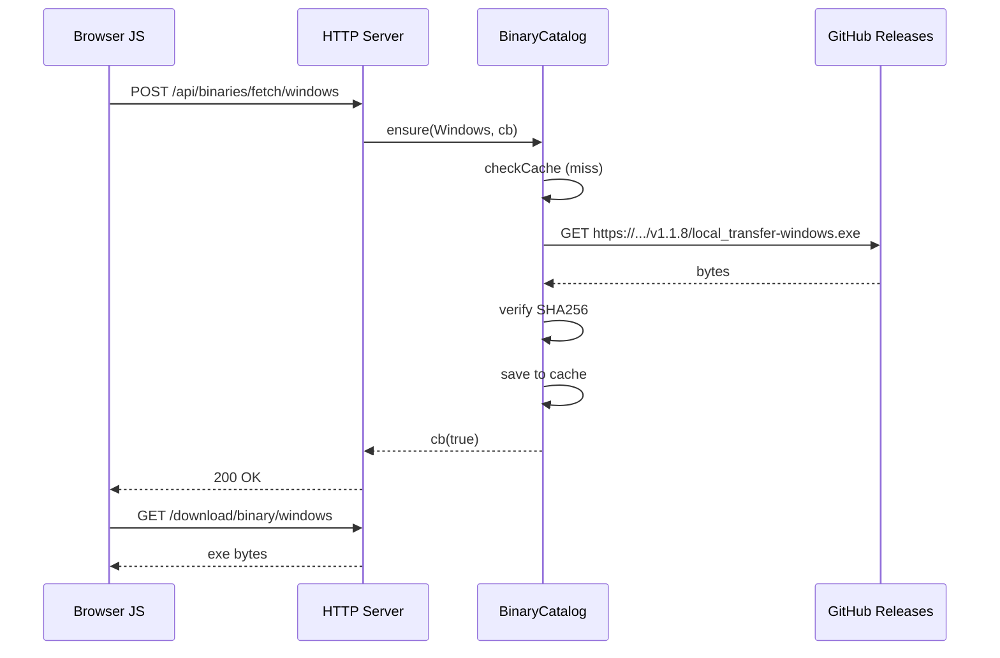

# Multi-OS Installer — Distribuer LocalTransfer depuis le web

> Document de suivi / roadmap pour permettre à n'importe quel visiteur
> web (Mac/Win/Linux) de télécharger le binaire LocalTransfer pour SON
> propre OS, pas seulement celui du host.

**Créé :** 2026-04-24
**Scope :** couche `ltr::web` (self_routes, self_binary) + assets web +
CI releases
**État :** analyse validée, recommandation retenue = **Stratégie C
(hybride)**. En attente de décisions préalables avant implémentation.

---

## 📊 Phases proposées

| Phase | Titre | Statut | Effort |
|-------|-------|--------|--------|
| 0 | Pipeline CI 3-OS + release GitHub | ⏳ à faire | 3-5 j |
| 1 | BinaryCatalog + cache local | ⏳ à venir | 4-6 j |
| 2 | Fetch lazy + verify SHA256 | ⏳ à venir | 3-5 j |
| 3 | UX web (bouton OS-aware + fallback) | ⏳ à venir | 2-3 j |
| 4 | (V2) AppImage + .deb + .rpm pour Linux | ⏳ plus tard | 3-5 j |
| 5 | (V2) Signature cryptographique | ⏳ plus tard | 3-5 j |

---

## 1. État actuel

### Ce qui marche
- Endpoint `GET /download/self` (via `src/web/routes/self_routes.cpp`)
- `SelfBinary::produceBytes()` sert le binaire **du host qui tourne** :
  - macOS : zip `.app` via miniz
  - Windows : `.exe` direct
  - Linux : ELF direct
- JS détecte l'OS du visiteur (`detectPlatform()` dans `common.js`)
- Affiche le bandeau install **seulement si**
  `hostPlatform === visitorPlatform`

### La limitation
Host macOS + visiteur Windows → **aucun bouton d'install**. Valeur
d'usage ~33 % (uniquement OS matching).

---

## 2. Stratégies envisagées

### Stratégie A — Bundling local (tout dans l'app)

L'app livre 3 binaires dans `assets/binaries/` :
- `local_transfer-macos.zip` (~50 Mo)
- `local_transfer-windows.exe` (~40 Mo)
- `local_transfer-linux.AppImage` (~45 Mo)

**Pros :** zéro réseau, intégrité garantie, même version partout.
**Cons :** taille × 3, CI complexe (3 artefacts packés ensemble),
redondance.

### Stratégie B — Fetch distant pur (GitHub Releases)

Au premier GET cross-OS, DL lazy depuis
`github.com/.../releases/v1.1.8/local_transfer-windows.exe`.

**Pros :** taille inchangée, toujours la dernière.
**Cons :** dépendance Internet au 1er DL, MITM si pas de signature,
~30 s d'attente première fois.

### Stratégie C — Hybride (RETENUE)

- Binaire OS host : inline (comme aujourd'hui)
- Autres OS : fetchés lazy au 1er `GET /download/binary/:os`, cachés
  localement
- Intégrité : SHA256 embeddé au build + HTTPS GitHub Releases
- Offline + cache manquant : message « voir GitHub Releases »

**Pros :** taille inchangée, offline OK pour l'OS host, cross-OS fonctionne
quand en ligne.
**Cons :** complexité (DL async + cache + hash + fallback).

---

## 3. Recommandations retenues

| Décision | Choix |
|----------|-------|
| Stratégie | **C (hybride)** |
| CDN | **GitHub Releases** (gratuit, stable, HTTPS natif) |
| Format Linux | **AppImage seul** en V1 (universel, pas de deps système) |
| Versioning | **Aligné sur la version du host** (pas de mismatch protocol LTR1) |
| Intégrité | **SHA256 embeddé au build + HTTPS** (signature crypto = V2) |
| Cache | **Dernière version uniquement** (éviter accumulation) |
| Auto-update | Non en V1 — fetch uniquement à la demande |
| Formats V2 | `.deb` + `.rpm` si demandé |

---

## 4. Architecture technique

### 4.1 Module `BinaryCatalog` (nouveau)

```cpp
// include/ltr/web/binary_catalog.hpp
namespace ltr::web {

enum class TargetOS { MacOS, Windows, Linux };

struct BinaryEntry {
    TargetOS os;
    std::string version;          // "1.1.8"
    std::string sha256;           // integrity check
    std::uint64_t sizeBytes;
    std::filesystem::path localPath;   // vide si pas en cache
    std::string remoteUrl;             // fallback DL depuis GitHub
    bool available() const { return !localPath.empty(); }
};

class BinaryCatalog {
public:
    BinaryCatalog(std::filesystem::path cacheDir,
                  std::string currentVersion);

    std::vector<BinaryEntry> snapshot() const;

    // Fetch async si absent. Callback OK/fail.
    void ensure(TargetOS os, std::function<void(bool ok)> cb);

    std::optional<BinaryEntry> get(TargetOS os) const;

private:
    std::filesystem::path cacheDir_;
    std::string           version_;
    mutable std::mutex    mu_;
    std::map<TargetOS, BinaryEntry> entries_;
};

} // namespace ltr::web
```

### 4.2 Nouveaux endpoints HTTP

| Endpoint | Méthode | Réponse |
|----------|---------|---------|
| `/api/binaries` | GET | JSON `[{os, version, available, size, sha256, remoteUrl?}]` |
| `/download/binary/:os` | GET | Fichier binaire OU 404 si indispo |
| `/api/binaries/fetch/:os` | POST | `202 Accepted` puis progression SSE ou poll |

Remplace progressivement `/download/self` (conservé pour backcompat
ou supprimé si on refactor entièrement).

### 4.3 Format des binaires servis

| OS | Format | Installation |
|----|--------|--------------|
| macOS | `.app.zip` | unzip + drag dans /Applications |
| Windows | `.exe` portable | double-clic |
| Linux | `.AppImage` | `chmod +x` + run |

### 4.4 Cache local

```
Platform-dependant:
macOS   : ~/Library/Application Support/LocalTransfer/binaries/
Windows : %APPDATA%\LocalTransfer\binaries\
Linux   : ~/.cache/local-transfer/binaries/

Contenu:
├── catalog.json         ← liste versions + SHA256 + timestamps
├── macos-1.1.8.app.zip
├── windows-1.1.8.exe
└── linux-1.1.8.AppImage
```

### 4.5 Flow fetch (côté host)



### 4.6 Intégration JS

```js
// Au chargement de la page principale :
const cat = await fetch('/api/binaries').then(r => r.json());
const me = cat.find(b => b.os === state.visitorPlatform);

if (me?.available) {
    // Bouton direct "Télécharger pour Windows"
    showDownloadButton(me);
} else if (me) {
    // Bouton "Préparer pour Windows (40 Mo)"
    showFetchButton(me);
} else {
    // OS exotique ou mobile → message alternatif
    showMobileMessage();
}

// Dropdown "autres OS" toujours disponible
showAlternativeOsMenu(cat.filter(b => b.os !== state.visitorPlatform));
```

### 4.7 Détection OS visiteur améliorée

Priorité :
1. `navigator.userAgentData.platform` (Chrome/Edge 93+, fiable)
2. Fallback UA sniffing pour Safari/Firefox
3. Si ambigu → afficher les 3 boutons sans présélection

---

## 5. UX côté web — états visuels

### 5.1 Détection réussie + binaire disponible
```
┌─────────────────────────────────────┐
│ Télécharger pour Windows            │
│ 40 Mo · v1.1.8 · SHA256 ✓           │
│ [ Télécharger ]                     │
└─────────────────────────────────────┘
Autres : [macOS] [Linux]
```

### 5.2 Détection réussie, cache vide (première fois)
```
┌─────────────────────────────────────┐
│ Obtenir l'app pour Windows          │
│ 40 Mo · fetch depuis releases       │
│ [ Préparer et télécharger ]         │
└─────────────────────────────────────┘
```
Clic → spinner → bouton devient « Télécharger ».

### 5.3 Offline + cache manquant
```
┌─────────────────────────────────────┐
│ App non disponible hors-ligne       │
│ [ Voir sur GitHub Releases ]        │
└─────────────────────────────────────┘
```

### 5.4 Visiteur mobile (Android/iOS)
```
┌─────────────────────────────────────┐
│ LocalTransfer est une app desktop   │
│ (Mac / Windows / Linux). Installe  │
│ sur un ordinateur pour recevoir les │
│ fichiers via l'app native.          │
└─────────────────────────────────────┘
```

---

## 6. Pipeline CI (Phase 0 — prérequis)

Nécessaire pour que les binaires existent quelque part :

### Workflow par OS (GitHub Actions)
1. `build-macos` : Xcode → `local_transfer-macos.zip`
2. `build-windows` : MSVC 2022 → `local_transfer-windows.exe`
3. `build-linux` : Ubuntu + AppImage builder → `local_transfer-linux.AppImage`
4. `release` : tag `v1.1.9` → publish 3 artefacts + `SHA256SUMS.txt`

### Contenu `SHA256SUMS.txt`
```
<hash>  local_transfer-macos.zip
<hash>  local_transfer-windows.exe
<hash>  local_transfer-linux.AppImage
```

### Intégration côté app

Au build, un header généré (CMake custom cmd) contient :
```cpp
// include/ltr/web/release_manifest.hpp (généré)
namespace ltr::web::release {
constexpr std::string_view kVersion = "1.1.8";
constexpr std::string_view kShaMacOS    = "abcd...";
constexpr std::string_view kShaWindows  = "1234...";
constexpr std::string_view kShaLinux    = "ef56...";
constexpr std::string_view kBaseUrl =
    "https://github.com/<user>/local-transfer/releases/download/v1.1.8";
}
```

Au fetch : `BinaryCatalog` compare le SHA256 du fichier DL à celui du
header embeddé → mismatch = rejet.

---

## 7. Risques & tradeoffs

| Risque | Probabilité | Impact | Atténuation |
|--------|-------------|--------|-------------|
| GitHub Releases down | Basse | Haut | Mirror (releases.localtransfer.app) V2 |
| Version host ≠ version release | Moyenne | Moyen | CI déclenche release à chaque tag, version embeddée = tag |
| SHA256 mismatch (CDN corrompu) | Très basse | Très haut | Refuse, log, bouton « GitHub » fallback |
| Cache corrompu disque | Basse | Moyen | Re-verify SHA256 au load du cache, refetch si mismatch |
| Visiteur mobile confus | Haute | Faible | Message explicite § 5.4 |
| Bandwidth host limité | Moyenne | Moyen | Le DL passe par GH Releases, pas par le host → pas de charge pour le host sauf le 1er fetch |
| Cross-OS mismatch LTR1 protocol | Haute | Haut | Version host = version release aligned |

---

## 8. Questions à trancher AVANT de coder

1. **Compte/organisation GitHub** où seront les releases ?
2. **Pipeline CI** existe déjà ou à construire ? (si pas → Phase 0 = plusieurs jours)
3. **Signature** : on accepte V1 sans signature crypto (juste HTTPS + SHA256) ?
4. **Cache size limit** : on limite à la version courante uniquement ou on garde un historique ?
5. **Nom du binaire dans l'archive Mac** : `LocalTransfer.app` ou autre ?
6. **Endpoint `/download/self` existant** : garde ou supprime quand on introduit `/download/binary/:os` ?
7. **V2 Linux** : `.deb` + `.rpm` demandés ou AppImage suffit pour V2 aussi ?
8. **Ordre des sprints** : avant ou après UX-5 Confort ?

---

## 9. Ordre d'implémentation recommandé

1. **Phase 0 — Pipeline CI 3-OS** (3-5 j) — bloquant pour tout le reste
2. **Phase 1 — BinaryCatalog + cache** (4-6 j) — structure C++ + tests
3. **Phase 2 — Fetch lazy + verify** (3-5 j) — glue réseau
4. **Phase 3 — UX web** (2-3 j) — modif JS + HTML, simple une fois
   backend prêt

Total V1 : **12-19 j** après Phase 0 établie.

**Recommandation temporelle :**
→ finir **UX-5 Confort** (roadmap host) avant de démarrer ceci
→ puis attaquer ce projet en sprint dédié "Multi-OS Installer"

---

## Journal

### 2026-04-24
- Analyse initiale livrée (3 stratégies A/B/C comparées)
- Stratégie C (hybride) retenue avec GitHub Releases + AppImage Linux +
  SHA256 embeddé
- Document créé pour reprendre après UX-5
