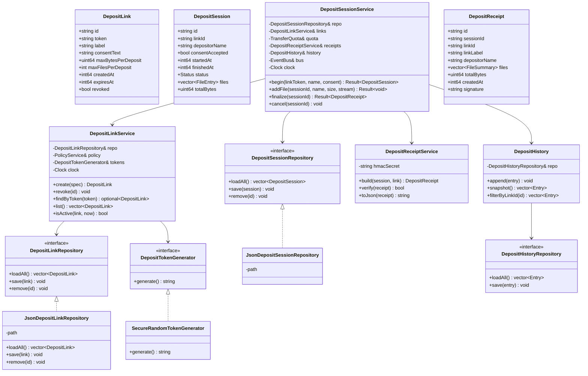
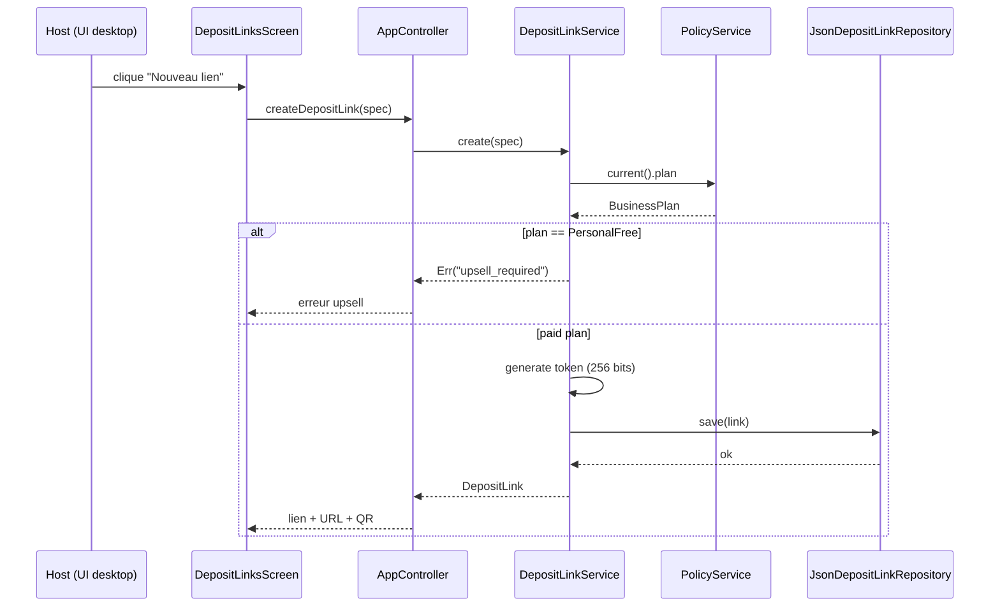
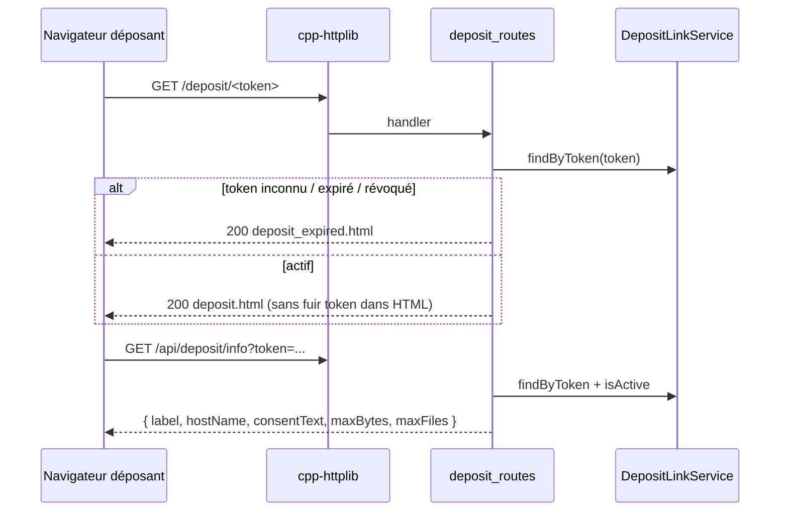
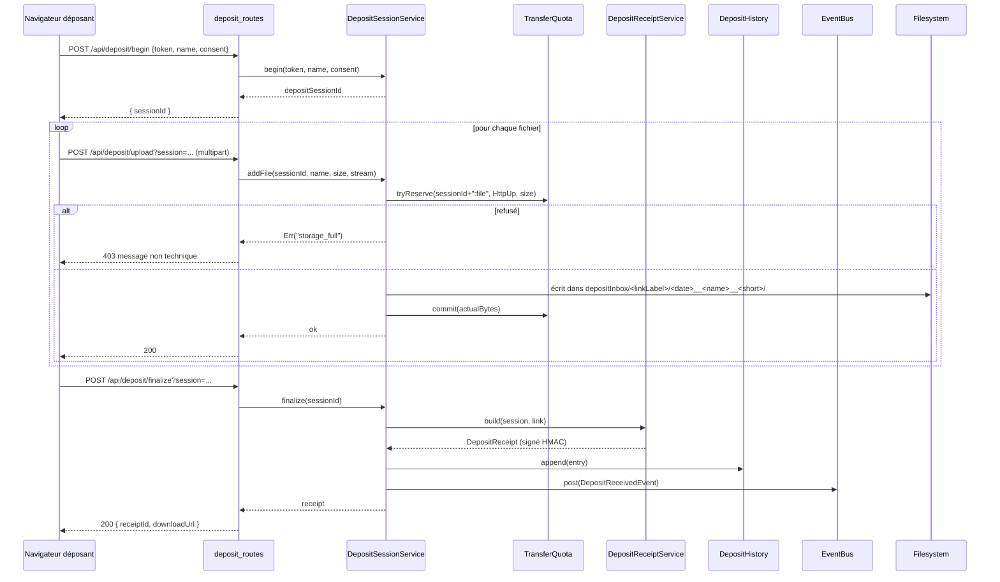
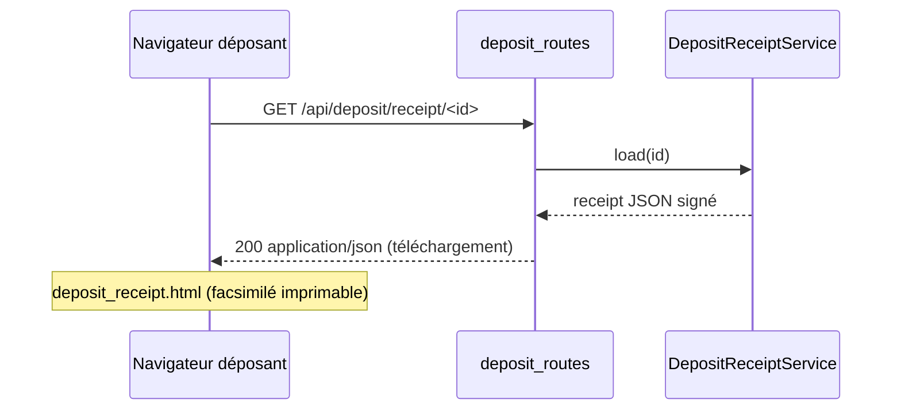
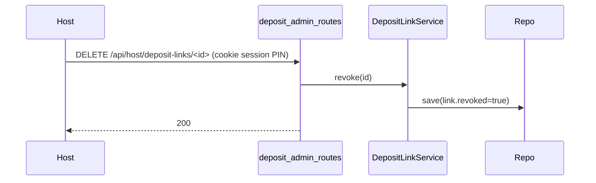

# Architecture — Phase 2 : Portail Client Externe

> Basée sur `business-spec.md`. Respecte SRP + DIP de la Phase 1.
> Stack : C++17 / SFML 2.6.1 / cpp-httplib / nlohmann/json / picosha2.

---

## 1. Vue d'ensemble

### Objectifs techniques

- **Étanchéité** : le portail déposant et le dashboard host partagent
  le serveur HTTP mais sont totalement isolés (préfixes d'URL distincts,
  pas de cookie partagé, pas de session dashboard requise côté portail).
- **SRP** : un service = une responsabilité. Pas de logique dans les
  routes ; pas de httplib/json dans les services métier.
- **DIP** : les services dépendent d'interfaces (`DepositLinkRepository`,
  `DepositSessionRepository`, `DepositHistoryRepository`), jamais d'un
  fichier ou d'un format.
- **Réutilisation** : `TransferQuota`, `PolicyService`, `QrCode`,
  `WebSessionStore::hmacSha256Hex`, `picosha2`, `AuditExportService`.
- **Aucune dépendance externe nouvelle**.

### Composants impactés

| Couche | Nouveau | Modifié |
|---|---|---|
| `ltr::core` | `DepositReceivedEvent` | `event_bus.hpp` |
| `ltr::infra` | `DepositLink`, `DepositLinkService`, `DepositLinkRepository`, `DepositSession`, `DepositSessionService`, `DepositSessionRepository`, `DepositHistory`, `DepositHistoryRepository`, `DepositReceiptService`, `DepositTokenGenerator` | `audit_export_service.{hpp,cpp}` (agrège DepositHistory) |
| `ltr::web` | `routes/deposit_routes.{hpp,cpp}`, `routes/deposit_admin_routes.{hpp,cpp}` | `web_service.{hpp,cpp}`, `routes/route_registrar.cpp` |
| `ltr::ui` | `screens/deposit_links_screen.{hpp,cpp}`, `widgets/deposit_link_card.{hpp,cpp}` | `screens/main_screen.cpp` (nav vers le nouveau screen) |
| `ltr::app` | — | `app_controller.{hpp,cpp}` (instancie + injecte) |
| `assets/web` | `deposit.html`, `deposit_expired.html`, `deposit_receipt.html`, `js/deposit.js`, ajouts CSS | `index.html` (onglet « Liens de dépôt » côté host) |
| `tests` | 5 nouveaux fichiers | `CMakeLists.txt` |

---

## 2. Diagramme de modules

```
ltr::ui::screens::DepositLinksScreen           ← desktop, gestion liens
    │
    ▼
ltr::app::AppController
    │ owns
    ├─► PolicyService                          (déjà Phase 1)
    ├─► QuotaService                           (déjà Phase 1)
    ├─► TransferHistory                        (déjà Phase 1, inchangé)
    ├─► JsonDepositLinkRepository
    ├─► JsonDepositSessionRepository
    ├─► JsonDepositHistoryRepository
    ├─► DepositTokenGenerator
    ├─► DepositLinkService     ← injecté dans WebService
    ├─► DepositSessionService  ← injecté dans WebService
    ├─► DepositReceiptService  ← injecté dans WebService
    └─► DepositHistory         ← injecté dans WebService + AuditExportService

ltr::web::WebService
    │
    ├─► routes/deposit_routes.cpp        (public, /deposit/* + /api/deposit/*)
    └─► routes/deposit_admin_routes.cpp  (auth host, /api/host/deposit-links/*)

ltr::infra::DepositLinkService
    │ depends on (interface)
    └─► DepositLinkRepository
            ▲
            │ implements
        JsonDepositLinkRepository

ltr::infra::DepositSessionService
    │ depends on
    ├─► DepositSessionRepository (interface)
    ├─► DepositLinkService       (lookup + validité)
    ├─► TransferQuota            (réservation HttpUp)
    └─► DepositReceiptService    (génère reçu signé)
```

---

## 3. Diagramme de classes (Mermaid)



---

## 4. Flux (Mermaid)

### 4.a Création d'un lien (host)



### 4.b Déposant ouvre le lien



### 4.c Soumission du dépôt



### 4.d Reçu



### 4.e Révocation (host)



### 4.f Expiration

Vérification **lazy** dans `DepositLinkService::isActive(link, now)` :
appelée à chaque accès aux routes publiques. Pas de cron. Un job de
nettoyage léger est exécuté dans le keepalive thread déjà présent dans
`WebService` pour purger les sessions abandonnées de
`DepositSessionRepository` (TTL : 1 h après dernier append sans
finalize).

---

## 5. Structure des fichiers

```
include/ltr/
├── core/
│   └── event_bus.hpp                          (MODIF — ajoute DepositReceivedEvent)
├── infra/
│   ├── deposit_link.hpp                       (NEW — struct DepositLink + enums)
│   ├── deposit_link_repository.hpp            (NEW — interface)
│   ├── deposit_link_service.hpp               (NEW)
│   ├── deposit_session.hpp                    (NEW — struct DepositSession)
│   ├── deposit_session_repository.hpp         (NEW — interface)
│   ├── deposit_session_service.hpp            (NEW)
│   ├── deposit_history.hpp                    (NEW — store + repository interface)
│   ├── deposit_receipt.hpp                    (NEW — struct + service)
│   ├── deposit_token_generator.hpp            (NEW — interface + secure impl)
│   └── audit_export_service.hpp               (MODIF — agrège DepositHistory)
├── web/
│   ├── web_service.hpp                        (MODIF — setters injection)
│   └── routes/
│       ├── deposit_routes.hpp                 (NEW)
│       └── deposit_admin_routes.hpp           (NEW)
├── ui/
│   ├── screens/
│   │   ├── deposit_links_screen.hpp           (NEW)
│   │   └── main_screen.hpp                    (MODIF — navigation)
│   └── widgets/
│       └── deposit_link_card.hpp              (NEW)
└── app/
    └── app_controller.hpp                     (MODIF — owners + accessors)

src/                                            (mêmes paths)
infra/deposit_link_service.cpp
infra/deposit_session_service.cpp
infra/deposit_history.cpp
infra/deposit_receipt_service.cpp
infra/deposit_token_generator.cpp
infra/json_deposit_link_repository.cpp
infra/json_deposit_session_repository.cpp
infra/json_deposit_history_repository.cpp
infra/audit_export_service.cpp                  (MODIF)
web/routes/deposit_routes.cpp                   (NEW)
web/routes/deposit_admin_routes.cpp             (NEW)
web/routes/route_registrar.cpp                  (MODIF)
web/web_service.cpp                             (MODIF — getters/setters)
ui/screens/deposit_links_screen.cpp             (NEW)
ui/widgets/deposit_link_card.cpp                (NEW)
ui/screens/main_screen.cpp                     (MODIF léger — bouton accès)
app/app_controller.cpp                          (MODIF)

assets/web/
├── html/
│   ├── deposit.html                            (NEW — page déposant)
│   ├── deposit_expired.html                    (NEW — lien inactif)
│   └── deposit_receipt.html                    (NEW — facsimilé imprimable)
├── js/
│   ├── deposit.js                              (NEW — logique page déposant)
│   └── host_deposit_links.js                   (NEW — admin dashboard)
└── css/
    └── style.css                               (MODIF — ajouts deposit-*)

assets/web/html/index.html                      (MODIF — onglet « Liens de dépôt »)

tests/
├── test_deposit_link_service.cpp               (NEW)
├── test_deposit_session_service.cpp            (NEW)
├── test_deposit_receipt_service.cpp            (NEW)
├── test_deposit_history.cpp                    (NEW)
├── test_deposit_routes.cpp                     (NEW — smoke httplib)
└── CMakeLists.txt                              (MODIF)

CMakeLists.txt                                  (MODIF — sources)
```

---

## 6. Contrats clés (résumé d'interfaces)

### DepositLink (POD, sérialisable)

```cpp
namespace ltr::infra {
struct DepositLink {
    std::string id;                  // uuid court (12 hex) pour logs
    std::string token;               // 32+ octets b64url, EST le secret
    std::string label;
    std::string consentText;
    std::uint64_t maxBytesPerDeposit{0};   // 0 = pas de limite locale
    int           maxFilesPerDeposit{0};   // 0 = pas de limite locale
    std::int64_t  createdAt{0};
    std::int64_t  expiresAt{0};            // 0 = sans expiration
    bool          revoked{false};
};
}
```

### Interfaces

```cpp
class DepositLinkRepository {
public:
    virtual ~DepositLinkRepository() = default;
    virtual std::vector<DepositLink> loadAll() const = 0;
    virtual void save(const DepositLink& link) = 0;
    virtual void remove(const std::string& id) = 0;
};

class DepositSessionRepository { /* idem pour DepositSession */ };
class DepositHistoryRepository { /* idem pour DepositHistory::Entry */ };

class DepositTokenGenerator {
public:
    virtual ~DepositTokenGenerator() = default;
    virtual std::string generate() = 0;     // ≥ 256 bits, b64url
};
```

### Result<T> léger pour éviter les exceptions dans le service

```cpp
template <class T> struct Result {
    bool ok{false};
    std::string reason;     // "expired", "revoked", "consent_required",
                            // "name_required", "files_limit",
                            // "size_limit", "storage_full",
                            // "upsell_required", "unknown"
    T value{};
};
```

(Pas une lib externe, juste un POD interne au module.)

### Nouvel événement

```cpp
// core/event_bus.hpp
struct DepositReceivedEvent {
    std::string depositSessionId;
    std::string depositLinkId;
    std::string depositLinkLabel;
    std::string depositorName;
    int           fileCount{0};
    std::uint64_t totalBytes{0};
    std::int64_t  timestamp{0};
};
```

---

## 7. Décisions d'architecture commentées

### 7.1 Historique : store dédié (non fusionné avec TransferHistory)

`TransferHistory` reste **inchangé** pour ne pas casser les tests
existants et préserver son SRP (« historique des transferts pair-à-pair »).
`DepositHistory` est un nouveau store avec son schéma propre. L'audit
export agrège les deux sources (option `?include=deposits` au besoin,
sinon les dépôts sont inclus par défaut comme `kind="deposit-in"`).

### 7.2 Reçu = JSON signé HMAC, pas PDF

- Format : JSON sérialisé canonique + signature HMAC-SHA-256 hex.
- Secret HMAC : **réutilise** celui déjà persisté pour les tokens
  WebSessionStore (dérivé du fingerprint certificat). Pas de nouveau
  secret à gérer.
- Le navigateur déposant reçoit le JSON + ouvre `deposit_receipt.html`
  pour un affichage imprimable (CSS `@media print` propre).

### 7.3 Filesystem layout des fichiers reçus

```
<downloadDir>/Deposits/<linkLabel-safe>/<YYYY-MM-DD>__<depositor-safe>__<sid-short>/<filename>
```

- `linkLabel-safe` et `depositor-safe` = passés par
  `infra::FilesystemService::sanitizePath` existant.
- Pas de collision : `sid-short` (6 hex) ajouté.

### 7.4 Étanchéité authentification

| Route | Auth |
|---|---|
| `GET /deposit/:token` | aucune (le token est le secret) |
| `GET /api/deposit/info?token=...` | token query |
| `POST /api/deposit/begin?token=...` | token query |
| `POST /api/deposit/upload?session=...` | depositSessionId opaque (lié au token côté serveur) |
| `POST /api/deposit/finalize?session=...` | idem |
| `GET /api/deposit/receipt/:id` | receiptId (long, imprévisible) |
| `GET /api/host/deposit-links` | cookie session dashboard PIN |
| `POST /api/host/deposit-links` | cookie session dashboard PIN |
| `DELETE /api/host/deposit-links/:id` | cookie session dashboard PIN |

Les routes déposant **n'utilisent jamais** `WebSessionStore::validate` ;
les routes admin **l'utilisent toujours**. Aucun croisement.

### 7.5 Intégration Quota

- Compteur côté `DepositSessionService::addFile()`, flow `HttpUp`,
  reservation ID = `"deposit:" + sessionId + ":" + filename`.
- Si refus : message non technique côté déposant
  (« Ce dépôt ne peut pas être accepté pour le moment. »), audit log
  côté host avec raison technique.

### 7.6 Intégration Policy

- `DepositLinkService::create()` lit `PolicyService::current().plan` ;
  refuse si `PersonalFree` avec raison `upsell_required`.
- UI desktop : le bouton « Créer un lien » est désactivé visuellement
  avec un tooltip « Disponible sur Business ».

### 7.7 Notification temps réel

- `DepositSessionService::finalize()` poste
  `DepositReceivedEvent` sur l'`EventBus`.
- `AppController::tick()` (déjà appelé chaque frame) draine et déclenche
  popup + son via le système d'événements UI existant.
- Si app fermée au moment du dépôt, l'événement est perdu (cohérent
  avec l'archi event-bus actuelle) ; au prochain démarrage,
  `DepositHistory` est lue et l'UI peut afficher un badge « Nouveaux
  dépôts depuis votre dernière visite » via un timestamp persisté
  `lastSeenDepositAt` dans la config.

---

## 8. CONTRAT D'IMPLÉMENTATION

> Toute déviation par rapport à cette liste doit être justifiée et validée
> avant audit.

### Couche `ltr::core`
- [ ] `include/ltr/core/event_bus.hpp` — ajouter `struct DepositReceivedEvent`
      et l'inclure dans le `std::variant<…>` ou mécanisme equivalent du bus.

### Couche `ltr::infra`
- [ ] `include/ltr/infra/deposit_link.hpp` + `src/infra/deposit_link.cpp` —
      struct + helpers (status, isActive, anonymizedShortId).
- [ ] `include/ltr/infra/deposit_link_repository.hpp` — interface
      `DepositLinkRepository`.
- [ ] `include/ltr/infra/deposit_link_service.hpp` + `.cpp` — CRUD + lifecycle.
- [ ] `src/infra/json_deposit_link_repository.cpp` (header inline dans
      le `.hpp` du repo) — atomique `.tmp` + rename, format
      `cfgDir/deposit_links.json`.
- [ ] `include/ltr/infra/deposit_session.hpp` + `.cpp` — struct
      `DepositSession` + helpers.
- [ ] `include/ltr/infra/deposit_session_repository.hpp` — interface.
- [ ] `src/infra/json_deposit_session_repository.cpp` — fichier
      `cfgDir/deposit_sessions.json`.
- [ ] `include/ltr/infra/deposit_session_service.hpp` + `.cpp` —
      orchestrateur (begin, addFile, finalize, cancel) ; dépend de
      `TransferQuota`, `DepositLinkService`, `DepositReceiptService`,
      `DepositHistory`, `EventBus`.
- [ ] `include/ltr/infra/deposit_history.hpp` + `.cpp` — store thread-safe,
      cap MAX_ENTRIES = 2000.
- [ ] `src/infra/json_deposit_history_repository.cpp` — fichier
      `cfgDir/deposit_history.json`.
- [ ] `include/ltr/infra/deposit_receipt.hpp` + `.cpp` — struct + service
      `build/verify/toJson` utilisant HMAC-SHA-256 (réutiliser le helper
      privé de `WebSessionStore` → soit le rendre public/extrait, soit
      dupliquer dans un helper `infra::hmac_sha256_hex`).
- [ ] `include/ltr/infra/deposit_token_generator.hpp` + `.cpp` —
      interface + `SecureRandomTokenGenerator` (std::random_device +
      Xoshiro256** ou similaire, 32 octets, b64url).
- [ ] `include/ltr/infra/audit_export_service.hpp` + `.cpp` —
      surcharges `exportJson/exportCsv` qui acceptent
      `(const std::vector<TransferHistory::Entry>&, const std::vector<DepositHistory::Entry>&)`.

### Couche `ltr::web`
- [ ] `include/ltr/web/web_service.hpp` + `src/web/web_service.cpp` —
      ajouter setters `setDepositLinkService`, `setDepositSessionService`,
      `setDepositReceiptService`, `setDepositHistory` + accessors.
- [ ] `include/ltr/web/routes/deposit_routes.hpp` + `.cpp` — routes
      publiques `/deposit/:token`, `/api/deposit/info`,
      `/api/deposit/begin`, `/api/deposit/upload`,
      `/api/deposit/finalize`, `/api/deposit/receipt/:id`. Pas de
      `WebSessionStore::validate`.
- [ ] `include/ltr/web/routes/deposit_admin_routes.hpp` + `.cpp` —
      routes admin `/api/host/deposit-links` (GET, POST, DELETE),
      `/api/host/deposit-history` (GET filtrable par linkId). Auth
      cookie session PIN obligatoire.
- [ ] `src/web/routes/route_registrar.cpp` — appeler
      `registerDeposit(svc)` et `registerDepositAdmin(svc)` AVANT
      `registerStatic` (priorité aux routes API/HTML dynamiques).

### Couche `ltr::ui`
- [ ] `include/ltr/ui/widgets/deposit_link_card.hpp` + `.cpp` —
      RoundedRect avec libellé, badge expiration, badge « actif/expiré »,
      bouton « copier URL », bouton « afficher QR », bouton « révoquer ».
- [ ] `include/ltr/ui/screens/deposit_links_screen.hpp` + `.cpp` —
      écran complet : liste, modal de création (form), modal QR, modal
      révocation. Utilise `Colors`, `Spacing`, `Radius`, `FontSize` du
      thème, `ltr::ui::utf8()` partout.
- [ ] `src/ui/screens/main_screen.cpp` — ajouter point d'entrée
      (bouton/onglet « Liens de dépôt ») vers `DepositLinksScreen`.

### Couche `ltr::app`
- [ ] `include/ltr/app/app_controller.hpp` + `src/app/app_controller.cpp` —
      instancie les 3 repositories JSON + les 3 services + le générateur
      de tokens + `DepositHistory`. Injecte dans `WebService`. Branche
      l'écoute `DepositReceivedEvent` pour propager à l'état UI.
- [ ] Méthodes publiques côté controller :
      `createDepositLink(spec)`, `revokeDepositLink(id)`,
      `listDepositLinks()`, `depositHistorySnapshot()`.

### Assets web
- [ ] `assets/web/html/deposit.html` — page autonome, ne charge **pas**
      le JS du dashboard, ni `pin_storage.js`, ni `peers.js`.
      Charge uniquement `deposit.js` + `common.js` light (utils i18n).
- [ ] `assets/web/html/deposit_expired.html` — page statique.
- [ ] `assets/web/html/deposit_receipt.html` — vue facsimilé,
      lit le JSON via query string `?r=<base64url>` ou via `fetch`
      sur `/api/deposit/receipt/:id`, formate, prêt pour `window.print()`.
- [ ] `assets/web/js/deposit.js` — fetch info → render form → submit
      multipart → afficher progression → afficher reçu. Messages non
      techniques. Pas de jargon. Pas d'i18n complexe (FR + fallback EN
      minimal).
- [ ] `assets/web/js/host_deposit_links.js` — onglet dashboard admin,
      table des liens + CRUD via `/api/host/deposit-links`.
- [ ] `assets/web/css/style.css` — ajouts `.deposit-*` (page déposant
      sobre, sans header dashboard) + `.host-deposit-*` (admin).
- [ ] `assets/web/html/index.html` — onglet « Liens de dépôt » dans le
      dashboard host, visible si plan != PersonalFree (badge upsell
      sinon).

### Tests
- [ ] `tests/test_deposit_link_service.cpp` — création/refus PersonalFree/
      révocation/expiration/lookup par token.
- [ ] `tests/test_deposit_session_service.cpp` — begin sans consent
      refusé, begin sans name refusé, addFile au-dessus du quota refusé,
      finalize produit reçu + history + event, finalize idempotent.
- [ ] `tests/test_deposit_receipt_service.cpp` — build → toJson → verify
      OK ; tampering détecté ; signature stable.
- [ ] `tests/test_deposit_history.cpp` — append, snapshot, filterByLinkId,
      cap MAX_ENTRIES.
- [ ] `tests/test_deposit_routes.cpp` — smoke httplib comme
      `test_http_smoke.cpp` : 200 sur lien actif, 200 expired.html sur
      lien révoqué, 403 quota dépassé, 404 receiptId inconnu, étanchéité
      (GET /api/host/deposit-links sans cookie = 401).
- [ ] `tests/CMakeLists.txt` — déclaration des 5 nouveaux tests +
      `WORKING_DIRECTORY` sur le test routes.

### Build
- [ ] `CMakeLists.txt` (racine) — ajout des sources `.cpp` à
      `ltr_core` (couche infra + web routes).
- [ ] Pas de nouvelle dépendance dans `cmake/Dependencies.cmake`.

---

## 9. Non-objectifs (à NE PAS implémenter)

- ❌ Reprise automatique d'un upload interrompu (Phase 2 ré-essaye à zéro).
- ❌ Génération PDF native (le HTML imprimable suffit).
- ❌ Notification push / mail / SMS au déposant.
- ❌ Branding personnalisé (logo, couleurs) sur la page déposant — viendra
   en Phase 4 (Enterprise).
- ❌ Tunnel internet ou exposition publique — strict LAN.
- ❌ Sessions persistantes côté déposant (cookies, localStorage).
- ❌ Modification du schéma `TransferHistory` (zéro régression Phase 1).

---

## 10. Risques et atténuations

| Risque | Atténuation |
|---|---|
| Stocker beaucoup de sessions abandonnées dans le JSON | TTL 1 h + purge au keepalive |
| Tokens devinés | 32 octets crypto + révocation manuelle |
| Reçu falsifié | Signature HMAC vérifiable côté host |
| Collision noms de fichiers de 2 déposants simultanés | Sous-dossier `<sid-short>` |
| Upload énorme bloque tout le quota mensuel | Limite par lien + check pre-flight |
| Plan downgrade Business→Free pendant qu'un lien existe | Lecture policy au check d'activation : si plan Free, lien marqué `inactive` côté UI host, déposant voit deposit_expired |

---

## UI_REQUIRED: true

Deux interfaces visuelles distinctes sont nécessaires :

1. **UI desktop SFML** — nouvel écran `DepositLinksScreen` (liste,
   création, QR, révocation). Doit suivre les conventions du thème
   (`Colors`, `Spacing`, `Radius`, `FontSize`, `RoundedRect`, `utf8()`).
2. **UI web déposant** — pages HTML/CSS/JS dédiées, totalement
   séparées du dashboard host, ton « rassurant » et non technique.

→ L'Agent UI/UX devra donc être consulté pour proposer les options
visuelles avant l'implémentation.
