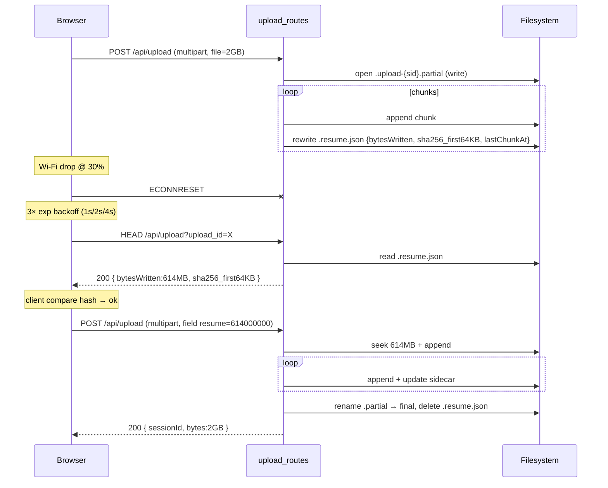
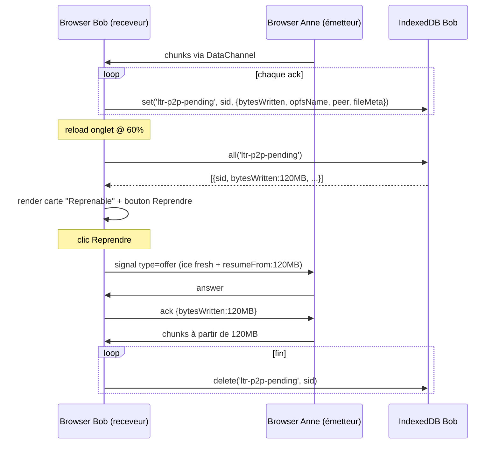
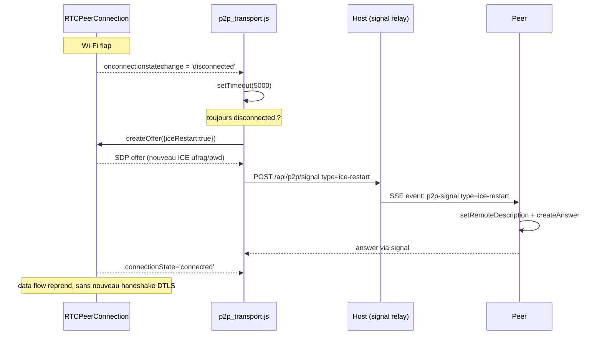
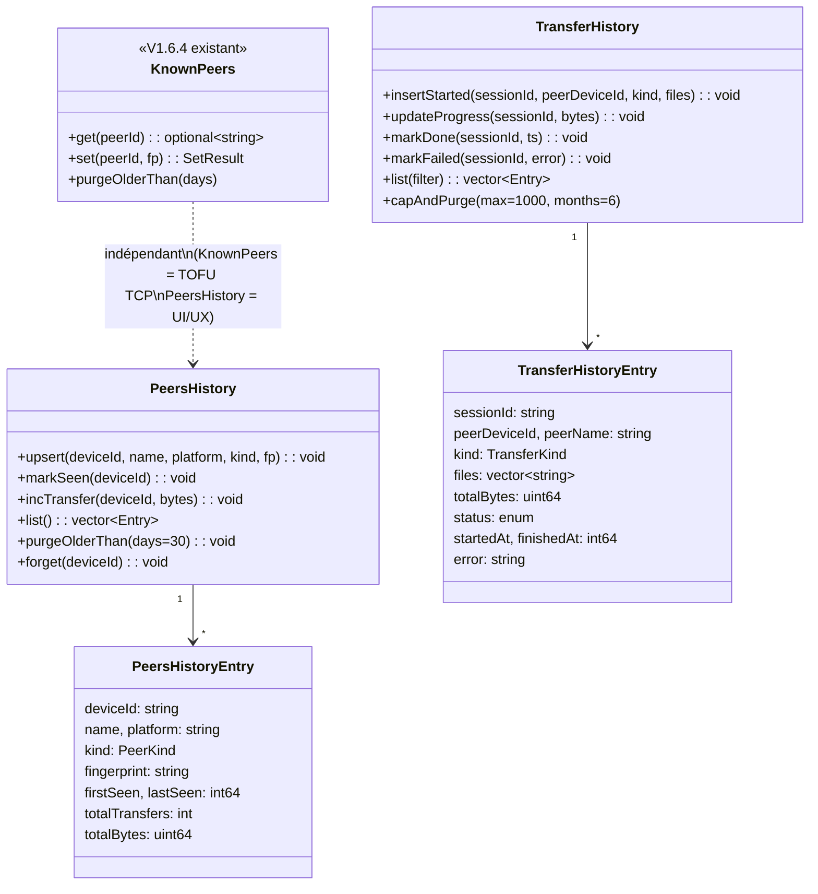

# Architecture — Sprint V1.6.5

**Nom :** Stabilité, sessions résilientes, historique (HTTP + P2P)
**Date :** 2026-05-03
**Statut :** En attente de validation utilisateur
**Pré-requis :** V1.6.4 (HTTPS LAN + cert_manager + crypto_identity + KnownPeers TOFU TCP)

---

## 1. Vue d'ensemble

### 1.1 Diff vs V1.6.4

| Domaine | V1.6.4 | V1.6.5 |
|---|---|---|
| Session web TTL | 30 s | 300 s + cookie persistent 30 j |
| Auth navigateur | PIN à chaque ouverture | Cookie `ltr_remember` HMAC + PIN chiffré WebCrypto |
| Upload HTTP | Stream multipart, pas de resume | Resume via field `resume` + sidecar `.resume.json` |
| Download HTTP | Stream complet uniquement | Range Request RFC 7233 + 206 Partial Content |
| Resume P2P | Aucun (handle OPFS perdu au reload) | IndexedDB `ltr-p2p-pending` + bouton "Reprendre" |
| iceRestart | Aucun | Auto si `connectionState='disconnected' > 5 s` |
| Historique host | Aucun | `peers_history.json` (30 j) + `transfer_history.json` (1000 entries / 6 mois) |
| TOFU P2P | Aucun (TOFU TCP only) | `ltr-p2p-known-peers` IndexedDB + toast warning |
| Bug 0 % HTTP | `TransferProgressEvent` au 1er chunk | `{0}` dès création ticket |
| Bug 0 % P2P | `phase='sending'` à `dc.onopen` | `phase='connecting'` à `pc.connectionState='connecting'` |
| `cancelFlags_` | Leak (jamais cleanup) | `cleanupCancelFlag(sid)` au close du provider |

### 1.2 Composants nouveaux

| Composant | Couche | Rôle |
|---|---|---|
| `infra::PeersHistory` | infra | Persiste pairs vus (deviceId, fingerprint, totalBytes, lastSeen) |
| `infra::TransferHistory` | infra | Persiste transferts (sessionId, kind, status, peer, files) |
| `web::TokenSigner` | web | HMAC SHA-256 signing/verify pour cookie `ltr_remember` |
| `assets/web/js/idb.js` | front | Wrapper minimal IndexedDB (get/set/delete/all) — natif, pas de dep |
| `assets/web/js/pin_storage.js` | front | WebCrypto AES-GCM + HKDF — chiffre/déchiffre PIN |
| `ui::screens::HistoryScreen` | ui | Vue Historique desktop (filtres, "Oublier ce pair") |

### 1.3 Composants modifiés

| Composant | Changements |
|---|---|
| `web::WebSessionStore` | + `makePersistentToken/verifyPersistentToken`, TTL 30s→300s |
| `web::WebService` | `pushFiles` émet `TransferProgressEvent{0}` dès création ticket ; `cleanupCancelFlag` au close ; injection fingerprint cert pour TokenSigner |
| `web::routes::upload_routes` | Field `resume` + sidecar `.upload-XXX.partial` + `.resume.json` |
| `web::routes::download_routes` | Header `Range:` → 206 + `Content-Range` |
| `web::routes::auth_routes` | `remember:true` → cookie `ltr_remember` ; nouveau `POST /api/auth/refresh` |
| `web::routes::logout_routes` | Efface `ltr_token` + `ltr_remember` |
| `web::routes::p2p_routes` | Whitelist `ice-restart` |
| `app::AppController` | Hooks PeersHistory/TransferHistory dans `onEvent` |
| `app::AppState` | `hiddenPeers` (offline mais < 30 j) |
| `ui::screens::main_screen` | Merge livePeers + hiddenPeers (grisés) |
| `ui::widgets::header` | Bouton "📋 Historique" |
| `assets/web/js/p2p_session.js` | Persist IndexedDB à chaque ack ; vérif fingerprint au receive offer |
| `assets/web/js/p2p_transport.js` | Watch `connectionState` + iceRestart |
| `assets/web/js/transfer_registry.js` | Boot scan IndexedDB + bouton "Reprendre" |
| `assets/web/js/login.js` | 2 checkboxes + WebCrypto chiffrement PIN |
| `assets/web/js/upload.js` | Retry 3× backoff exp + bouton "Reprendre" UI |
| `assets/web/js/common.js` | Hook 401 → tente `/api/auth/refresh` avant redirect /login |

---

## 2. Diagrammes Mermaid

### 2.1 Flow auth avec cookie `ltr_remember`

```mermaid
sequenceDiagram
    participant B as Browser
    participant S as WebService
    participant SS as WebSessionStore

    Note over B,S: Jour 1 — login
    B->>S: POST /api/auth { pin, remember:true, deviceId }
    S->>SS: authenticate(pin, expectedPin, deviceId)
    SS-->>S: token (32 hex)
    S->>SS: makePersistentToken(deviceId, sha256(pin), now+30j)
    SS-->>S: "deviceId.exp.HMAC"
    S-->>B: Set-Cookie: ltr_token=...; ltr_remember=...; Max-Age=30j

    Note over B,S: Jour 2 — re-ouverture
    B->>S: GET /api/inbox (cookies: ltr_token expiré, ltr_remember valide)
    S-->>B: 401
    B->>S: POST /api/auth/refresh (cookie ltr_remember)
    S->>SS: verifyPersistentToken(token, sha256(currentPin))
    SS-->>S: ok / pin-mismatch / expired
    alt ok
        S->>SS: createSessionFromRefresh(deviceId, ua)
        SS-->>S: nouveau ltr_token
        S-->>B: 200 + Set-Cookie ltr_token
        B->>S: retry GET /api/inbox
        S-->>B: 200
    else pin-mismatch / expired
        S-->>B: 401 (cleared cookie)
        B->>B: redirect /login
    end
```

### 2.2 Flow resume upload HTTP



### 2.3 Flow resume P2P receveur



### 2.4 Flow iceRestart



### 2.5 Class diagram historique



---

## 3. Contrat d'implémentation par vague

### Wave 1 — Stabilité critique (HTTP)

- [ ] `src/web/web_service.cpp::pushFiles` → après `TransferStartedEvent`, émettre `TransferProgressEvent{sessionId, 0, 0.0, 0s}` dès création des tickets (avant `zipAndAnnounce`)
- [ ] `assets/web/js/p2p_transport.js` → écouter `pc.onconnectionstatechange`, dispatcher `phase='connecting'` dès `'connecting'` (avant `dc.onopen`)
- [ ] `src/web/web_service.hpp` → ajouter `void cleanupCancelFlag(const std::string& sid)`
- [ ] `src/web/web_service.cpp` → impl : `lock_guard(cancelMu_); cancelFlags_.erase(sid)`
- [ ] `src/web/routes/download_routes.cpp::streamFile` + `streamZip` → appeler `svc.cleanupCancelFlag(sessionId)` dans le path `done`/`failed`/`cancelled`
- [ ] `src/web/routes/upload_routes.cpp` → field optionnel `resume` (offset bytes) parsé via `req.get_param_value`
- [ ] `src/web/routes/upload_routes.cpp` → si `resume>0` : ouvrir `.upload-{uploadId}.partial` en `std::ios::binary | std::ios::ate`, valider offset
- [ ] `src/web/routes/upload_routes.cpp` → écrire sidecar `.upload-{uploadId}.resume.json` `{totalBytes, sha256_partial_first_64KB, lastChunkAt}` à chaque flush 1 MB
- [ ] `src/web/routes/upload_routes.cpp` → endpoint `HEAD /api/upload?upload_id=X` retourne `{bytesWritten, sha256_first64KB}` ou 404
- [ ] `src/web/routes/upload_routes.cpp` → au succès : `rename .partial → final`, `remove .resume.json`
- [ ] `assets/web/js/upload.js` → wrap `fetch` dans retry 3× exp backoff (1 s, 2 s, 4 s) sur `TypeError`/`AbortError`
- [ ] `assets/web/js/upload.js` → bouton "Reprendre" si `failed{network}` détecté ; UI fait `HEAD /api/upload` puis renvoie depuis l'offset
- [ ] `src/web/routes/download_routes.cpp::streamFile` → parser `Range: bytes=N-M` (helper `parseRangeHeader`), ouvrir le stream à `seekg(N)`, set status 206, header `Content-Range: bytes N-M/total`, ajuster `Content-Length`
- [ ] `src/web/routes/download_routes.cpp::streamFile` → si Range invalide : 416 Range Not Satisfiable
- [ ] `tests/test_range_request.cpp` (nouveau) → unit test du parser Range
- [ ] `tests/test_resume_upload_sidecar.cpp` (nouveau) → roundtrip écrire/lire sidecar JSON

### Wave 2 — Resume P2P

- [ ] `assets/web/js/idb.js` (nouveau, ~80 lignes) → wrapper natif IndexedDB :
  - `idb.open(dbName, version, schema)` → Promise<DB>
  - `idb.set(store, key, value)`, `idb.get(store, key)`, `idb.delete(store, key)`, `idb.all(store)`
  - Pas de dépendance externe (CLAUDE.md)
- [ ] `assets/web/js/p2p_session.js::wireReceiverDc` → à chaque ack (déjà existant), `await idb.set('ltr-p2p-pending', sid, {sid, peerDeviceId, peerName, fileMeta, opfsHandleName, bytesWritten, ts})`
- [ ] `assets/web/js/p2p_session.js::finalizeReceivedFile` → `await idb.delete('ltr-p2p-pending', sid)` après écriture finale OPFS
- [ ] `assets/web/js/transfer_registry.js` → au boot, `await idb.all('ltr-p2p-pending')` ; pour chaque entry, render carte "Reprenable" + bouton "Reprendre"
- [ ] `assets/web/js/transfer_registry.js` → handler bouton : invoque `p2p_session.resumeReceiver(sid)` qui re-ouvre l'OPFS handle, recrée le PC, signal `offer{resumeFrom: bytesWritten}`
- [ ] `assets/web/js/p2p_transport.js` → bind `pc.onconnectionstatechange` ; si `'disconnected'`, démarrer `setTimeout(5000)` ; dans le timeout, si toujours `'disconnected'` : `pc.createOffer({iceRestart:true})` + signal `type=ice-restart`
- [ ] `assets/web/js/p2p_transport.js` → si `'connected'` avant les 5 s, `clearTimeout` (pas d'iceRestart inutile)
- [ ] `src/web/routes/p2p_routes.cpp::isValidSignalType` → ajouter `"ice-restart"` à la whitelist
- [ ] Pas de test unit C++ (logique 100 % JS) — smoke E2E uniquement

### Wave 3 — Sessions résilientes

- [ ] `include/ltr/core/types.hpp` → `kWebSessionTtl = 300s` (était 30 s) ; ajouter `constexpr auto kWebSessionRememberTtl = std::chrono::hours(24*30);`
- [ ] `include/ltr/web/web_session_store.hpp` → 4 nouvelles méthodes :
  ```cpp
  void setHmacSecret(std::string_view secret); // fingerprint cert hex
  std::string makePersistentToken(const std::string& deviceId,
                                  const std::string& pinHash,
                                  std::chrono::system_clock::time_point exp);
  enum class VerifyResult { Ok, Expired, BadHmac, PinMismatch, Malformed };
  VerifyResult verifyPersistentToken(const std::string& token,
                                      const std::string& currentPinHash,
                                      std::string& outDeviceId);
  ```
- [ ] `src/web/web_session_store.cpp` → impl HMAC-SHA-256 via picosha2 (déjà dispo) en mode HMAC : H((K xor opad) || H((K xor ipad) || msg)). Format token : `base64url(deviceId).base64url(expEpochSec).base64url(hmac32)`
- [ ] `src/web/web_session_store.cpp` → sha256 du PIN courant fait par appelant (pas dans le store : SoC)
- [ ] `src/web/web_service.cpp::start` → après `loadOrGenerate` cert, `sessions_.setHmacSecret(fingerprint_)`
- [ ] `src/web/routes/auth_routes.cpp::POST /api/auth` → si body contient `remember:true` : `auto pTok = sessions.makePersistentToken(deviceId, sha256(pin), now+30j); res.set_header("Set-Cookie", "ltr_remember="+pTok+"; Max-Age=2592000; HttpOnly; SameSite=Lax")`
- [ ] `src/web/routes/auth_routes.cpp` → nouveau `POST /api/auth/refresh` : lit cookie `ltr_remember`, parse `deviceId.exp.hmac`, appelle `verifyPersistentToken(token, sha256(currentExpectedPin), outDeviceId)`. Si Ok → `authenticate` interne (sans re-PIN) → set `ltr_token`. Si BadHmac/PinMismatch/Expired → 401 + clear cookie.
- [ ] `src/web/routes/logout_routes.cpp` → `Set-Cookie: ltr_token=; Max-Age=0` ET `ltr_remember=; Max-Age=0`
- [ ] `assets/web/html/login.html` → 2 `<input type="checkbox">` :
  - `#cb-remember` checked par défaut (Q3) — label "Se souvenir de cet appareil"
  - `#cb-store-pin` non-coché — label "Mémoriser le PIN sur cet appareil"
- [ ] `assets/web/js/login.js` → POST body inclut `remember: cbRemember.checked`
- [ ] `assets/web/js/pin_storage.js` (nouveau) :
  - `derivePinKey(fingerprintCert)` → HKDF-SHA-256 (salt fixe `'ltr-pin-v1'`) → AES-GCM key
  - `storePin(pin, fp)` → AES-GCM encrypt → localStorage `ltr-pin-encrypted`/`ltr-pin-iv`
  - `loadPin(fp)` → decrypt ; si fail (cert régénéré) → wipe + return null
- [ ] `assets/web/js/login.js` → si `cbStorePin.checked` après auth OK → `pinStorage.storePin(pin, fingerprintFromCertInfo)` ; au boot, si présent → pré-remplir input PIN
- [ ] `assets/web/js/common.js` → fetch wrapper : si réponse 401 sur route protégée → tenter `POST /api/auth/refresh` (1 fois, no-loop) ; si Ok → retry req originale ; sinon redirect /login
- [ ] `tests/test_persistent_token.cpp` (nouveau) :
  - roundtrip make → verify → Ok
  - tamper hmac → BadHmac
  - exp passé → Expired
  - pinHash différent → PinMismatch
  - token tronqué → Malformed

### Wave 4 — Historique

- [ ] `include/ltr/infra/peers_history.hpp` (nouveau, pattern KnownPeers) :
  ```cpp
  struct Entry {
      std::string deviceId, name, platform, fingerprint;
      domain::PeerKind kind;
      std::int64_t firstSeenSec, lastSeenSec;
      std::uint32_t totalTransfers;
      std::uint64_t totalBytes;
  };
  class PeersHistory {
  public:
      explicit PeersHistory(std::filesystem::path);
      void load(); void save() const;
      void upsert(const Entry& e);  // merge sur deviceId
      void markSeen(std::string_view deviceId);
      void incTransfer(std::string_view deviceId, std::uint64_t bytes);
      void purgeOlderThan(int days = 30);
      void forget(std::string_view deviceId);
      std::vector<Entry> list() const;
      std::optional<Entry> get(std::string_view deviceId) const;
  };
  ```
- [ ] `src/infra/peers_history.cpp` (nouveau) → JSON `cfgDir/peers_history.json`, mutex interne, save() à chaque mutation
- [ ] `include/ltr/infra/transfer_history.hpp` (nouveau) :
  ```cpp
  enum class TransferKind { TcpSend, TcpRecv, HttpUp, HttpDown, P2P };
  enum class Status { Started, Done, Failed, Cancelled };
  struct Entry {
      std::string sessionId, peerDeviceId, peerName, error;
      TransferKind kind; Status status;
      std::vector<std::string> files;
      std::uint64_t totalBytes;
      std::int64_t startedAt, finishedAt;
  };
  class TransferHistory {
  public:
      void insertStarted(...); void markDone(...); void markFailed(...);
      void capAndPurge(std::size_t max = 1000,
                       std::chrono::hours olderThan = std::chrono::hours(24*30*6));
      std::vector<Entry> list(/*filter*/) const;
  };
  ```
- [ ] `src/infra/transfer_history.cpp` (nouveau) → JSON `cfgDir/transfer_history.json`
- [ ] `src/app/app_controller.cpp` → instancie `peersHistory_` + `transferHistory_` au start
- [ ] `src/app/app_controller.cpp::onEvent` → hooks :
  - `PeerSeenEvent` → `peersHistory_.upsert(...)` + `markSeen`
  - `TransferStartedEvent` → `transferHistory_.insertStarted(...)`
  - `TransferProgressEvent` → throttle, update bytes
  - `TransferDoneEvent` → `markDone` + `peersHistory_.incTransfer`
  - `TransferFailedEvent` → `markFailed`
- [ ] `src/app/app_controller.cpp` → boot : `peersHistory_.purgeOlderThan(30)` ; `transferHistory_.capAndPurge(1000, 6 mois)`
- [ ] `include/ltr/app/app_state.hpp` → `std::vector<domain::Device> hiddenPeers; // offline mais < 30j`
- [ ] `src/app/app_controller.cpp` → calcul de `hiddenPeers` = `peersHistory_.list()` filtrés (`lastSeen < 30j` ET pas dans livePeers) ; rafraîchi à chaque PeerSeenEvent/PeerLostEvent
- [ ] `src/ui/screens/main_screen.cpp` → render livePeers (couleurs normales) + hiddenPeers (alpha 0.5, badge "offline")
- [ ] `include/ltr/ui/screens/history_screen.hpp` + `.cpp` (nouveau) → vue scrollable des transferts, filtres (kind, peer, date), bouton "Oublier ce pair"
- [ ] `include/ltr/ui/widgets/header.hpp` → bouton `RoundedRect` "📋 Historique" qui pousse `NavigateToHistoryEvent`
- [ ] `include/ltr/ui/ui_app.hpp` → handle event → switch vers HistoryScreen
- [ ] `assets/web/js/p2p_session.js::createOffer` payload → ajouter `selfDeviceId, selfFingerprintDtls (extraite via pc.getStats SCTP)`
- [ ] `assets/web/js/p2p_session.js::onOffer` → sur réception : lookup `idb.get('ltr-p2p-known-peers', remoteDeviceId)` ; si fp diff → toast warning, demander confirmation
- [ ] `tests/test_peers_history.cpp` (nouveau) → upsert idempotent, purge 30j, forget
- [ ] `tests/test_transfer_history.cpp` (nouveau) → cap 1000 (ring), purge 6 mois, status flow

---

## 4. Décisions architecturales

### 4.1 HMAC secret pour `ltr_remember`

**Décision : fingerprint cert HTTPS (recommandé).**

| Option | Pros | Cons |
|---|---|---|
| **A. Fingerprint cert HTTPS** | Déjà persisté (V1.6.4), stable cross-restart, régénéré uniquement si cert régénéré (= changement IP LAN) | Si cert tourné → tous remembers invalidés |
| B. Secret 32-byte dédié (`hmac_secret.bin`) | Indépendant du cert | 1 fichier de plus à gérer, vol du secret = forge |

→ **A** retenu : KISS, le coût "cert régénéré = re-PIN" est acceptable et rare (cert valide 397 j), et déjà documenté dans la spec métier §7.

### 4.2 PeersHistory vs TransferHistory : 2 classes séparées

**Décision : 2 classes séparées.**

- **Cohésion** : un pair existe indépendamment de ses transferts (ex: vu mais jamais transféré)
- **Cycle de vie différent** : pairs purgés à 30 j, transferts cap 1000 / 6 mois
- **Tests indépendants** : `test_peers_history` et `test_transfer_history` sans setup croisé
- **SoC** : update de pair quand `PeerSeenEvent`, transfert quand `TransferStarted/Done/Failed`
- Pattern identique à V1.6.4 (`KnownPeers` séparé du flux applicatif)

### 4.3 P2P logging côté host

**Décision : agrégation à `TransferDoneEvent`/`TransferFailedEvent` uniquement.**

Le host n'observe que les signals, pas les chunks (relayés en SSE, opaques). Logger par signal = verbosité énorme (offer/answer/N×ice/N×ice-restart) sans valeur diagnostic. On agrège donc :
- Pour P2P, `app_controller` insère dans `transfer_history` à `TransferStartedEvent` (signal `offer` reçu côté host depuis émetteur via SSE introspection) et finalise à `TransferDoneEvent` (browser fait `POST /api/p2p/transfer-done` — nouveau endpoint léger pour notifier le host, optionnel).

Note : si on veut éviter le nouveau endpoint, on peut se passer du tracking host des transferts P2P (le host ne stocke que TCP+HTTP, le browser stocke P2P en IndexedDB). **Décision retenue : pas de nouveau endpoint, P2P transfers ne sont pas dans `transfer_history.json`** (YAGNI). Le browser conserve sa vue locale via IndexedDB.

### 4.4 Race condition 2 onglets PIN remember

**Décision : pas de changement, déjà géré.**

Si l'utilisateur ouvre 2 onglets et coche "remember" dans les 2 :
1. Onglet A → POST /api/auth → token A, cookie remember A (HMAC sur deviceId A)
2. Onglet B (deviceId différent : localStorage par origin mais tab partage origin → **même deviceId**) → POST /api/auth → `WebSessionStore.authenticate` détecte `deviceId` déjà présent → invalide l'ancien token → token B, cookie remember B

→ Comportement conforme V1.1 (`removeByDeviceId` dans `authenticate`). Le 1er onglet recevra 401 sur prochaine req → tente `/api/auth/refresh` avec son ancien remember → HMAC ne match plus le **token courant** mais HMAC ne dépend pas du token courant ; il dépend de `deviceId + pinHash + exp` → **les 2 cookies remember sont valides**, et le serveur recrée juste une nouvelle session pour celui qui refresh en premier. Dédup `deviceId → token` continue de protéger l'unicité de la session active.

→ Documentation utilisateur : "Une seule session active par navigateur. Ouvrir l'app dans un 2e onglet déconnecte le 1er."

### 4.5 Migration sans casser V1.6.4

| Endpoint | V1.6.4 | V1.6.5 | Compat ? |
|---|---|---|---|
| `POST /api/auth` | `{pin, deviceId}` | `{pin, deviceId, remember?}` | Oui (champ optionnel) |
| `POST /api/auth/refresh` | n/a | nouveau | Non bloquant (ancien client n'appelle jamais) |
| `POST /api/upload` | multipart | + field `resume?` | Oui (champ optionnel) |
| `HEAD /api/upload` | n/a | nouveau | Non bloquant |
| `GET /api/download/:id` | stream complet | `Range:` opt → 206 | Oui (sans header → flow inchangé) |
| `POST /api/p2p/signal` | type `offer/answer/ice/refuse/cancel/bye` | + `ice-restart` | Oui (whitelist élargie) |
| Cookie `ltr_token` TTL | 30 s côté serveur | 300 s | Oui (heartbeat existant 10 s suffit pour 30 ou 300) |
| IndexedDB | n/a (juste OPFS) | `ltr-p2p-pending`, `ltr-p2p-known-peers` | Oui (Safari iOS sandboxed → fallback : pas de resume P2P, comportement V1.6.4 inchangé) |

---

## 5. Plan de migration sans casser V1.6.4

1. **Wave 1 indépendante** : déployable sans Wave 2/3/4 (tests E2E HTTP suffisent)
2. **Wave 2** : nécessite Wave 1 (cleanupCancelFlag déjà déployé) ; active iceRestart + IndexedDB
3. **Wave 3** : peut shipper indépendamment de Wave 2 (touche login/auth/cookies, pas P2P)
4. **Wave 4** : nécessite Waves 1-3 (consomme événements stabilisés)

**Détection runtime IndexedDB** : `if (!window.indexedDB) { /* warn + skip resume features */ }` → Safari privé / vieux UA → comportement V1.6.4 préservé.

**Fallback HMAC** : si `setHmacSecret` jamais appelé (ex: cert HTTPS off via flag) → `verifyPersistentToken` retourne `Malformed` → tous les remember refusés → re-login : pas de régression, juste pas de feature.

---

## 6. Fichiers à créer / modifier — Récapitulatif

### Nouveaux fichiers (12)
- `include/ltr/infra/peers_history.hpp` + `src/infra/peers_history.cpp`
- `include/ltr/infra/transfer_history.hpp` + `src/infra/transfer_history.cpp`
- `include/ltr/ui/screens/history_screen.hpp` + `src/ui/screens/history_screen.cpp`
- `assets/web/js/idb.js`
- `assets/web/js/pin_storage.js`
- `tests/test_range_request.cpp`
- `tests/test_resume_upload_sidecar.cpp`
- `tests/test_persistent_token.cpp`
- `tests/test_peers_history.cpp`
- `tests/test_transfer_history.cpp`

### Fichiers modifiés (~17)
- `include/ltr/core/types.hpp` (TTL constants)
- `include/ltr/web/web_session_store.hpp` + `.cpp`
- `include/ltr/web/web_service.hpp` + `src/web/web_service.cpp`
- `src/web/routes/upload_routes.cpp`
- `src/web/routes/download_routes.cpp`
- `src/web/routes/auth_routes.cpp`
- `src/web/routes/logout_routes.cpp`
- `src/web/routes/p2p_routes.cpp`
- `include/ltr/app/app_state.hpp` + `src/app/app_controller.cpp`
- `include/ltr/ui/widgets/header.hpp` + impl
- `src/ui/screens/main_screen.cpp` + `include/ltr/ui/ui_app.hpp`
- `assets/web/html/login.html`
- `assets/web/js/login.js`, `common.js`, `upload.js`
- `assets/web/js/p2p_session.js`, `p2p_transport.js`, `transfer_registry.js`
- `CMakeLists.txt` (nouveaux .cpp + tests)

---

## 7. Flag UI

UI_REQUIRED: true

Justification : touches multiples côté UI front et desktop —
- Login HTML : 2 nouvelles checkboxes
- Transfer registry : carte "Reprenable" + bouton Reprendre
- Upload UI : bouton Reprendre sur échec
- Toast warning TOFU P2P (fingerprint changé)
- Sidebar pairs : items grisés (offline < 30 j)
- Nouvel écran desktop "Historique" avec filtres
- Header : nouveau bouton "📋 Historique"

---

**Architecture validée par l'agent, en attente de validation utilisateur.**
