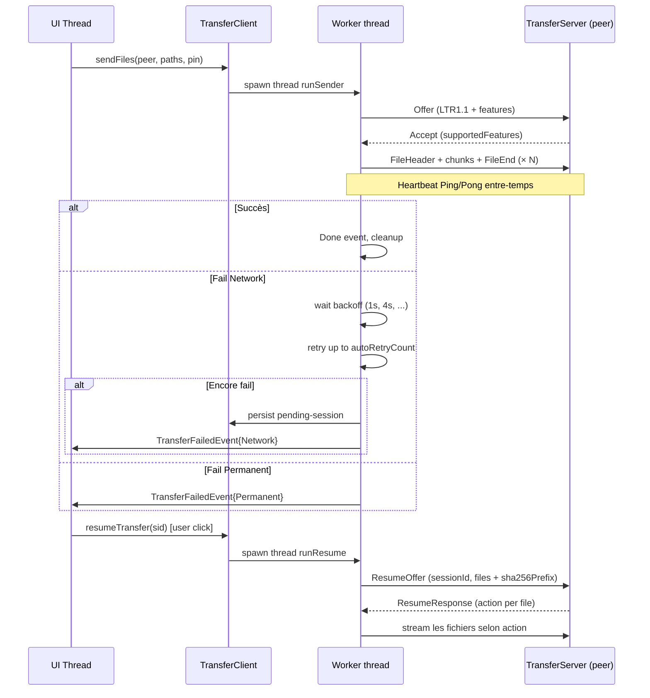
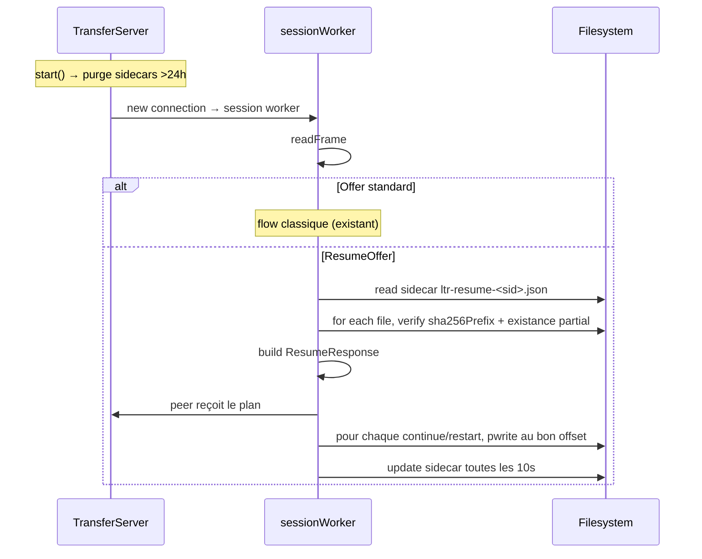

# Architecture — Sprint Transfer Resume

**Date :** 2026-04-24
**NEW_PROJECT :** false
**UI_REQUIRED :** true (mockups déjà dans ANALYSIS.md § 4.6 + ci-dessous §8)

---

## 1. Vue d'ensemble

Refonte du flow TCP LTR1 pour supporter :
1. Resume (sidecar receiver + pending-sessions sender)
2. Classification erreurs + auto-retry
3. Heartbeat Ping/Pong
4. Cross-restart
5. UI étendue (boutons + banner startup)

### Stratégie générale

- **Backward compat LTR1 legacy** : si l'un des 2 pairs ne sait pas
  parler LTR1.1, fallback sur Offer classique (restart complet).
  Négocié via un champ `"protocol": "LTR1.1"` dans le JSON Offer.
- **Sidecar = 1 par session globale** (pas par fichier) dans
  `downloadDir/` : `ltr-resume-<sessionId>.json`. Contient le state
  de TOUS les fichiers de la session (ceux déjà complets + celui en
  cours avec offset).
- **Sender persistance** : `pending-sessions.json` dans le config dir
  parent, loadé au startup.
- **Heartbeat via `sf::SocketSelector`** : pas de thread dédié, on
  intègre dans la main loop de runSender/sessionWorker avec timeout
  10 s, envoi Ping si aucune data depuis 10 s, fail si aucun
  Ping/Pong/data depuis 20 s.
- **Resume** = méthodes séparées `resumeSender` / `resumeSessionWorker`
  pour clarté du code.

### Fichiers à toucher

| Fichier | Action |
|---------|--------|
| `include/ltr/network/protocol.hpp` | +MessageType ResumeOffer/Response/Ping/Pong |
| `src/network/protocol.cpp` | Serialization / guards sur les nouveaux types |
| `include/ltr/core/event_bus.hpp` | +`ErrorCategory` enum, champ `category` dans `TransferFailedEvent` |
| `include/ltr/network/transfer_client.hpp` | +`resumeSession(sid, ...)`, WorkerCtx étendu |
| `src/network/transfer_client.cpp` | +runResume, heartbeat integration, auto-retry |
| `include/ltr/network/transfer_server.hpp` | +lookup sidecar, resume handler |
| `src/network/transfer_server.cpp` | +purge startup, resume path, heartbeat integration |
| `include/ltr/infra/resume_sidecar.hpp` | **NOUVEAU** — I/O sidecar + pending-sessions |
| `src/infra/resume_sidecar.cpp` | **NOUVEAU** |
| `include/ltr/infra/config.hpp` | +`autoRetryCount`, +`resumeSidecarTtlHours` |
| `src/infra/config.cpp` | Load/save des 2 nouveaux champs |
| `include/ltr/app/app_state.hpp` | +UiTransfer fields (sourcePaths, peerId, pinCode, resumable, retryAttempts, maxRetries, lastErrorCategory, crossRestart) + pendingRestartBanner |
| `include/ltr/app/app_controller.hpp` | +resumeTransfer(sid), resumeAllTransfers(), dismissPendingBanner() |
| `src/app/app_controller.cpp` | +impl, onEvent handle ErrorCategory, persist/load pending-sessions |
| `include/ltr/ui/screens/main_screen.hpp` | +drawPendingBanner helpers, resume button rects |
| `src/ui/screens/main_screen.cpp` | Boutons Reprendre par card + global + banner |
| `scripts/generate_icons.py` | +draw_refresh (icône « Reprendre ») |
| `assets/icons/refresh.png` | NOUVEAU (généré) |
| `include/ltr/ui/icon_library.hpp` | +`Id::Refresh` |
| `src/ui/icon_library.cpp` | +case Refresh |
| `CMakeLists.txt` | +`src/infra/resume_sidecar.cpp`, +embed `icon_refresh.png` |
| `tests/test_resume_sidecar.cpp` | NOUVEAU — tests unitaires I/O sidecar |
| `tests/CMakeLists.txt` | +resume_sidecar |
| `docs-agents/NETWORK.md` | NOUVEAU — flow resume + protocol + limitations |

---

## 2. Protocole LTR1.1

### 2.1 Nouveaux MessageType

```cpp
enum class MessageType : std::uint8_t {
    // existant
    Offer       = 0x01,
    Accept      = 0x02,
    Reject      = 0x03,
    FileHeader  = 0x04,
    FileChunk   = 0x05,
    FileEnd     = 0x06,
    Done        = 0x07,
    Cancel      = 0x08,
    Error       = 0x09,
    // V1.1.9 — Sprint Transfer Resume
    ResumeOffer    = 0x0A,
    ResumeResponse = 0x0B,
    Ping           = 0x0C,
    Pong           = 0x0D,
};
```

### 2.2 Offer — extension backward-compat

L'`Offer` gagne 2 champs optionnels :

```json
{
  "protocol": "LTR1.1",
  "features": ["resume", "heartbeat"],
  "sessionId": "abc123...",
  "senderId": "uuid",
  "senderName": "Mac de Serge",
  "pinCode": "472931",
  "files": [...]
}
```

Si `"protocol"` absent → pair legacy LTR1 → flow classique inchangé.
Le field `"features"` est une liste extensible pour V2+.

### 2.3 Accept — extension

```json
{
  "protocol": "LTR1.1",
  "supportedFeatures": ["resume", "heartbeat"]
}
```

Si le receveur répond avec LTR1.1 et n'inclut pas `"resume"` dans
`supportedFeatures` → le sender désactive le resume pour cette session
(mais heartbeat reste possible).

### 2.4 ResumeOffer (C→S)

Identique à `Offer` + :

```json
{
  "protocol": "LTR1.1",
  "resume": true,
  "sessionId": "<même qu'avant>",
  "files": [
    {
      "relativePath": "MyFolder/sub/photo.jpg",
      "size": 5242880,
      "sha256Prefix": "<hash des 4 Ko début>"
    },
    ...
  ]
}
```

`sha256Prefix` : 4 premiers Ko du source → permet de détecter si le
source a été modifié entre le fail et le resume.

### 2.5 ResumeResponse (S→C)

```json
{
  "files": [
    { "relativePath": "a.txt", "action": "skip",     "skipBytes": 0 },
    { "relativePath": "b.bin", "action": "continue", "skipBytes": 3221225472 },
    { "relativePath": "c.jpg", "action": "restart",  "skipBytes": 0 }
  ]
}
```

Actions :
- `skip` : fichier déjà complet côté receveur → sender skippe
- `continue` : fichier partial → sender fseek(skipBytes) et stream la suite
- `restart` : source modifié OU sidecar incohérent → sender recommence à 0

### 2.6 Ping / Pong

Payload : `{"ts": <ms_since_epoch>}`. Envoyé toutes les 10 s pendant
les phases longues (streaming FileChunk). Timeout 20 s sans Pong → fail
`ErrorCategory::Network`.

---

## 3. Format sidecar receiver

Fichier : `downloadDir/ltr-resume-<sessionId>.json` (**1 par session
globale**, cohérent avec décision Q2=A).

```json
{
  "sessionId": "abc123...",
  "senderDeviceId": "uuid-sender",
  "senderName": "Mac de Serge",
  "createdAt": "2026-04-24T10:00:00Z",
  "lastUpdateAt": "2026-04-24T10:05:30Z",
  "files": [
    {
      "relativePath": "MyFolder/a.txt",
      "status": "done",
      "expectedSize": 1024,
      "bytesReceived": 1024,
      "sha256Prefix": "abcd..."
    },
    {
      "relativePath": "MyFolder/b.bin",
      "status": "partial",
      "expectedSize": 5242880,
      "bytesReceived": 3221225472,
      "sha256Prefix": "1234...",
      "partialPath": "MyFolder/b.bin.part"
    }
  ]
}
```

Écrit :
- Au démarrage de la session (state vide)
- À chaque `FileEnd` réussi (status="done" pour ce fichier)
- Toutes les ~10 s pendant streaming (bytesReceived mis à jour, throttlé)
- Sur toute erreur (pas sur Cancel explicite qui supprime le sidecar)

Lu au démarrage de `TransferServer::start` (purge sidecars >24 h) et
sur chaque `ResumeOffer` pour répondre avec le bon plan.

---

## 4. Format pending-sessions.json sender

Fichier : `<configDir>/pending-sessions.json` (à côté de `config.json`).

```json
[
  {
    "sessionId": "abc123",
    "peerId": "uuid-peer",
    "peerName": "MacBook Pro",
    "peerIp": "192.168.1.3",
    "peerTcpPort": 45455,
    "pinCode": "472931",
    "sourcePaths": ["/Users/me/MyFolder", "/Users/me/photo.jpg"],
    "totalBytes": 5242880000,
    "bytesTransferred": 3221225472,
    "retryAttempts": 0,
    "lastErrorCategory": "network",
    "createdAt": "2026-04-24T10:00:00Z"
  }
]
```

Écrit :
- À chaque fail Network/Protocol (ajout si pas déjà présent, update si
  existe)

Supprimé :
- Sur TransferDone complet de la session
- Sur click user « Ignorer »
- Sur resumeAll succès

Lu : au `AppController::start` après `cfg_.loadOrCreate`. Les entrées
restaurent des `UiTransfer{status:Failed, resumable:true,
crossRestart:true}` dans `state_.transfers`. Banner startup s'affiche
tant que `state.transfers` contient ≥1 `crossRestart==true`.

---

## 5. Classification erreurs

```cpp
// core/event_bus.hpp
enum class ErrorCategory : std::uint8_t {
    Unknown   = 0,
    Network   = 1,   // disconnect, timeout, ping/pong miss → resumable + auto-retry
    Protocol  = 2,   // frame invalide, crc mismatch → resumable + retry 1x
    Permanent = 3,   // disk full, perm denied, sidecar corrupted → pas de resume
    Cancelled = 4,   // user cancel → pas de resume
};

struct TransferFailedEvent {
    std::string sessionId;
    std::string reason;
    ErrorCategory category{ErrorCategory::Unknown};  // V1.1.9
};
```

### Table des politiques

| Catégorie | Auto-retry silencieux | resumable | Card UI |
|-----------|------------------------|-----------|---------|
| Network | `cfg.autoRetryCount`× (backoff 1s, 4s, 16s, cap 5) | ✅ | [Reprendre] [Ignorer] |
| Protocol | 1× | ✅ | [Reprendre] [Ignorer] |
| Permanent | — | ❌ | [Ignorer] + raison |
| Cancelled | — | ❌ | [Ignorer] |
| Unknown | — | ✅ (safe default) | [Reprendre] [Ignorer] |

---

## 6. Heartbeat via sf::SocketSelector

Approche : intégrer dans les loops `runSender` et `sessionWorker` sans
thread dédié. Utiliser `sf::SocketSelector::wait(timeout)` pour poller
avec un timeout de 1 s, vérifier les échéances Ping/Pong à chaque
itération.

```cpp
// Pseudocode intégration heartbeat (client et server)
sf::SocketSelector selector;
selector.add(sock);

auto lastActivity = steady_clock::now();
auto lastPingSent = steady_clock::now();
constexpr auto kPingInterval = seconds(10);
constexpr auto kPingTimeout  = seconds(20);

while (!done && !cancel) {
    const bool ready = selector.wait(milliseconds(1000));
    const auto now = steady_clock::now();

    if (now - lastActivity > kPingTimeout) {
        // pair silencieux → network timeout
        bus_.post(TransferFailedEvent{sid, "heartbeat_timeout",
                                       ErrorCategory::Network});
        return;
    }

    if (ready) {
        // ... lire une frame, si c'est un Ping répondre Pong, si Pong
        // ignorer, sinon traiter normalement
        lastActivity = now;
    }

    if (now - lastPingSent >= kPingInterval) {
        writeFrame(sock, MessageType::Ping, payloadTs);
        lastPingSent = now;
    }
}
```

Implication : le code existant de `runSender` qui fait des
`readFrame(sock, ...)` bloquants doit être refactorisé pour utiliser
`selector.wait(1000ms)` puis `readFrame` non-bloquant seulement si
ready, ou rester bloquant mais avec un timeout par socket. SFML
`sf::TcpSocket` en blocking mode attend indéfiniment, donc il faut
passer en non-blocking + selector.

---

## 7. Config — nouveaux champs

```cpp
struct Config {
    // existant
    // ...
    bool sharePanelCollapsed{false};  // UX-4

    // V1.1.9 — Sprint Transfer Resume
    int autoRetryCount{2};          // nombre de tentatives silencieuses Network
    int resumeSidecarTtlHours{24};  // purge sidecars plus vieux
};
```

JSON load/save avec `j.value(...)` + defaults → rétro-compat config
legacy.

---

## 8. UI

### 8.1 Card Failed resumable

```
┌────────────────────────────────────────────────────┐
│ ↑  MacBook Pro      [🔄 Reprendre]   [Ignorer]    │
│    ✗ Coupure réseau · 3.2 Go / 5 Go (64 %)         │
│ ███████████████████████████░░░░░░░░░░░░░           │
└────────────────────────────────────────────────────┘
```

- Bouton « Reprendre » : variant Primary accent, icône refresh.png 14×14
  à gauche du texte
- Bouton « Ignorer » : variant Secondary, supprime la card sans RPC
  cleanup (sidecar receiver expire à 24 h)
- Texte ligne 2 : `"✗ <raison lisible> · <bytesDone> / <total> (XX %)"`
  avec raison traduite depuis `ErrorCategory`

### 8.2 Header TRANSFERTS avec bouton global

```
TRANSFERTS · 5  [🔄 Reprendre tout (3)]       [◀] [▶]
```

- Bouton « Reprendre tout » visible si ≥1 card resumable (texte inclut
  le count « (3) »)
- Clic : `controller_.resumeAllTransfers()` → séquentiel 1 par 1 (Q1=A)
- Position : entre le label TRANSFERTS et les flèches scroll

### 8.3 Sous-statut « Reconnexion… »

Pendant un auto-retry, la card reste `InProgress` mais avec un texte
modifié ligne 2 :

```
┌────────────────────────────────────────────────────┐
│ ↑  MacBook Pro                                     │
│    ⟳ Reconnexion 1/2… · 3.2 Go / 5 Go (64 %)       │
│ ███████████████████████████░░░░░░░░░░░░░           │
└────────────────────────────────────────────────────┘
```

Couleur texte ligne 2 : `Colors::warning`.

### 8.4 Banner startup (Q3=C)

Si au démarrage `pending-sessions.json` contient ≥1 entrée :

```
╔═══════════════════════════════════════════════════════════════════╗
║ ⓘ  3 transferts en attente · [Reprendre tout] [Ignorer]           ║
╚═══════════════════════════════════════════════════════════════════╝
```

Position : sous le header principal (juste avant la sidebar + centre +
share), 44 px de haut, fond `accentLight`, border bottom `accent`.
Disparaît après clic sur l'un des 2 boutons OU quand `state.transfers`
ne contient plus d'entrée `crossRestart==true`.

### 8.5 AppState extension

```cpp
struct AppState {
    // existant
    // ...

    // V1.1.9 — Sprint Transfer Resume
    bool pendingRestartBannerVisible{false};
};

struct UiTransfer {
    // existant
    std::chrono::steady_clock::time_point terminalAt{};  // UX-2

    // V1.1.9
    std::vector<std::filesystem::path> sourcePaths;
    std::string   peerId;
    std::string   pinCode;
    bool          resumable{false};
    int           retryAttempts{0};
    int           maxRetries{0};
    std::string   lastErrorCategory;  // "network" / "protocol" / ...
    bool          crossRestart{false};
};
```

---

## 9. Architecture des workers

### 9.1 TransferClient — workflow



### 9.2 TransferServer — workflow



---

## 10. CONTRAT D'IMPLÉMENTATION

### Fichiers à créer
- [ ] `include/ltr/infra/resume_sidecar.hpp` + `src/infra/resume_sidecar.cpp`
- [ ] `assets/icons/refresh.png` (16×16) via scripts/generate_icons.py
- [ ] `tests/test_resume_sidecar.cpp`
- [ ] `docs-agents/NETWORK.md`

### Fichiers à modifier
- [ ] `include/ltr/network/protocol.hpp` — 4 nouveaux MessageType
- [ ] `src/network/protocol.cpp` — rien à changer (encodeFrame est agnostique)
- [ ] `include/ltr/core/event_bus.hpp` — `ErrorCategory` enum + champ dans `TransferFailedEvent`
- [ ] `include/ltr/network/transfer_client.hpp` — `resumeSession(sid)`, WorkerCtx étendu
- [ ] `src/network/transfer_client.cpp` — runSender refactor (heartbeat+retry+persist) + runResume
- [ ] `include/ltr/network/transfer_server.hpp` — resume path
- [ ] `src/network/transfer_server.cpp` — purge startup + sidecar write + resume negotiation
- [ ] `include/ltr/infra/config.hpp` — +2 champs
- [ ] `src/infra/config.cpp` — load/save
- [ ] `include/ltr/app/app_state.hpp` — UiTransfer extensions + pendingRestartBannerVisible
- [ ] `include/ltr/app/app_controller.hpp` — +resumeTransfer, resumeAllTransfers, dismissPendingBanner
- [ ] `src/app/app_controller.cpp` — onEvent handle ErrorCategory + auto-retry + persist/load + banner logic
- [ ] `include/ltr/ui/screens/main_screen.hpp` — helpers banner + resume buttons
- [ ] `src/ui/screens/main_screen.cpp` — drawBanner, boutons Reprendre (card + global), sous-statut Reconnexion
- [ ] `scripts/generate_icons.py` — +draw_refresh
- [ ] `include/ltr/ui/icon_library.hpp` — +Id::Refresh
- [ ] `src/ui/icon_library.cpp` — +case Refresh
- [ ] `CMakeLists.txt` — +resume_sidecar.cpp + embed icon_refresh.png
- [ ] `tests/CMakeLists.txt` — +test_resume_sidecar
- [ ] `tests/test_download_ticket.cpp` — aucune modif (isolé)

### Fichiers inchangés (contrôle)
- Toute la couche `ltr::web` (streaming zip, cancel flag, sessions, etc.)
- Couche UI hors main_screen (widgets individuels)
- Tests V1.1.8 existants (doivent tous passer)

---

## 11. Tests

### Tests unitaires nouveaux
- `test_resume_sidecar.cpp` :
  - write → read roundtrip
  - parse JSON corrompu → exception, delete fichier
  - purgeOlderThan(ttl) supprime les > 24 h
  - missing partial file → action=restart

### Tests existants à adapter
- `test_http_smoke` : aucun changement (couche web)
- `test_protocol` : vérifier que les 4 nouveaux MessageType
  round-trippent correctement via encodeFrame/readFrame
- `test_web_session_store` + `test_web_session_dedup` : aucun changement
- `test_streaming_zip` + `test_download_ticket` : aucun changement

### Smoke tests manuels
- Wi-Fi coupé 3 s au milieu d'un envoi 5 Go → auto-retry transparent
- Wi-Fi coupé >60 s → 2 retries + Failed + bouton Reprendre
- App killée (kill -9) → redémarrage → banner + clic Reprendre tout
- Source file renommé entre fail et resume → restart silencieux
- Peer legacy LTR1 (autre build sans LTR1.1) → fallback Offer classique

---

## 12. Risques architecturaux

| Risque | Atténuation |
|--------|-------------|
| Refactor lourd de runSender | Approche progressive : d'abord heartbeat intégré, puis resume séparé dans runResume |
| Sidecar I/O concurrency (write while read) | Mutex dans resume_sidecar.cpp, atomic write via fichier .tmp + rename |
| Auto-retry loop infini sur bug | Cap hard à 5 tentatives quoi qu'il arrive, logs détaillés |
| Cross-restart avec peer IP changée (DHCP) | Au resume, si connect fail → afficher « Pair introuvable » + garder le pending pour prochain essai |
| Banner au startup affiché trop tôt | Afficher après `controller_.start()` + load pending, donc après splash/init |

---

UI_REQUIRED: true — mockups ci-dessus § 8 complets, pas besoin de `/agent-uiux` séparé.
