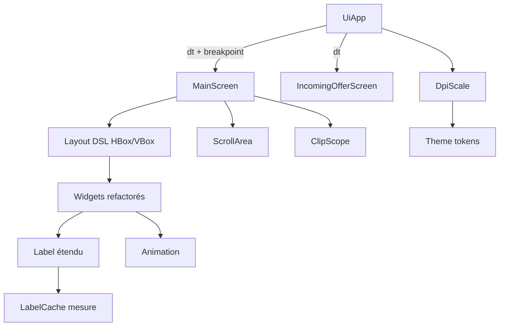

# Architecture — Sprint UI Layout System

**Date :** 2026-04-26
**NEW_PROJECT :** false
**UI_REQUIRED :** true (mockups Compact/Regular/Large + drawer dans
ui-proposal.md)

---

## 1. Vue d'ensemble

Refonte complète de la couche d'affichage SFML. 7 nouveaux modules + 4
extensions de modules existants + refactor screens/widgets.



### Fichiers à créer

| Fichier | Rôle |
|---------|------|
| `include/ltr/ui/layout.hpp` + `src/ui/layout.cpp` | Mini-DSL HBox/VBox |
| `include/ltr/ui/clip_scope.hpp` + `src/ui/clip_scope.cpp` | RAII sf::View |
| `include/ltr/ui/widgets/scroll_area.hpp` + `.cpp` | Widget scroll réutilisable |
| `include/ltr/ui/breakpoint.hpp` + `src/ui/breakpoint.cpp` | Breakpoint enum + helpers |
| `include/ltr/ui/animation.hpp` + `src/ui/animation.cpp` | Helper d'animation |
| `include/ltr/ui/dpi.hpp` + `src/ui/dpi.cpp` | Détection + helpers DPI |
| `include/ltr/ui/label_cache.hpp` + `src/ui/label_cache.cpp` | Cache de mesure Label |

### Fichiers à modifier

| Fichier | Action |
|---------|--------|
| `include/ltr/ui/widgets/label.hpp` + `.cpp` | +maxWidth/ellipsis/alignment + bind cache |
| `include/ltr/ui/theme.hpp` + `.cpp` | Tokens passent par DpiScale |
| `include/ltr/ui/ui_app.hpp` + `.cpp` | Détection DPI au start, breakpoint propagé |
| `include/ltr/ui/screens/main_screen.hpp` + `.cpp` | Refactor complet via Layout DSL + ScrollArea + ClipScope + drawer Compact |
| `include/ltr/ui/screens/incoming_offer_screen.hpp` + `.cpp` | Refactor modale inbox via Layout + ScrollArea |
| `src/ui/widgets/file_row.cpp` | Refactor via HBox |
| `src/ui/widgets/device_list_item.cpp` | Refactor via HBox |
| `src/ui/widgets/share_panel.cpp` | Refactor via VBox |
| `src/ui/widgets/dropdown_menu.cpp` | Refactor via VBox |
| `CMakeLists.txt` | +7 nouveaux .cpp |
| `tests/CMakeLists.txt` + nouveaux tests | Tests Label ellipsis, ScrollArea, Layout |
| `docs-agents/UI_GUIDELINES.md` | Tutoriel layout + animations |

---

## 2. Lot 1 — `Label` étendu + cache de mesure

### API étendue

```cpp
class Label {
public:
    enum class Alignment { Left, Center, Right };

    // existant
    Label& setText(const std::string& s);
    Label& setSize(unsigned pts);
    Label& setColor(sf::Color);
    Label& setBold(bool);
    Label& setPosition(float x, float y);

    // V2 — Sprint UI Layout System
    Label& setMaxWidth(float w);                 // 0 = pas de contrainte
    Label& setEllipsis(bool on);                 // default true si maxWidth>0
    Label& setAlignment(Alignment a);            // default Left
    Label& setBounds(const sf::FloatRect& r);    // raccourci : maxWidth + position selon alignement

    // Mesure : sans contrainte (pour layout) OU avec contrainte
    sf::Vector2f measure() const;                // taille naturelle
    sf::Vector2f measureClamped() const;         // après ellipsis

    void draw(sf::RenderTarget&) const;
};
```

### Algorithme ellipsis

```cpp
std::string Label::renderText() const {
    if (maxWidth_ <= 0 || !ellipsis_) return text_;

    const auto natural = measure();
    if (natural.x <= maxWidth_) return text_;

    // Binary search sur la longueur du substring + " …"
    constexpr std::string kEllipsis = "\xE2\x80\xA6";  // U+2026 …
    const auto ellipsisW = measureRaw(kEllipsis).x;
    int lo = 0, hi = text_.size();
    while (lo < hi) {
        int mid = (lo + hi + 1) / 2;
        const auto truncated = text_.substr(0, mid);
        const auto w = measureRaw(truncated).x + ellipsisW;
        if (w <= maxWidth_) lo = mid;
        else hi = mid - 1;
    }
    return text_.substr(0, lo) + kEllipsis;
}
```

### Cache de mesure

```cpp
// label_cache.hpp
namespace ltr::ui {

struct LabelKey {
    std::string text;
    unsigned size;
    bool bold;
    bool operator==(const LabelKey&) const = default;
};

struct LabelKeyHash {
    std::size_t operator()(const LabelKey& k) const noexcept {
        return std::hash<std::string>{}(k.text)
             ^ (std::hash<unsigned>{}(k.size) << 1)
             ^ (std::hash<bool>{}(k.bold) << 2);
    }
};

class LabelCache {
public:
    static sf::Vector2f get(const LabelKey& key);
    static void clear(); // appelé sur changement DPI

private:
    static std::unordered_map<LabelKey, sf::Vector2f, LabelKeyHash> cache_;
};

} // namespace ltr::ui
```

Cache lazy-populated. Première mesure d'une combinaison → calcul SFML +
insertion. Suivantes → lookup O(1). Cache vidé au changement de DPI.

---

## 3. Lot 2 — `ClipScope` RAII

### API

```cpp
// clip_scope.hpp
namespace ltr::ui {

// RAII : à la construction, push une sf::View qui clip le rendu au
// rect spécifié. À la destruction, restore la view précédente.
//
// Usage :
//   {
//     ClipScope clip(target, sidebarRect_);
//     drawSidebar(target);  // tout dessin ici est clippé à sidebarRect_
//   }
//   // view restaurée
class ClipScope {
public:
    ClipScope(sf::RenderTarget& target, const sf::FloatRect& rect);
    ~ClipScope();

    ClipScope(const ClipScope&) = delete;
    ClipScope& operator=(const ClipScope&) = delete;

private:
    sf::RenderTarget& target_;
    sf::View          previousView_;
};

} // namespace ltr::ui
```

### Implémentation

```cpp
ClipScope::ClipScope(sf::RenderTarget& target, const sf::FloatRect& rect)
    : target_(target), previousView_(target.getView()) {
    sf::View clipped(rect);
    // Viewport en coordonnées normalisées 0-1 sur la fenêtre.
    const auto size = target.getSize();
    sf::FloatRect viewport(
        rect.left / static_cast<float>(size.x),
        rect.top  / static_cast<float>(size.y),
        rect.width  / static_cast<float>(size.x),
        rect.height / static_cast<float>(size.y));
    clipped.setViewport(viewport);
    target_.setView(clipped);
}

ClipScope::~ClipScope() {
    target_.setView(previousView_);
}
```

---

## 4. Lot 3 — `ScrollArea` unifié

### API

```cpp
// scroll_area.hpp
namespace ltr::ui {

class ScrollArea {
public:
    enum class Direction { Vertical, Horizontal, Both };

    ScrollArea() = default;
    ScrollArea& setBounds(const sf::FloatRect& r);
    ScrollArea& setDirection(Direction d);
    ScrollArea& setContentSize(float w, float h);  // taille virtuelle totale
    ScrollArea& showScrollbar(bool b);              // default true

    bool handleEvent(const sf::Event& e);  // return true si consommé
    void draw(sf::RenderTarget& t) const;  // dessine la scrollbar uniquement

    // Position actuelle de scroll (en pixels).
    float scrollX() const { return scrollX_; }
    float scrollY() const { return scrollY_; }

    // Helper : itère sur les items qui sont visibles dans le viewport.
    // `itemPos(i) → sf::FloatRect` calcule la position de l'item i en
    // coordonnées contenu virtuel. La fonction `fn(i, posInViewport)`
    // est appelée pour chaque item visible avec sa position translatée.
    template<typename ItemPosFn, typename DrawFn>
    void forEachVisible(std::size_t count, ItemPosFn itemPos, DrawFn fn) const {
        for (std::size_t i = 0; i < count; ++i) {
            const auto r = itemPos(i);
            // r en coords contenu. Translate via scrollX_/scrollY_.
            sf::FloatRect screen = r;
            screen.left -= scrollX_;
            screen.top  -= scrollY_;
            screen.left += bounds_.left;
            screen.top  += bounds_.top;
            // Skip si entièrement hors viewport
            if (screen.left + screen.width  < bounds_.left)            continue;
            if (screen.top  + screen.height < bounds_.top)             continue;
            if (screen.left > bounds_.left + bounds_.width)            break;
            if (screen.top  > bounds_.top  + bounds_.height)           break;
            fn(i, screen);
        }
    }

private:
    void clampScroll();

    sf::FloatRect bounds_{};
    Direction     dir_{Direction::Vertical};
    float         contentW_{0.f}, contentH_{0.f};
    float         scrollX_{0.f}, scrollY_{0.f};
    bool          showScrollbar_{true};

    // Drag scrollbar
    bool          dragging_{false};
    float         dragStartMouse_{0.f};
    float         dragStartScroll_{0.f};
};

} // namespace ltr::ui
```

### Refactorings induits

3 scrolls existants → 1 widget réutilisable :

| Source | Action |
|--------|--------|
| `MainScreen::filesScrollY_` + `filesContentHeight_` | → `ScrollArea filesScroll_` (Direction::Vertical) |
| `MainScreen::transfersScrollX_` + `transfersContentW_` | → `ScrollArea transfersScroll_` (Direction::Horizontal) |
| `IncomingOfferScreen` modal scroll (hardcoded max 5) | → `ScrollArea inboxScroll_` (Direction::Vertical) |

**Ajout** : `MainScreen::peersScroll_` (Direction::Vertical) pour la
sidebar APPAREILS scrollable (>7 pairs OK).

---

## 5. Lot 4 — Breakpoints + DPI

### Breakpoint

```cpp
// breakpoint.hpp
enum class Breakpoint { Compact, Regular, Large };

// Détection synchrone selon la largeur de la fenêtre.
Breakpoint detectBreakpoint(unsigned widthPx);

// Constantes des seuils.
constexpr unsigned kCompactMaxPx = 800;
constexpr unsigned kRegularMaxPx = 1300;

// Largeurs sidebar/sharePanel selon breakpoint.
struct LayoutMetrics {
    float sidebarW;
    float sharePanelExpandedW;
};
LayoutMetrics metricsFor(Breakpoint bp);
```

### DPI

```cpp
// dpi.hpp
class DpiScale {
public:
    static void detect(const sf::Window& win);
    static float scale() { return scale_; }
    static unsigned scaled(unsigned pts) { return static_cast<unsigned>(pts * scale_); }
    static float    scaled(float pts) { return pts * scale_; }
private:
    static float scale_;
};
```

Détection via :
- macOS : `[NSScreen mainScreen].backingScaleFactor` (Retina = 2.0)
- Windows : `GetDpiForWindow(hwnd) / 96`
- Linux : `Xft.dpi` ou fallback 1.0
- Fallback générique : `sf::VideoMode::getDesktopMode().width / window.getSize().x` ratio

Tokens Theme passent par `DpiScale::scaled()` :

```cpp
namespace Spacing {
    inline float xs() { return DpiScale::scaled(4.f); }
    inline float sm() { return DpiScale::scaled(8.f); }
    // ...
}
```

(Ou alternative : un facteur global `scale_` multiplié à chaque usage,
moins invasif. À discuter dans le dev.)

### Propagation breakpoint

```
UiApp::onResize(w, h)
  → DpiScale::detect(window_)        // re-check si écran a changé
  → Breakpoint bp = detectBreakpoint(w)
  → main_->setBreakpoint(bp)
  → offer_->setBreakpoint(bp)
  → main_->setViewSize({w, h})       // déclenche rebuildLayout
```

---

## 6. Lot 5 — Layout DSL HBox/VBox

### Choix d'implémentation : composition fluide + arrange explicite

Approche **fluent builder** chaînable, terminée par `.layout(parentRect)` :

```cpp
// layout.hpp
namespace ltr::ui {

struct LayoutChild {
    sf::FloatRect bounds;     // calculé par layout()
    bool          fixed{false};
    float         fixedSize{0.f};
    int           weight{1};   // pour expanded
    std::function<void(sf::RenderTarget&, const sf::FloatRect&)> draw;
    std::function<void(const sf::Event&, const sf::FloatRect&)>  handle;
};

class Box {
public:
    enum class Direction { Horizontal, Vertical };

    Box& spacing(float s) { spacing_ = s; return *this; }
    Box& padding(float p) { paddingAll_ = p; return *this; }
    Box& padding(float h, float v) { paddingH_ = h; paddingV_ = v; return *this; }

    // Ajoute un enfant. La taille fixée OU le poids détermine sa largeur/hauteur.
    Box& fixed(float size, std::function<void(sf::RenderTarget&,
                                                const sf::FloatRect&)> draw);
    Box& expanded(int weight, std::function<void(sf::RenderTarget&,
                                                  const sf::FloatRect&)> draw);

    // Calcule la layout et appelle les `draw` dans l'ordre.
    void layout(const sf::FloatRect& parent, sf::RenderTarget& target);

    // Variante qui retourne les bounds calculés (sans dessiner) — utile
    // pour stocker les rects et les utiliser dans handleEvent ensuite.
    std::vector<sf::FloatRect> computeBounds(const sf::FloatRect& parent) const;

protected:
    Direction direction_;
    float spacing_{0.f};
    float paddingAll_{0.f};
    float paddingH_{-1.f}, paddingV_{-1.f};  // -1 = use paddingAll
    std::vector<LayoutChild> children_;
};

class HBox : public Box {
public:
    HBox() { direction_ = Direction::Horizontal; }
};

class VBox : public Box {
public:
    VBox() { direction_ = Direction::Vertical; }
};

} // namespace ltr::ui
```

### Algorithme `layout()`

```cpp
void Box::layout(const sf::FloatRect& parent, sf::RenderTarget& target) {
    const float ph = paddingH_ >= 0 ? paddingH_ : paddingAll_;
    const float pv = paddingV_ >= 0 ? paddingV_ : paddingAll_;

    sf::FloatRect inner{
        parent.left + ph,
        parent.top  + pv,
        parent.width  - 2 * ph,
        parent.height - 2 * pv
    };

    // 1. Calculer la taille des enfants fixés
    float fixedTotal = 0.f;
    int weightTotal = 0;
    for (const auto& c : children_) {
        if (c.fixed) fixedTotal += c.fixedSize;
        else         weightTotal += c.weight;
    }

    // 2. Espace restant pour les expanded
    const bool isH = (direction_ == Direction::Horizontal);
    const float available = (isH ? inner.width : inner.height)
                           - fixedTotal
                           - spacing_ * std::max<int>(0, children_.size() - 1);
    const float perWeight = (weightTotal > 0)
                            ? std::max(0.f, available / weightTotal)
                            : 0.f;

    // 3. Placer chaque enfant
    float cursor = isH ? inner.left : inner.top;
    for (auto& c : children_) {
        const float size = c.fixed ? c.fixedSize : (perWeight * c.weight);
        c.bounds = isH
            ? sf::FloatRect{cursor, inner.top, size, inner.height}
            : sf::FloatRect{inner.left, cursor, inner.width, size};
        if (c.draw) c.draw(target, c.bounds);
        cursor += size + spacing_;
    }
}
```

### Exemple d'usage (refactor `FileRow`)

```cpp
void FileRow::draw(sf::RenderTarget& target) const {
    HBox{}
        .padding(Spacing::md)
        .spacing(Spacing::sm)
        .fixed(20.f, [this](auto& t, const auto& r) {
            // checkbox 20×20
            drawCheckbox(t, r);
        })
        .fixed(kind_ == Kind::Folder ? 20.f : 0.f, [this](auto& t, const auto& r) {
            if (kind_ == Kind::Folder) drawFolderIcon(t, r);
        })
        .expanded(1, [this](auto& t, const auto& r) {
            // nom + sous-titre dans un VBox
            VBox{}
                .fixed(18.f, [this](auto& t, const auto& r) {
                    Label{}.setText(name_).setBounds(r)
                          .setMaxWidth(r.width).setEllipsis(true).draw(t);
                })
                .fixed(14.f, [this](auto& t, const auto& r) {
                    if (kind_ == Kind::Folder) {
                        Label{}.setText(formatFileCount()).setBounds(r).draw(t);
                    }
                })
                .layout(r, t);
        })
        .fixed(60.f, [this](auto& t, const auto& r) {
            Label{}.setText(formatBytes(size_)).setBounds(r)
                  .setAlignment(Label::Alignment::Right).draw(t);
        })
        .fixed(22.f, [this](auto& t, const auto& r) {
            if (cb_) drawCloseButton(t, r);
        })
        .layout(bounds_, target);
}
```

Plus de magic numbers de positions. Resize → relayout auto.

---

## 7. Bonus — Animations

```cpp
// animation.hpp
namespace ltr::ui {

class Animation {
public:
    enum class Easing { Linear, EaseOut, EaseInOut };

    Animation() = default;
    void start(float from, float to, float durationSec, Easing e = Easing::EaseOut);
    void update(float dt);  // accumulate elapsed, clamp
    bool finished() const { return elapsed_ >= duration_; }
    float value() const;    // interpolated current

private:
    float from_{0.f}, to_{0.f};
    float duration_{0.f}, elapsed_{0.f};
    Easing easing_{Easing::EaseOut};
};

} // namespace ltr::ui
```

Usage : chaque card UiTransfer / WebInboxEntry gagne un `fadeAnim_`.
Lors de la création → `start(0, 1, 0.2s)`. Lors de la suppression →
`start(1, 0, 0.2s)`, on attend `finished()` avant de réellement
retirer du vector.

---

## 8. Compact mode — drawer hamburger

```
┌──────────────────────────────────────┐
│ ☰ LocalTransfer    [3] [Mac de S.]   │  ← header avec ☰ à gauche
├──────────────────────────────────────┤
│ Drawer fermé : centre seul prend     │
│ toute la largeur                     │
│                                       │
│ [Centre — fichiers à envoyer]        │
│                                       │
└──────────────────────────────────────┘
                Toggle ☰ ↓
┌──────────────────────────────────────┐
│ ☰ LocalTransfer    [3] [Mac de S.]   │
├──────────┬───────────────────────────┤
│ Sidebar  │                           │
│ APPAREILS│ [Centre rétréci]          │
│  · Mac   │                           │
│  · iPhone│                           │
│          │                           │
└──────────┴───────────────────────────┘
```

Toggle bouton ☰ dans header → `state_.compactSidebarOpen = !state_.compactSidebarOpen`.
`MainScreen::rebuildLayout` détecte le breakpoint + le flag, ajuste les
rects.

---

## 9. CONTRAT D'IMPLÉMENTATION

### Vagues de livraison

**Wave 1 — Foundation** (estimé 2-3 j IA)
- [ ] `Label` étendu (maxWidth, ellipsis, alignment, setBounds, measureClamped)
- [ ] `LabelCache` (cache mesure)
- [ ] `ClipScope` RAII
- [ ] `Layout` DSL (Box / HBox / VBox)
- [ ] `Animation` helper
- [ ] `Breakpoint` enum + helpers
- [ ] `DpiScale` détection
- [ ] Tests unitaires : `test_label_ellipsis`, `test_layout_box`,
  `test_breakpoint`
- [ ] CMakeLists ajouts
- [ ] Build propre + 9 anciens tests + 3 nouveaux tests passent

**Wave 2 — Core widgets refactor** (1-2 j IA)
- [ ] `FileRow` refactoré sur HBox
- [ ] `DeviceListItem` refactoré sur HBox
- [ ] `SharePanel` refactoré sur VBox (les 2 modes : expanded + collapsed)
- [ ] `DropdownMenu` refactoré sur VBox
- [ ] Build propre, smoke tests visuels

**Wave 3 — Screens refactor** (3-4 j IA)
- [ ] `MainScreen` :
  - Nouveau `ScrollArea peersScroll_` (sidebar)
  - `filesScroll_` migré sur ScrollArea
  - `transfersScroll_` migré sur ScrollArea
  - `ClipScope` autour de chaque zone (header, sidebar, center, share, bottom)
  - Breakpoint detection + drawer Compact
  - Bouton ☰ dans header
  - Refactor `drawHeader/drawSidebar/drawCenter/drawTransferBar` via HBox/VBox
- [ ] `IncomingOfferScreen` :
  - Mode inbox refactoré sur ScrollArea (>5 demandes scrollable)
  - `ClipScope` autour de la modale
  - Refactor via VBox

**Wave 4 — Polish** (1-2 j IA)
- [ ] Animations fade-in/out sur cards transfer + inbox entries
- [ ] Slide animation drawer Compact
- [ ] DPI scaling appliqué globalement (Theme tokens)
- [ ] Audit final score ≥60
- [ ] Doc UI_GUIDELINES.md complétée
- [ ] PROGRESS.md mis à jour

### Fichiers inchangés (contrôle)
- Couche `ltr::core`, `ltr::network`, `ltr::infra`, `ltr::web`,
  `ltr::app` : aucun impact
- `IconLibrary`, `RoundedRect`, `Card`, `Button`, `ProgressBar`,
  `QrCodeView`, `TextInput` : API publique inchangée (peut bénéficier
  des nouveaux primitives en interne)

---

UI_REQUIRED: true (mockups Compact/Regular/Large + drawer dans
ui-proposal.md à venir)
