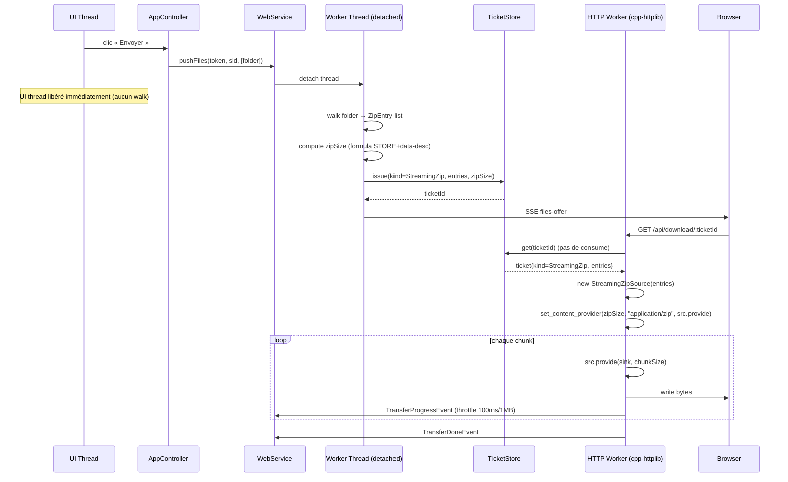

# Architecture — V1.1.8 ZIP streamé desktop → web

**Date :** 2026-04-24
**NEW_PROJECT :** false
**UI_REQUIRED :** false

---

## 1. Vue d'ensemble

Migration du flow « zip temp sur disque → ticket → stream du fichier » vers
« snapshot fichiers → ticket streaming → zip généré à la volée dans la
réponse HTTP ».

### Diff par rapport à V1.1.7

| Composant | V1.1.7 (actuel) | V1.1.8 (cible) |
|-----------|-----------------|----------------|
| Zip dossier | `folder_zipper::zipDirectoryToFile()` → fichier temp | Supprimé |
| `DownloadTicket` | 1 mode (File) + flag isTemp | 2 modes (File, StreamingZip) + snapshot entries |
| `DownloadTicketStore::consume` | get + delete | get (pas de delete — rejouable pendant TTL) |
| `download_routes` | `set_content_provider` sur ifstream | dispatch sur ticket.kind |
| Nouveau composant | — | `StreamingZipSource` (state machine zip STORE) |
| Walk dossier | Thread UI (dans `addFiles`) puis thread zip | Thread worker uniquement (aucun I/O dossier sur UI) |

---

## 2. Flow d'un envoi dossier



---

## 3. Format ZIP retenu : STORE + data descriptor

**Objectif : streamer sans lire les fichiers 2× (pas de CRC32 pré-calculé).**

- Mode STORE (`compression method = 0`) : zéro compression, zéro état
  interne à maintenir entre chunks
- Bit 3 du general purpose bit flag activé → CRC32 et sizes sont à 0 dans
  le local file header, puis écrits après les data dans un **data descriptor**

### Layout par entrée (N fichiers)

```
[Local File Header]        30 octets + filename
[File Data]                file_size octets (STORE)
[Data Descriptor]          16 octets (signature 4 + CRC32 4 + comp 4 + uncomp 4)
...
[Central Directory Entry]  46 octets + filename (par entrée)
[End of Central Directory] 22 octets
```

### Content-Length exact

```
zipSize = Σ(30 + nameLen + fileSize + 16 + 46 + nameLen) + 22
        = Σ(92 + 2·nameLen + fileSize) + 22
```

Le test unitaire `test_streaming_zip.cpp` vérifie cette formule octet-exact
sur un jeu de 2 fichiers (1 Ko + 2 Ko).

### CRC32

Utiliser `mz_crc32()` de miniz (déjà linké). Calcul incrémental par chunk
dans `StreamingZipSource`, émis dans le data descriptor à la fin de chaque
entrée.

---

## 4. Contrats de classes

### 4.1 DownloadTicket (modifié)

```cpp
enum class TicketKind { File, StreamingZip };

struct ZipEntry {
    std::filesystem::path abs;   // path absolu sur le host
    std::string relInZip;        // ex: "monDossier/sub/photo.jpg"
    std::uint64_t size;
};

struct DownloadTicket {
    std::string id;
    std::string sessionToken;
    std::string sessionId;
    TicketKind  kind{TicketKind::File};

    // kind == File
    std::filesystem::path path;

    // kind == StreamingZip
    std::vector<ZipEntry> zipEntries;

    std::string displayName;
    std::uint64_t size{0};                                // total HTTP body
    std::chrono::steady_clock::time_point expiresAt{};
    // isTemp supprimé (plus de fichier temp)
};
```

### 4.2 DownloadTicketStore (modifié)

```cpp
class DownloadTicketStore {
public:
    // Issue kind File
    std::string issue(sessionToken, sessionId, path, displayName, size);

    // NOUVEAU — Issue kind StreamingZip
    std::string issueStreamingZip(sessionToken, sessionId,
                                  std::vector<ZipEntry> entries,
                                  displayName, zipSize);

    // Renommé : consume → get (pas de suppression, ticket rejouable)
    std::optional<DownloadTicket> get(const std::string& ticketId);

    std::vector<DownloadTicket> evictExpired();        // inchangé
    std::optional<DownloadTicket> peek(ticketId) const;// inchangé
};
```

### 4.3 StreamingZipSource (NOUVEAU)

```cpp
// Générateur zip incrémental utilisé par la route download.
// Appelé chunk par chunk depuis le worker cpp-httplib.
// Thread-ownership : un seul thread HTTP worker à la fois.
class StreamingZipSource {
public:
    explicit StreamingZipSource(std::vector<ZipEntry> entries);

    // Rempli `sink` d'au plus `maxBytes` octets. Return :
    //   true  = encore du contenu à fournir
    //   false = terminé (sink.done() appelé OU erreur)
    // Interne : state machine (Header → Data → DataDescriptor → … → CD → EOCD)
    bool provide(httplib::DataSink& sink, std::size_t maxBytes);

    std::uint64_t bytesWritten() const { return written_; }
    bool errored() const { return errored_; }
    const std::string& errorMsg() const { return errorMsg_; }

private:
    enum class Phase { LocalHeader, Data, DataDescriptor,
                       CentralDir, Eocd, Done };

    std::vector<ZipEntry> entries_;
    std::size_t curEntry_{0};
    Phase       phase_{Phase::LocalHeader};
    std::ifstream curFile_;
    std::uint32_t curCrc_{0};
    std::uint64_t curRead_{0};

    // pour central dir : mémorise l'offset où chaque local header a commencé
    std::vector<std::uint64_t> localOffsets_;
    std::vector<std::uint32_t> crcs_;

    std::uint64_t written_{0};
    std::size_t   cdWriteCursor_{0};
    std::string   cdBuffer_;              // central dir précomputé en fin de flux

    bool        errored_{false};
    std::string errorMsg_;
};
```

### 4.4 WebService::zipAndAnnounce (modifié)

```cpp
// V1.1.8 : plus d'écriture disque. Build la liste ZipEntry et issue
// un ticket streaming-zip.
void zipAndAnnounce(sessionToken, sessionId, files);
// Logique :
//   pour chaque file dans files :
//     si is_directory :
//       walk récursif → list<ZipEntry>{abs, "dossier/sub/...", size}
//       compute zipSize via formule
//       issueStreamingZip(...)
//     sinon :
//       issue File classique
//   broadcaster_.send(SSE files-offer)
```

### 4.5 download_routes (modifié)

```cpp
// V1.1.8 : dispatch sur ticket.kind.
server.Get(R"(/api/download/([0-9a-f]{32}))", [&](req, res){
    // ... auth + ticket lookup via get() (pas consume) ...

    if (tkt.kind == TicketKind::File) {
        streamFile(tkt, res);          // code V1.1.7 conservé
    } else {
        streamZip(tkt, res);           // nouveau
    }
});
```

---

## 5. Suppression (bonus)

- `src/web/folder_zipper.cpp` → supprimer
- `include/ltr/web/folder_zipper.hpp` → supprimer
- `CMakeLists.txt` : retirer `src/web/folder_zipper.cpp` de `ltr_core`
- `DownloadTicket::isTemp` → supprimer (plus de fichier temp)
- Cleanup des `*isTempCopy, *tempPath` dans `download_routes.cpp`

---

## 6. Thread-safety

| Thread | Accès autorisé | Interdit |
|--------|----------------|----------|
| UI (main) | `pushFiles()` (détache immédiatement) | Walk dossier, file_size en loop |
| Worker ZipAndAnnounce | `tickets_.issue*`, `broadcaster_.send`, `bus_.post` | AppState |
| HTTP worker (download) | `tickets_.get/peek`, `bus_.post` (throttle) | AppState, autre socket |
| StreamingZipSource | ses membres + ifstream local | partagé multi-thread (1 seul worker par GET) |

Nota : avec Q3=B (ticket rejouable), **2 GET parallèles** sur le même
ticket sont possibles (user clique 2× par erreur). Chaque GET aura sa
**propre** instance `StreamingZipSource` → aucune contention, juste I/O
disque 2× en parallèle. Acceptable.

---

## 7. Throttle progress desktop

Dans le worker HTTP de download :

```cpp
if (now - lastProgressTime >= 100ms || sent - lastProgressBytes >= 1 MB) {
    bus_.post(TransferProgressEvent{sid, sent, speed, eta});
    lastProgressTime  = now;
    lastProgressBytes = sent;
}
```

Pas de changement côté AppController (reçoit les events comme avant).

---

## 8. Gestion d'erreurs

| Cas | Détection | Action |
|-----|-----------|--------|
| Fichier source disparu au moment du GET | `ifstream.open` échoue | `source.errored = true` → provider retourne `false` → cpp-httplib ferme → `TransferFailedEvent{"source_error"}` |
| Fichier raccourci en cours de lecture | `read` renvoie moins que prévu | Idem |
| Visiteur ferme l'onglet | `sink.write` renvoie `false` | `TransferFailedEvent{"cancelled"}` |
| Ticket expiré | `tickets_.get` → nullopt | 404 `{"error":"no_ticket"}` |

**Tous les events `TransferFailed`/`TransferDone` sont émis une seule fois**
(flag `doneEmitted` partagé via shared_ptr, comme V1.1.7).

---

## 9. CONTRAT D'IMPLÉMENTATION

### Fichiers à créer
- [ ] `include/ltr/web/streaming_zip_source.hpp`
- [ ] `src/web/streaming_zip_source.cpp`
- [ ] `tests/test_streaming_zip.cpp`

### Fichiers à modifier
- [ ] `include/ltr/web/download_ticket.hpp` — ajout `TicketKind`, `ZipEntry`, `zipEntries`, `kind` ; suppression `isTemp`
- [ ] `include/ltr/web/download_ticket_store.hpp` — ajout `issueStreamingZip`, renommage `consume` → `get` (sans delete)
- [ ] `src/web/download_ticket_store.cpp` — impl
- [ ] `src/web/web_service.cpp::zipAndAnnounce` — utilise `issueStreamingZip` + suppression usage `zipDirectoryToFile`
- [ ] `include/ltr/web/web_service.hpp` — rien à changer
- [ ] `src/web/routes/download_routes.cpp` — dispatch sur `kind`, nouveau `streamZip`
- [ ] `CMakeLists.txt` — retirer `folder_zipper.cpp`, ajouter `streaming_zip_source.cpp` + test
- [ ] `tests/CMakeLists.txt` — ajouter `test_streaming_zip`
- [ ] `docs-agents/WEB.md` — section V1.1.8
- [ ] `.ai-outputs/docs/web-interface.html` — changelog V1.1.8

### Fichiers à supprimer
- [ ] `include/ltr/web/folder_zipper.hpp`
- [ ] `src/web/folder_zipper.cpp`

### Tests à ajouter
- [ ] `test_streaming_zip` :
  1. Créer 2 fichiers temp (1 Ko texte + 2 Ko binaire random)
  2. Build `std::vector<ZipEntry>`
  3. Calculer `expectedSize` via la formule
  4. Instancier `StreamingZipSource`, pull tous les octets dans un `std::string buffer`
  5. `assert(buffer.size() == expectedSize)`
  6. Écrire buffer dans un fichier, ouvrir avec `mz_zip_reader_init_file`, vérifier 2 entrées, extraire, comparer content + CRC

---

UI_REQUIRED: false
