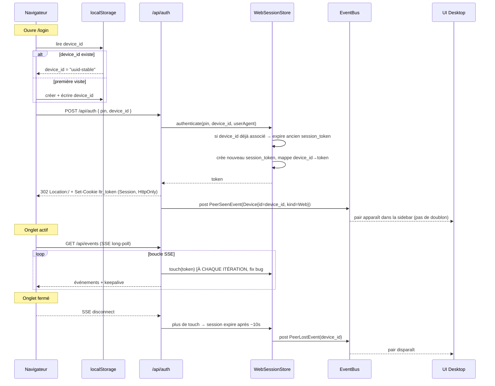
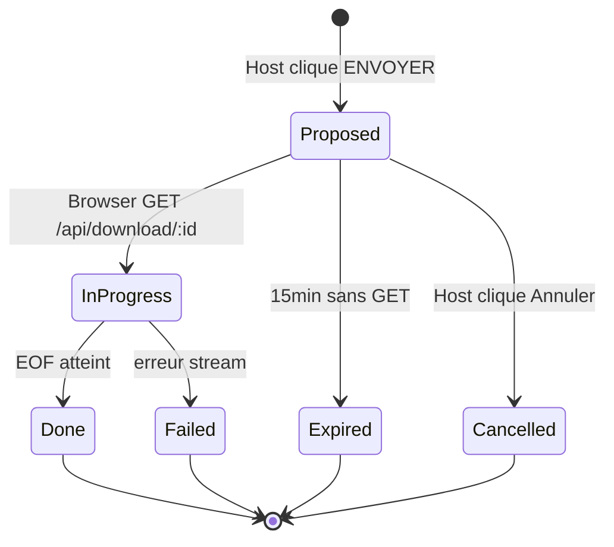
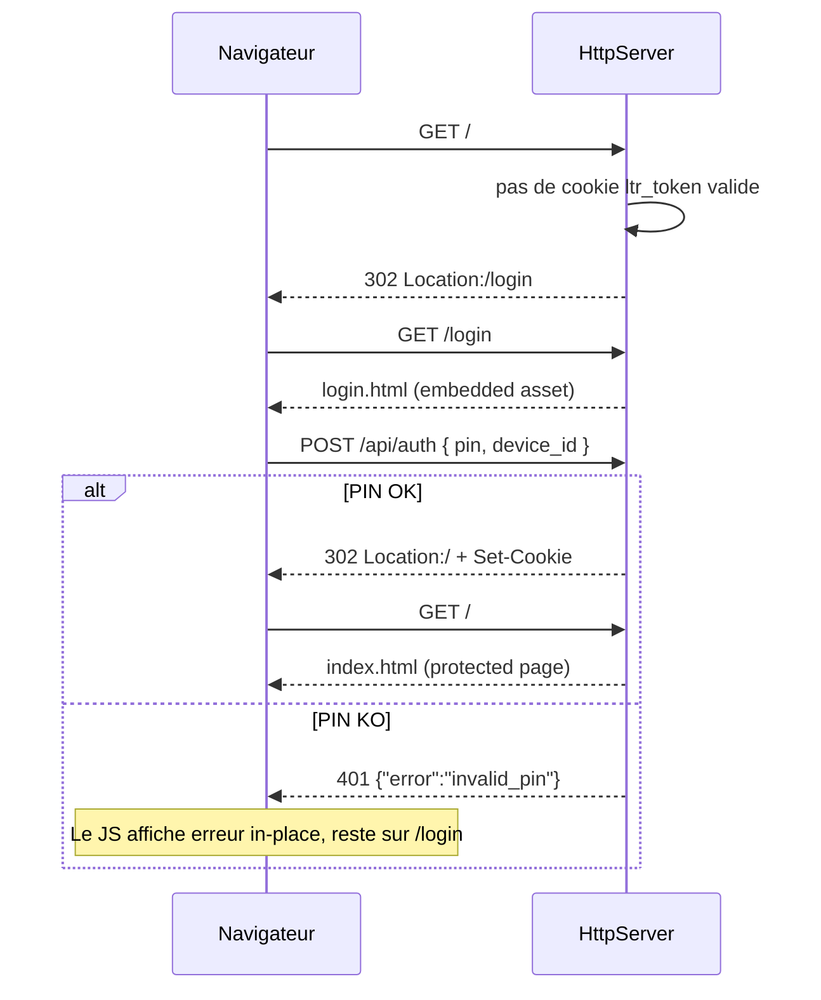
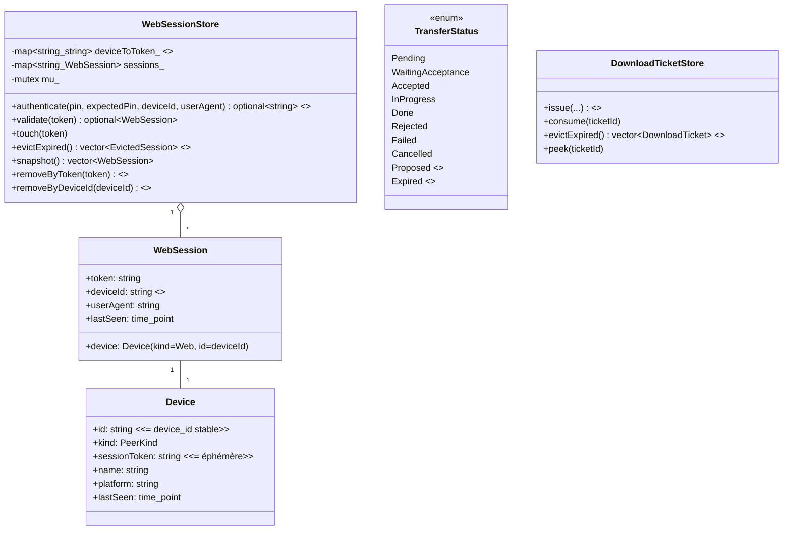

# 🏗️ Architecture — web-interface V1.1

> **Feature** : web-interface-v1-1
> **Spec métier** : [./business-spec.md](./business-spec.md)
> **Statut** : proposée (en attente validation utilisateur)
> **Date** : 2026-04-22
> **Nature** : correctif + repensée du mécanisme session/device, pas d'ajout de lib

---

## 1. Vue d'ensemble — diff par rapport à V1

### 1.1 Concepts repensés

| Concept | V1 (cassé) | V1.1 (corrigé) |
|---|---|---|
| Identité du pair web | `Device.id = session_token` → dupliqué à chaque re-auth | `Device.id = device_id` (stable, localStorage) ; `sessionToken` séparé |
| Cycle de vie session | 30s d'inactivité → evict | Touche à chaque itération SSE → reste alive tant que l'onglet est ouvert |
| Cookie | Non spécifié (persistent par défaut ?) | Cookie **de session** (expire à la fermeture d'onglet) |
| Statut transfert desktop → web | Passe directement à `InProgress` dès l'émission, bloqué à 0 % | Nouveau `Proposed` → `InProgress` (au 1er byte streamé) → `Done`/`Expired`/`Cancelled` |
| Expiration ticket | 5 min, silencieuse | 15 min, émet `TransferFailedEvent{reason="expired"}` |
| Téléchargement web | Stream + éventuel JSON 401 dans le stream → fichier pollué | JS `fetch()` + `blob` ; si 401 → redirect `/login` côté navigateur |
| Upload mobile | `<input hidden>` + label → casse iOS Safari | Bouton explicite « Choisir des fichiers » qui appelle `input.click()` + input CSS offscreen |
| Auth UI | Un seul `index.html` avec états togglés | 2 pages : `/login` dédié + `/` protégée (redirect 302 si pas de cookie) |
| PIN saisie | Auto-submit à 6 cases remplies | Aucun auto-submit, clic explicite |
| Sélection fichiers desktop | Tous envoyés, tous restent | Checkbox par FileRow, auto-clean des envoyés |

### 1.2 Fichiers touchés (synthèse)

**11 fichiers MODIFIÉS**, **4 fichiers AJOUTÉS**, 0 supprimé.

---

## 2. Architecture des changements

### 2.1 Cycle de vie session web (corrigé)



### 2.2 Statut des transferts desktop → web (corrigé)



### 2.3 Flow d'auth en 2 pages



---

## 3. Diagramme de classes — changements



---

## 4. Structure des fichiers

### 4.1 Fichiers à AJOUTER (4)

| Fichier | Rôle |
|---|---|
| `assets/web/login.html` | Page dédiée au formulaire PIN |
| `assets/web/login.js` | Logique JS du formulaire (saisie, submit sur clic, redirect après OK) |
| `assets/web/login.css` | Styles spécifiques login (ou réutilise style.css commun) |
| `include/ltr/web/routes/logout_routes.hpp` + `src/web/routes/logout_routes.cpp` | POST /api/logout + handler |

### 4.2 Fichiers à MODIFIER (principaux)

| Fichier | Nature du changement |
|---|---|
| `assets/web/index.html` | Ne contient plus que la page principale (plus d'état auth) ; ajout header + bouton « Se déconnecter » |
| `assets/web/app.js` | Supprimer gestion auth ; ajouter gestion logout ; `fetch+blob` pour download ; `input.click()` explicite + bouton Choisir ; détection 401 → redirect `/login` |
| `assets/web/style.css` | Responsive mobile affiné + styles du bouton logout + bouton « Choisir fichiers » |
| `include/ltr/web/web_session_store.hpp` | Ajouter `std::map<deviceId, token> deviceToToken_`, signature `authenticate(pin, expected, deviceId, ua)`, `removeByDeviceId` |
| `src/web/web_session_store.cpp` | Implémenter dédup via device_id (invalider ancien token si même device_id se ré-authentifie) |
| `include/ltr/web/web_session.hpp` | Ajouter `deviceId` |
| `src/web/routes/auth_routes.cpp` | Lire `device_id` du body ; si absent, générer côté serveur et retourner dans JSON de réponse ; renvoyer 302 Location:/ au lieu de 200 |
| `src/web/routes/events_routes.cpp` | **BUG FIX CRITIQUE #4** : `touch(token)` à chaque itération, pas seulement dans le `else` |
| `src/web/routes/download_routes.cpp` | Conserver 401 JSON (mais le JS va l'intercepter), émettre `TransferStartedEvent` au premier byte streamé (pas avant), gérer `Cancelled` |
| `src/web/web_service.cpp::pushFiles` | Émettre `TransferStartedEvent` avec statut `Proposed` (NOUVEAU) au lieu de `InProgress` ; aussi émettre SSE |
| `src/web/web_service.cpp::keepaliveLoop` | Ne plus pousser de ping via broadcaster (ça bloquait le touch SSE) ; ne garder que l'éviction sessions/tickets |
| `src/web/download_ticket_store.cpp::evictExpired` | Retourner la liste des tickets expirés pour que l'appelant émette `TransferFailedEvent{reason="expired"}` |
| `src/web/routes/static_routes.cpp` | Ajouter `/login` → login.html ; guard sur `/` → redirect 302 `/login` si pas de cookie valide ; servir `/login.js` |
| `src/web/routes/route_registrar.cpp` | Enregistrer `registerLogout` |
| `include/ltr/domain/transfer_status.hpp` | Ajouter `Proposed` et `Expired` |
| `include/ltr/app/app_state.hpp` | Remplacer `selectedFilesAbs` (vector<string>) par structure avec `checked` bool |
| `src/app/app_controller.cpp` | `requestSend` : n'envoie que les `checked` ; sur `TransferDoneEvent` d'un send : retirer les fichiers envoyés de la liste ; nouvelle commande `toggleFileCheck(path)` et `cancelPending(sid)` |
| `src/ui/screens/main_screen.cpp` | Afficher checkbox dans FileRow, gérer clic toggle ; afficher nouveaux statuts (Proposed / Expired) dans la zone Transferts avec libellés et couleurs ; bouton Annuler sur card Proposed |
| `src/ui/widgets/file_row.cpp` + `.hpp` | Ajout `setChecked(bool)`, `onToggle(cb)` ; dessin de la checkbox à gauche |
| `cmake/EmbedFile.cmake` + `CMakeLists.txt` | Ajouter embed de `login.html`, `login.js`, `login.css` |
| `docs-agents/WEB.md` | Mettre à jour : device_id, flow 2 pages, états Proposed/Expired |

### 4.3 Fichiers INCHANGÉS

- Tout `ltr::network::*` (TCP LTR1)
- `include/ltr/web/http_server.hpp/.cpp`
- `include/ltr/web/sse_channel.hpp/.cpp`, `sse_broadcaster.hpp/.cpp`
- `include/ltr/web/qr_code.hpp/.cpp`
- `self_binary_*.cpp`
- `include/ltr/web/routes/route_helpers.hpp/.cpp`

---

## 5. Interfaces / contrats clés

### 5.1 Extension `domain::Device`

```cpp
// Pas de changement de structure, juste la SÉMANTIQUE de .id pour kind=Web :
// Avant V1 : id = session_token → duplication à chaque re-auth
// V1.1     : id = device_id (stable) ; sessionToken = token courant (éphémère)
```

### 5.2 `WebSessionStore` (signatures mises à jour)

```cpp
class WebSessionStore {
public:
    struct EvictedSession {
        std::string token;
        std::string deviceId;
    };

    std::optional<std::string> authenticate(
        const std::string& providedPin,
        const std::string& expectedPin,
        const std::string& deviceId,   // NOUVEAU — requis (géré serveur-side)
        const std::string& userAgent);

    std::optional<WebSession> validate(const std::string& token) const;
    void touch(const std::string& token);

    std::vector<EvictedSession> evictExpired();  // retourne device_id + token
    std::vector<WebSession> snapshot() const;

    void removeByToken(const std::string& token);        // renommé
    void removeByDeviceId(const std::string& deviceId);  // NOUVEAU

private:
    mutable std::mutex mu_;
    std::map<std::string, WebSession> sessions_;
    std::map<std::string, std::string> deviceToToken_;   // NOUVEAU
};
```

Comportement de `authenticate(pin, expected, device_id, ua)` :
1. Si PIN invalide → `nullopt`
2. Si `device_id` déjà associé à un token existant → **invalider l'ancien** (eviction) avant d'en créer un nouveau
3. Générer un nouveau `token` ; crée `WebSession{token, deviceId, ua, device}`
4. `sessions_[token] = session` + `deviceToToken_[deviceId] = token`
5. Retourne le nouveau token

### 5.3 `TransferStatus` étendu

```cpp
enum class TransferStatus {
    Pending,
    WaitingAcceptance,
    Accepted,
    InProgress,
    Done,
    Rejected,
    Failed,
    Cancelled,
    Proposed,   // NOUVEAU : desktop → web, SSE envoyé, attend clic visiteur
    Expired,    // NOUVEAU : ticket expiré sans clic
};
```

### 5.4 `AppState::SelectedFile` (nouvelle struct)

```cpp
struct SelectedFile {
    std::filesystem::path absolutePath;
    std::string           displayName;
    std::uint64_t         size;
    bool                  checked{true};
};

struct AppState {
    // ...
    std::vector<std::filesystem::path> inputPaths;        // inchangé
    std::vector<SelectedFile>          selectedFiles;     // REMPLACE selectedFilesAbs + totals
    std::uint64_t selectedFilesCheckedTotal{0};           // somme des cochés
    std::uint64_t selectedFilesCheckedCount{0};
    // ...
};
```

`AppController` maintient `selectedFilesCheckedTotal` et `…Count` à jour lors de `addFiles`, `toggleFileCheck`, et auto-clean `TransferDoneEvent`.

### 5.5 Nouveaux endpoints HTTP

| Méthode | Route | Auth | Comportement |
|---|---|---|---|
| GET | `/login` | non | Sert `login.html` embarqué |
| POST | `/api/logout` | cookie | Invalide la session, clear cookie, répond 204 |
| GET | `/` | cookie | **NOUVEAU GUARD** : si pas de cookie valide → 302 Location:/login |
| POST | `/api/auth` | body pin + device_id | **SIGNATURE CHANGE** : accepte + génère `device_id`, répond 302 Location:/ au lieu de 200 JSON ; JSON conservé pour cas 401 |

### 5.6 Événements `EventBus` — aucun nouvel event ajouté

**Décision architecturale** : garder `PeerSeenEvent`, `PeerLostEvent`, `IncomingOfferEvent`, `TransferStartedEvent`, `TransferProgressEvent`, `TransferDoneEvent`, `TransferFailedEvent` tels quels. L'ajout des statuts `Proposed` et `Expired` se fait **dans `AppState::UiTransfer.status`** (côté consommateur), pas via de nouveaux events.

Mapping :
| Déclencheur | Event | Statut UI obtenu |
|---|---|---|
| `pushFiles` | `TransferStartedEvent` | Statut initial `Proposed` côté AppController |
| Premier byte streamé | `TransferProgressEvent` | Statut passe à `InProgress` |
| EOF atteint | `TransferDoneEvent` | `Done` |
| Ticket expiré sans consume | `TransferFailedEvent{reason="expired"}` | `Expired` (détecté côté AppController via reason) |
| Host clique Annuler | `TransferFailedEvent{reason="cancelled"}` | `Cancelled` |

---

## 6. Correction bug par bug

### 6.1 Bug #1 — PIN invisible (iOS)
**Cause probable** : `font-size: 44px` trop grand + `height: 56px` + Safari qui rogne le rendu.
**Fix** : réduire à `font-size: 28px` + `height: 48px` + `line-height: 48px` ; vérifier `color` explicite ; empêcher l'autofill iOS via `autocomplete="off"` **sur chaque input** + `autocorrect="off" autocapitalize="off"`.

### 6.2 Bug #2 — Auto-submit
**Cause** : handler `input` qui appelle `submitPin()` dès que les 6 cases sont remplies.
**Fix** : supprimer l'auto-submit. Soumission uniquement via :
- Clic sur le bouton « Se connecter »
- Touche Entrée dans le form

### 6.3 Bug #3 — Pas de séparation visuelle
**Fix** : créer `/login.html` distinct. Redirection HTTP 302 après POST /api/auth succès.

### 6.4 Bug #4 — Session qui expire
**Cause** : `touch()` n'est appelé que dans le `else` (timeout SSE). Avec le keepalive qui pousse un ping toutes les 2s, le `got=true` est permanent.
**Fix** :
1. Dans `events_routes::registerEvents`, **appeler `svc.sessions().touch(token)` AVANT le `waitAndPop`** à chaque itération (toutes les 1s donc)
2. Dans `keepaliveLoop` (web_service.cpp), **supprimer** l'envoi du ping SSE (redondant avec le keepalive natif du SSE handler)
3. Garder dans `keepaliveLoop` : eviction sessions expirées + eviction tickets expirés

### 6.5 Bug #5 — Transferts à 0 % bloqués
**Cause** : `pushFiles` émet `TransferStartedEvent`, et sur la card desktop le statut reste à `InProgress` indéfiniment si le visiteur ne clique pas.
**Fix** : nouveau statut `Proposed` affiché clairement + bouton Annuler côté desktop + timer 15 min qui affiche `Expired`.

### 6.6 Bug #6 — JSON au lieu du fichier
**Cause** : `<a href download>` → navigateur suit le lien, récupère 401 JSON, sauvegarde comme fichier.
**Fix** : remplacer par bouton qui appelle `fetch(url, {credentials:'same-origin'})` → vérifier `response.ok` → si 401 redirect `/login`, sinon `blob()` + déclencher téléchargement via lien temporaire.

### 6.7 Bug #7 — Duplication
**Fix** : `Device.id = device_id` (stable) au lieu de `session_token`.

### 6.8 Bug #8 — Fichiers non vidés
**Fix** : checkboxes + auto-clean post `TransferDoneEvent`.

### 6.9 Bug #9 — Upload mobile HS
**Cause** : `<input type="file" hidden>` + label ne déclenche pas le picker sur iOS.
**Fix** :
```html
<input type="file" id="file-input" multiple style="position:absolute;left:-9999px">
<button type="button" id="pick-files-btn" class="btn btn-primary">Choisir des fichiers</button>
```
```js
document.getElementById('pick-files-btn').addEventListener('click',
  () => document.getElementById('file-input').click());
```

---

## 7. CONTRAT D'IMPLÉMENTATION

### 7.1 Fichiers à AJOUTER

- [ ] `assets/web/login.html`
- [ ] `assets/web/login.js`
- [ ] `assets/web/login.css` (optionnel — peut réutiliser style.css)
- [ ] `include/ltr/web/routes/logout_routes.hpp`
- [ ] `src/web/routes/logout_routes.cpp`

### 7.2 Fichiers à MODIFIER

#### Couche domain/core
- [ ] `include/ltr/domain/transfer_status.hpp` — ajout `Proposed`, `Expired` + `toString`
- [ ] `include/ltr/app/app_state.hpp` — struct `SelectedFile`, remplacement de `selectedFilesAbs`

#### Couche web — serveur
- [ ] `include/ltr/web/web_session.hpp` — ajout `deviceId`
- [ ] `include/ltr/web/web_session_store.hpp` — nouvelle signature + `deviceToToken_` + `removeByDeviceId`
- [ ] `src/web/web_session_store.cpp` — impl dédup
- [ ] `src/web/web_service.cpp` — `pushFiles` émet désormais vers Proposed ; `keepaliveLoop` ne pousse plus de SSE ping, émet `TransferFailedEvent{reason="expired"}` pour tickets expirés
- [ ] `include/ltr/web/download_ticket_store.hpp` — `evictExpired` retourne `vector<DownloadTicket>`
- [ ] `src/web/download_ticket_store.cpp` — impl cohérente

#### Couche web — routes
- [ ] `src/web/routes/auth_routes.cpp` — lire device_id du body, générer si absent, renvoyer 302 Location:/
- [ ] `src/web/routes/events_routes.cpp` — **touch à chaque itération**
- [ ] `src/web/routes/download_routes.cpp` — garder 401 JSON (sera intercepté côté JS) ; émettre Progress au 1er byte (passage InProgress)
- [ ] `src/web/routes/upload_routes.cpp` — vérif cookie, petit nettoyage
- [ ] `src/web/routes/self_routes.cpp` — inchangé
- [ ] `src/web/routes/static_routes.cpp` — ajout GET /login, guard sur GET / → 302 /login si pas de cookie valide, servir login.html + login.js + login.css
- [ ] `src/web/routes/route_registrar.cpp` — ajout `registerLogout`

#### Couche app
- [ ] `include/ltr/app/app_controller.hpp` — nouvelles méthodes `toggleFileCheck(const std::string& abs)`, `cancelPending(const std::string& sessionId)`
- [ ] `src/app/app_controller.cpp` — `addFiles` pousse des `SelectedFile{checked=true}` ; `requestSend` filtre `checked` ; sur `TransferDoneEvent` (side desktop→X) retirer les fichiers envoyés ; map sessionId → fichiers envoyés pour le cleanup

#### Couche UI
- [ ] `include/ltr/ui/widgets/file_row.hpp` — ajout `setChecked`, `onToggle`
- [ ] `src/ui/widgets/file_row.cpp` — dessin checkbox gauche, gestion hit-test
- [ ] `src/ui/screens/main_screen.cpp` — binding toggle ; affichage des statuts `Proposed`/`Expired` avec libellés explicites + couleurs ; bouton Annuler sur card Proposed

#### Assets web
- [ ] `assets/web/index.html` — suppression état auth ; ajout header avec nom + bouton « Se déconnecter »
- [ ] `assets/web/app.js` — suppression logique PIN ; ajout logout ; download via fetch+blob ; upload via bouton explicite ; détection 401 → redirect /login
- [ ] `assets/web/style.css` — styles header, bouton logout, bouton Choisir fichiers, PIN size raisonnable

#### Build
- [ ] `cmake/EmbedFile.cmake` — inchangé
- [ ] `CMakeLists.txt` — ajout embed login.html + login.js + login.css + sources logout_routes.cpp

#### Documentation
- [ ] `docs-agents/WEB.md` — section "V1.1 : cycle de vie session/device" + flow 2 pages
- [ ] `.ai-outputs/docs/web-interface.html` — ajout changelog V1.1 avec les 9 bugs résolus

### 7.3 Tests

- [ ] `tests/test_web_session_store.cpp` — adapter à la nouvelle signature `authenticate(pin, expected, device_id, ua)` + test déduplication (même device_id = invalidation ancien token)
- [ ] `tests/test_http_smoke.cpp` — adapter la requête POST /api/auth (body inclut device_id)
- [ ] Ajouter un test `test_web_session_dedup.cpp` (ou intégrer dans test_web_session_store) pour vérifier que 2 authentifications avec le même device_id ne créent qu'un seul Device

### 7.4 Contraintes non-négociables

- [ ] C++17 strict
- [ ] Aucune nouvelle lib externe
- [ ] RAII partout
- [ ] Aucun accès SFML/AppState depuis threads web
- [ ] Aucune régression TCP LTR1
- [ ] Les 6 tests V1 continuent de passer (après adaptations signature `authenticate`)

---

## 8. Migration plan / ordre d'implémentation

| Lot | Action | Risque régression |
|---|---|---|
| 1 | `domain::TransferStatus` + `toString` (ajouts Proposed/Expired) | 🟢 rien |
| 2 | `WebSession` + `WebSessionStore` (deviceId + map auxiliaire) | 🟡 test_web_session_store à adapter |
| 3 | `auth_routes` : accepter device_id du body, répondre 302 | 🟡 tests à adapter |
| 4 | `events_routes` : touch à chaque itération | 🟢 fix isolé |
| 5 | `web_service::keepaliveLoop` : supprimer ping SSE, émettre expire | 🟢 |
| 6 | `download_ticket_store::evictExpired` retour enrichi | 🟢 |
| 7 | `download_routes` : émettre Progress au 1er byte | 🟢 |
| 8 | `static_routes` : guard + login.html | 🟡 tester le flow complet |
| 9 | Assets web : login.html + app.js refactoré + style.css | 🟡 tester sur iOS/Android |
| 10 | `logout_routes` + intégration route_registrar | 🟢 |
| 11 | `AppState::SelectedFile` + refactor AppController | 🟡 tests UI desktop |
| 12 | `FileRow` + `MainScreen` checkboxes + nouveaux statuts | 🟡 |
| 13 | Tests adaptés + nouveaux tests | 🟢 |
| 14 | Doc : WEB.md MAJ + web-interface.html changelog | 🟢 |

Build check après chaque lot critique (2, 3, 11).

---

## 9. Flag UI

```
UI_REQUIRED: true
```

Justification :
- **Page web** : 2 nouvelles pages (login + main refactorée) avec header, bouton logout, bouton Choisir fichiers
- **UI desktop** : checkboxes dans FileRow, affichage des statuts `Proposed`/`Expired`, bouton Annuler pour les cards Proposed

L'agent UI/UX doit proposer :
1. Layout de `login.html` (minimaliste, centré)
2. Layout du header de `index.html` (nom visiteur + bouton logout)
3. Position et style de la checkbox dans `FileRow` (gauche de l'icône existante ou à côté du bouton ✕)
4. Rendu des statuts `Proposed` / `Expired` dans la zone Transferts (couleurs, libellés, icône Annuler)

---

## 10. Résumé exécutif

V1.1 repense la séparation entre **identité stable** (`device_id` localStorage) et **session éphémère** (`session_token` cookie), supprime l'auto-submit PIN, ajoute une page `/login` dédiée avec redirection 302, corrige le keepalive SSE pour garder la session vivante tant que l'onglet est ouvert, introduit les statuts `Proposed`/`Expired` côté transferts desktop → web, rend le téléchargement web robuste via `fetch+blob`, répare l'upload mobile (iOS + Android), et ajoute des cases à cocher côté desktop avec auto-clean post-envoi.

**~600-800 lignes C++ modifiées**, **~400 lignes JS/HTML refactorées**, 4 fichiers ajoutés, aucune nouvelle lib. Livrable en ~2 itérations du dev agent.
