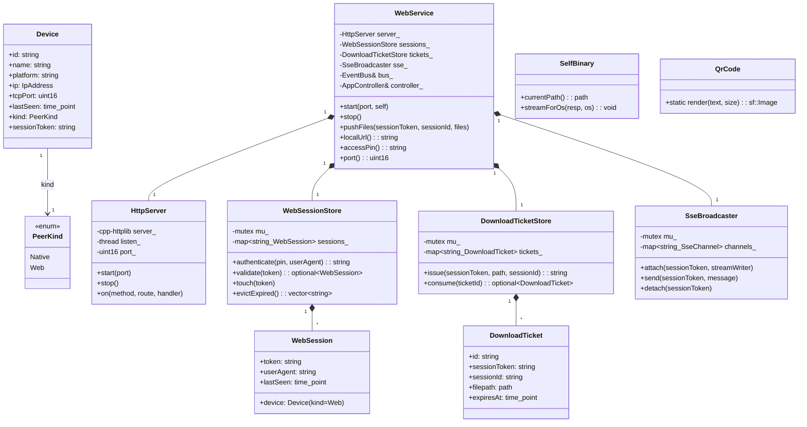
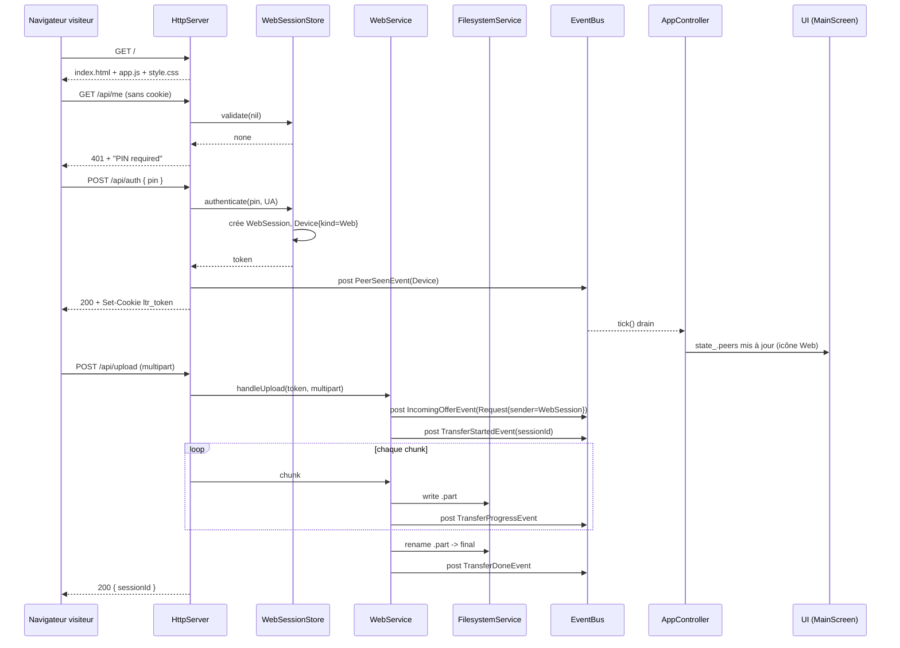
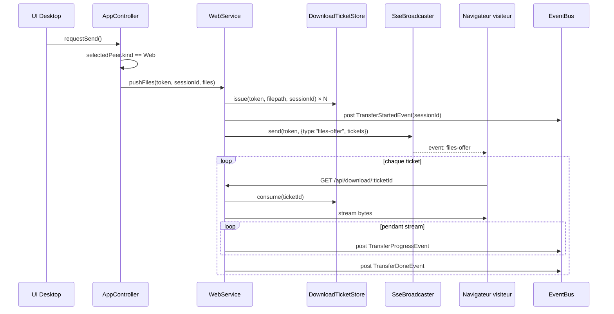
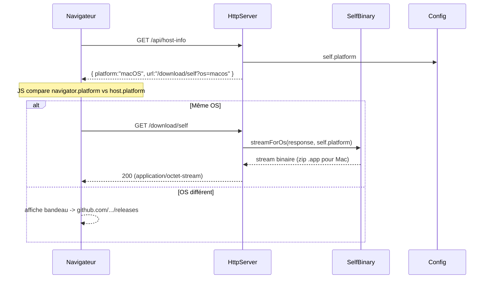

# 🏗️ Architecture — Interface Web LocalTransfer

> **Feature** : web-interface
> **Spec métier** : [.ai-outputs/specs/web-interface/business-spec.md](./business-spec.md)
> **Statut** : proposée (en attente validation utilisateur)
> **Date** : 2026-04-22

---

## 1. Vue d'ensemble

### 1.1 Objectif

Ajouter une **couche `ltr::web`** (sœur de `ltr::network`) dans le noyau `ltr_core`, sans toucher au protocole TCP LTR1 existant. Cette couche expose un serveur HTTP sur le LAN permettant à n'importe quel navigateur d'interagir bidirectionnellement avec l'app desktop.

Les **sessions web authentifiées deviennent des `domain::Device`** avec `kind = Web`, apparaissant dans la même `state_.peers` que les pairs natifs. Tout le pipeline UI existant fonctionne tel quel ; seul le `requestSend()` de `AppController` choisit le transport selon le `kind` du pair ciblé.

### 1.2 Composants impactés

| Composant | Impact | Détail |
|---|---|---|
| `domain::Device` | Extension | Ajout champ `kind` + `sessionToken` |
| `core::EventBus` | **Aucun ajout d'event** (réutilisation) | Sessions web → `PeerSeenEvent/PeerLostEvent` ; uploads web → `IncomingOfferEvent` + suite |
| `app::AppController` | Extension | Dispatch `requestSend` selon `peer.kind` ; démarre/arrête `WebService` |
| `app::AppState` | Aucun | pas de nouveau champ |
| `ui::MainScreen` | Extension | Ajout widget "Partage Web" (QR + URL + PIN) ; icône différenciée pour peers `Web` |
| `ltr::network::*` | **Aucun** | protocole TCP LTR1 inchangé |
| `ltr::ui::widgets` | Extension | Nouveau widget `QrCodeView` |
| `cmake/Dependencies.cmake` | Extension | +3 deps FetchContent (cpp-httplib, qrcodegen, miniz) |
| `CMakeLists.txt` | Extension | +cible `ltr_web`, intégrée à `ltr_core` ; +custom command embed assets |

### 1.3 Nouvelles entités

- `domain::PeerKind` — enum `Native | Web`
- `domain::Device` — ajout des champs `kind` et `sessionToken`
- `web::WebService` — façade, possède server + store + dispatcher
- `web::HttpServer` — wrapper cpp-httplib
- `web::WebSessionStore` — mémoire des sessions authentifiées (token → session)
- `web::DownloadTicketStore` — tickets éphémères pour push host→browser
- `web::SseBroadcaster` — multi-canal SSE par session
- `web::SelfBinary` — logique OS-specific pour servir le binaire courant
- `web::QrCode` — wrapper qrcodegen → image SFML
- `ui::widgets::QrCodeView` — widget SFML affichant le QR code
- `ui::widgets::SharePanel` — card "Partage Web" (QR + URL + PIN)

---

## 2. Couches — nouvelle vue

```
┌──────────────────────────────────────────────────────────────┐
│  UI (SFML)                                                   │
│    — ltr::ui → widgets, screens, theme, rounded_rect        │
│    + QrCodeView, SharePanel (nouveaux)                       │
├──────────────────────────────────────────────────────────────┤
│  App (orchestration)                                         │
│    — ltr::app → AppController, AppState                      │
│    Dispatch transport : peer.kind → TransferClient | WebSvc  │
├──────────────────────────────────────────────────────────────┤
│  Domain (entités pures)    │  Core (utilitaires)             │
│    — ltr::domain           │  — ltr::core                    │
│      Device+kind, FileMeta │    EventBus, Logger, types      │
│      TransferRequest       │                                 │
├──────────────────────┬─────┴─────┬──────────────────────────┤
│  Network (inchangé)  │  Web (NEW)│  Infra                   │
│    — ltr::network    │— ltr::web │  — ltr::infra            │
│      Protocol LTR1   │  HttpSrv  │    Config, Filesystem,   │
│      DiscoveryService│  Sessions │    HashService           │
│      TransferServer  │  SSE      │                          │
│      TransferClient  │  SelfBin  │                          │
│                      │  QrCode   │                          │
└──────────────────────┴───────────┴──────────────────────────┘
```

**Règle de dépendance** préservée : `ltr::web` dépend de `core + domain + infra`. Aucun couplage web↔network (parallèles).

---

## 3. Diagramme de classes (nouvelles entités)



---

## 4. Diagrammes de séquence

### 4.1 UC1 — Visiteur envoie un fichier au host



### 4.2 UC2 — Host envoie un fichier à un visiteur web



### 4.3 UC3 — Détection OS + téléchargement binaire



---

## 5. Structure des fichiers

### 5.1 En-têtes : `include/ltr/web/`

```
include/ltr/web/
├── README.md                   ← guide agent pour cette couche
├── web_service.hpp             ← façade (orchestrateur public)
├── http_server.hpp             ← wrapper cpp-httplib, gestion threads
├── web_session.hpp             ← entité domain WebSession
├── web_session_store.hpp       ← mémoire des sessions + auth PIN
├── download_ticket.hpp         ← entité DownloadTicket
├── download_ticket_store.hpp   ← mémoire des tickets éphémères
├── sse_channel.hpp             ← canal SSE par session
├── sse_broadcaster.hpp         ← multiplexeur SSE
├── self_binary.hpp             ← OS-specific : localiser le binaire
├── qr_code.hpp                 ← wrapper qrcodegen → sf::Image
└── routes/
    ├── README.md               ← guide agent pour routes/
    ├── route_registrar.hpp     ← point d'entrée d'enregistrement
    ├── auth_routes.hpp         ← POST /api/auth, GET /api/me
    ├── upload_routes.hpp       ← POST /api/upload
    ├── download_routes.hpp     ← GET /api/download/:ticketId
    ├── events_routes.hpp       ← GET /api/events (SSE)
    ├── self_routes.hpp         ← GET /download/self + /api/host-info
    └── static_routes.hpp       ← GET / (index.html + assets embarqués)
```

### 5.2 Sources : `src/web/`

```
src/web/
├── README.md                   ← guide agent pour src/web/
├── web_service.cpp
├── http_server.cpp
├── web_session_store.cpp
├── download_ticket_store.cpp
├── sse_channel.cpp
├── sse_broadcaster.cpp
├── self_binary_mac.cpp         ← compilé si APPLE
├── self_binary_win.cpp         ← compilé si WIN32
├── self_binary_posix.cpp       ← compilé sinon (Linux)
├── qr_code.cpp
└── routes/
    ├── route_registrar.cpp
    ├── auth_routes.cpp
    ├── upload_routes.cpp
    ├── download_routes.cpp
    ├── events_routes.cpp
    ├── self_routes.cpp
    └── static_routes.cpp
```

### 5.3 Assets web (sources) : `assets/web/`

```
assets/web/
├── index.html
├── app.js
├── style.css
└── icons/
    ├── upload.svg
    ├── download.svg
    └── file.svg
```

Les assets sont **embarqués** dans le binaire via une custom command CMake (cf. §9).

### 5.4 Nouveaux widgets UI : `include/ltr/ui/widgets/` et `src/ui/widgets/`

```
include/ltr/ui/widgets/
├── qr_code_view.hpp            ← texture SFML + RoundedRect border
└── share_panel.hpp             ← card affichant QR + URL + PIN

src/ui/widgets/
├── qr_code_view.cpp
└── share_panel.cpp
```

### 5.5 Modifications fichiers existants

| Fichier | Modification |
|---|---|
| `include/ltr/domain/device.hpp` | +`PeerKind kind`, +`std::string sessionToken` |
| `include/ltr/core/types.hpp` | +`constexpr std::uint16_t kWebPort = 45456;` |
| `include/ltr/app/app_controller.hpp` | +`std::unique_ptr<web::WebService> web_`, +`webShareInfo()` pour UI |
| `src/app/app_controller.cpp` | `start()`: instancier+start WebService ; `requestSend()`: switch `peer.kind` |
| `include/ltr/ui/screens/main_screen.hpp` | +`std::unique_ptr<widgets::SharePanel> share_` |
| `src/ui/screens/main_screen.cpp` | Layout ajout de la SharePanel ; icône différenciée Native/Web dans DeviceListItem |
| `include/ltr/ui/widgets/device_list_item.hpp` | +`setKind(PeerKind)` pour icône différenciée |
| `src/ui/widgets/device_list_item.cpp` | Dessin icône selon `kind` |
| `cmake/Dependencies.cmake` | +cpp-httplib, qrcodegen, miniz (via FetchContent) |
| `CMakeLists.txt` | +sources `src/web/*`, +link libs, +custom command embed assets |

### 5.6 Documentation (demande utilisateur)

```
docs-agents/
├── PROJECT.md                  ← existant, à MAJ (mention couche web)
├── ARCHITECTURE.md             ← existant, à MAJ (nouvelle couche)
├── DEVELOPMENT.md              ← existant, inchangé
├── UI_GUIDELINES.md            ← existant, inchangé
└── WEB.md                      ← NOUVEAU : guide central couche web
```

Chaque sous-dossier a un **`README.md`** court (5-15 lignes) destiné aux futurs agents :

- `include/ltr/web/README.md` → rôle, conventions, entrée via `WebService`
- `include/ltr/web/routes/README.md` → comment ajouter une route
- `src/web/README.md` → patterns d'implémentation (thread-safety, EventBus)

---

## 6. Interfaces / contrats clés

### 6.1 Extension `domain::Device`

```cpp
// include/ltr/domain/device.hpp
namespace ltr::domain {

enum class PeerKind : std::uint8_t { Native = 0, Web = 1 };

struct Device {
    std::string id;
    std::string name;
    std::string platform;
    sf::IpAddress ip{sf::IpAddress::None};
    std::uint16_t tcpPort{0};
    std::chrono::steady_clock::time_point lastSeen{};

    // NEW
    PeerKind kind{PeerKind::Native};
    std::string sessionToken; // non vide ssi kind == Web
};

} // namespace ltr::domain
```

### 6.2 `web::WebService` (façade)

```cpp
namespace ltr::web {

class WebService {
public:
    WebService(core::EventBus& bus,
               app::AppController& controller,
               infra::Config config,
               std::uint16_t port = core::kWebPort);
    ~WebService();

    WebService(const WebService&)            = delete;
    WebService& operator=(const WebService&) = delete;

    void start();
    void stop();

    // Invoqué depuis AppController::requestSend() quand peer.kind == Web.
    // N'alloue pas de thread ; les downloads sont tirés par le navigateur.
    void pushFiles(const std::string& sessionToken,
                   const std::string& sessionId,
                   const std::vector<std::filesystem::path>& files);

    // Pour l'UI (SharePanel).
    std::string localUrl() const;   // ex: "http://192.168.1.42:45456"
    std::string accessPin() const;  // 6 digits stables pour cette session d'app
    std::uint16_t port() const;     // port retenu (peut être != demandé)

private:
    // membres privés (cf. §3)
};

} // namespace ltr::web
```

### 6.3 Événements réutilisés (**aucun nouvel event** dans `core::EventBus`)

| Moment | Event émis | Commentaire |
|---|---|---|
| Auth PIN OK | `PeerSeenEvent{Device{kind=Web, id=session_token, name=parsed UA}}` | Ré-émis périodiquement (keepalive 2s) |
| Session expirée / détachée | `PeerLostEvent{deviceId=session_token}` | Après 15s sans keepalive SSE |
| Upload browser → host reçu | `IncomingOfferEvent{TransferRequest}` puis `TransferStartedEvent` | Auto-accepté (PIN a déjà validé) |
| Upload en cours | `TransferProgressEvent` | Même sémantique que native |
| Upload terminé | `TransferDoneEvent` ou `TransferFailedEvent` | idem |
| Push host → browser (download) | `TransferStartedEvent` à l'issue du ticket, `TransferProgressEvent` au fil du stream | idem |

Ceci permet à l'UI existante (`AppState`, `MainScreen`, `DeviceListItem`) de fonctionner **sans modification de logique**, seule l'icône dépend de `peer.kind`.

### 6.4 Routes HTTP

| Méthode | Route | Auth | Description |
|---|---|---|---|
| GET | `/` | non | `index.html` (embarqué) |
| GET | `/app.js`, `/style.css`, `/icons/*.svg` | non | Assets statiques embarqués |
| GET | `/api/host-info` | non | `{ platform, name, hasWebPin }` pour détection OS |
| POST | `/api/auth` | non (body `{pin}`) | Crée une session si PIN OK, set cookie `ltr_token`, 401 sinon |
| GET | `/api/me` | cookie | `{ token, device }` si auth, 401 sinon |
| POST | `/api/upload` | cookie | Multipart ; déclenche IncomingOfferEvent + TransferProgress |
| GET | `/api/events` | cookie | SSE long-lived ; pushed event types: `files-offer`, `ping` |
| GET | `/api/download/:ticketId` | cookie | Stream du fichier, consomme le ticket |
| GET | `/download/self` | non | Stream binaire de l'app courante (selon OS host) |

### 6.5 Sérialisations JSON

```json
// POST /api/auth request
{ "pin": "847293" }

// POST /api/auth response
{ "token": "c5f2...", "device": { "id":"c5f2...", "name":"iPhone (Safari)", "platform":"iOS", "kind":"web" } }

// GET /api/host-info
{ "platform":"macOS", "name":"Mac de Serge", "selfDownloadUrl":"/download/self" }

// SSE event "files-offer"
{ "type":"files-offer", "sessionId":"sess-uuid", "files":[
    { "name":"report.pdf", "size":1234567, "ticketId":"tkt-1" }
] }

// SSE event "ping" (keepalive)
{ "type":"ping", "at":1713782400 }
```

---

## 7. Modèle de concurrence

```
┌──────────────────────────────────────────────────────────────────┐
│  Thread UI (main) — draine EventBus à chaque frame              │
│    ▲                                                              │
│    │  (tous les events déjà existants + ceux émis par Web)       │
│  ┌─┼───────────┬──────────────┬──────────────┬─────────────────┐ │
│  │ Discovery  │ TransferSrv  │ TransferClt  │ Web (NEW)       │ │
│  │ (existant) │ (existant)   │ (existant)   │                 │ │
│  │            │              │              │ - listen thread │ │
│  │            │              │              │ - 1 worker/req  │ │
│  │            │              │              │   (cpp-httplib) │ │
│  │            │              │              │ - SSE long-poll │ │
│  │            │              │              │   thread/sess   │ │
│  │            │              │              │ - TTL sweeper   │ │
│  └────────────┴──────────────┴──────────────┴─────────────────┘ │
└──────────────────────────────────────────────────────────────────┘
```

**Invariants** :
- Aucun accès direct à SFML ou à `AppState` depuis un thread `ltr::web`. Tout passe par l'`EventBus`.
- `WebSessionStore`, `DownloadTicketStore`, `SseBroadcaster` sont thread-safe (mutex interne).
- `WebService::pushFiles` est appelé **depuis le thread UI** (via `AppController`). Il **ne bloque pas** : il crée les tickets en mémoire, émet l'event SSE et rend la main.
- `cpp-httplib` gère son pool de threads interne (option `set_thread_pool_count` pour borner — V1: défaut 8 threads).

---

## 8. Unification native ↔ web dans `AppController::requestSend()`

```cpp
void AppController::requestSend() {
    if (!canSend()) return;
    try {
        currentPinCode_ = makePinCode();
        const auto& files = state_.inputPaths;

        for (const auto& id : state_.selectedPeerIds) {
            domain::Device target;
            for (const auto& p : state_.peers) {
                if (p.id == id) { target = p; break; }
            }
            if (target.id.empty()) continue;

            std::string sid;
            if (target.kind == domain::PeerKind::Native) {
                sid = client_->sendFiles(target, files, currentPinCode_);
            } else { // PeerKind::Web
                sid = core::makeUuidV4();
                web_->pushFiles(target.sessionToken, sid, files);
            }

            UiTransfer t;
            t.sessionId = sid;
            t.peerName  = target.name;
            t.direction = "→";
            t.totalBytes = state_.selectedFilesTotal;
            t.status    = domain::TransferStatus::WaitingAcceptance;
            state_.transfers.push_front(std::move(t));
        }
    } catch (...) { /* existant */ }
}
```

**Aucune autre modification** dans la logique de send. Le reste du flow (events → UI) est identique.

---

## 9. Embedding des assets web

### 9.1 Principe

CMake lit chaque fichier de `assets/web/` et génère un header C++ contenant un tableau `constexpr` + un `std::string_view`. Les routes `static_routes` exposent ces views via cpp-httplib.

### 9.2 Script CMake (pseudo)

```cmake
function(ltr_embed_file SRC OUT_HEADER SYMBOL MIME)
    add_custom_command(
        OUTPUT ${OUT_HEADER}
        COMMAND ${CMAKE_COMMAND}
                -DSRC=${SRC}
                -DDST=${OUT_HEADER}
                -DSYMBOL=${SYMBOL}
                -DMIME=${MIME}
                -P ${CMAKE_SOURCE_DIR}/cmake/EmbedFile.cmake
        DEPENDS ${SRC}
        VERBATIM)
endfunction()

ltr_embed_file(${CMAKE_SOURCE_DIR}/assets/web/index.html
               ${CMAKE_BINARY_DIR}/generated/ltr/web/assets/index_html.hpp
               IndexHtml "text/html; charset=utf-8")
# ... idem pour app.js, style.css, icons/*.svg
```

`cmake/EmbedFile.cmake` lit `SRC` en hex, produit un `.hpp` :

```cpp
// Généré par EmbedFile.cmake — NE PAS ÉDITER
#pragma once
#include <cstddef>
#include <string_view>
namespace ltr::web::assets {
inline constexpr unsigned char IndexHtmlBytes[] = { 0x3c, 0x21, /* ... */ };
inline constexpr std::size_t IndexHtmlSize = sizeof(IndexHtmlBytes);
inline constexpr std::string_view IndexHtmlMime = "text/html; charset=utf-8";
inline constexpr std::string_view IndexHtml{
    reinterpret_cast<const char*>(IndexHtmlBytes), IndexHtmlSize };
} // namespace ltr::web::assets
```

**Itération dev** : modifier un asset → re-cmake --build (seul le `.hpp` généré et les fichiers qui l'incluent sont recompilés). ~2-5s sur un laptop moderne. Acceptable.

---

## 10. Dépendances à ajouter dans `cmake/Dependencies.cmake`

```cmake
# ---------- cpp-httplib (single-header HTTP server/client) --------------------
FetchContent_Declare(
    cpphttplib
    GIT_REPOSITORY https://github.com/yhirose/cpp-httplib.git
    GIT_TAG        v0.18.1
    GIT_SHALLOW    TRUE)
FetchContent_GetProperties(cpphttplib)
if(NOT cpphttplib_POPULATED)
    FetchContent_Populate(cpphttplib)
endif()
add_library(cpphttplib INTERFACE)
target_include_directories(cpphttplib INTERFACE ${cpphttplib_SOURCE_DIR})
# Config V1 : pas de SSL, HTTP plain
target_compile_definitions(cpphttplib INTERFACE CPPHTTPLIB_OPENSSL_SUPPORT=0)

# ---------- qrcodegen (single-header QR code generator) -----------------------
FetchContent_Declare(
    qrcodegen_src
    GIT_REPOSITORY https://github.com/nayuki/QR-Code-generator.git
    GIT_TAG        v1.8.0
    GIT_SHALLOW    TRUE)
FetchContent_GetProperties(qrcodegen_src)
if(NOT qrcodegen_src_POPULATED)
    FetchContent_Populate(qrcodegen_src)
endif()
add_library(qrcodegen STATIC
    ${qrcodegen_src_SOURCE_DIR}/cpp/qrcodegen.cpp)
target_include_directories(qrcodegen PUBLIC
    ${qrcodegen_src_SOURCE_DIR}/cpp)

# ---------- miniz (single-file zip, pour .app macOS) --------------------------
FetchContent_Declare(
    miniz_src
    GIT_REPOSITORY https://github.com/richgel999/miniz.git
    GIT_TAG        3.0.2
    GIT_SHALLOW    TRUE)
FetchContent_GetProperties(miniz_src)
if(NOT miniz_src_POPULATED)
    FetchContent_Populate(miniz_src)
endif()
add_library(miniz STATIC ${miniz_src_SOURCE_DIR}/miniz.c)
target_include_directories(miniz PUBLIC ${miniz_src_SOURCE_DIR})
```

**Note qrcodegen** : bien que la ref upstream fournisse une version C++, elle n'est pas header-only au sens strict (1 fichier .cpp). Compromis acceptable — 1 seul .cpp, aucune dépendance externe, code public domain. Reste dans l'esprit minimaliste.

**Note miniz** : single-file (miniz.c), public domain. Utilisé par ~1000 projets open source dont Zlib-successor. 80 Ko compilé. Conforme à l'esprit du projet.

---

## 11. Port HTTP, URL, PIN web

| Aspect | Décision |
|---|---|
| **Port** | `kWebPort = 45456` (fixe documentable). Fallback : si occupé, essaie 45457, 45458, …, 45466. Sinon échoue avec log. |
| **URL** | `http://<ip_v4_locale>:<port>` — IP = même `selfIpCached_` que le beacon UDP de DiscoveryService |
| **PIN web** | **6 chiffres**, généré une fois au démarrage de l'app (`std::random_device`), stable pour toute la session d'app. Régénéré au prochain run. Affiché en gros dans la `SharePanel`. **Distinct** du PIN 4 chiffres per-transfer natif. |
| **Partage UI** | `SharePanel` dans `MainScreen` : QR code (cliquable → affiche l'URL en gros), URL en texte copiable, PIN en gros (`4 7 2 9 3 1`) |

**Trade-off PIN** : le business-spec R3 dit "même PIN que le natif". Le natif utilise un PIN per-transfer (4 digits, généré à chaque envoi). Le web a besoin d'un PIN **stable pour l'authentification de session**. On adopte donc un PIN **web distinct et stable**, documenté dans la SharePanel comme "code d'accès web". Le PIN per-transfer natif reste inchangé. Cet écart avec la formulation stricte du R3 est discuté en §14.

---

## 12. Mémoire des sessions

### 12.1 V1 : 100% in-memory

- `WebSessionStore::sessions_` : `std::map<token, WebSession>` protégé par mutex
- Un token = 32 octets random hex (générés via `std::random_device`)
- TTL via `lastSeen` mis à jour par `touch()` (toute requête authentifiée)
- Sweeper thread toutes les 5s : expire sessions > 30s sans `touch` → émet `PeerLostEvent`
- Redémarrage app → sessions perdues → re-saisie du PIN à la prochaine visite

**Acceptation du R3 "device mémorisé"** : tant que l'app tourne, le navigateur garde son cookie → ok. Après redémarrage de l'app, re-PIN. C'est cohérent avec l'UX "le host contrôle, redémarrage = session perdue". Documenté dans le README de la couche.

### 12.2 V2 possible (hors V1)

Persister les tokens dans un fichier `~/.config/localtransfer/web_sessions.json`. Non implémenté V1.

---

## 13. Auto-propagation du binaire (`/download/self`)

### 13.1 Par OS

| OS | Méthode | Fichier servi | Content-Type |
|---|---|---|---|
| Windows | `GetModuleFileNameW(NULL, ...)` → stream du `.exe` | `local_transfer.exe` | `application/vnd.microsoft.portable-executable` |
| Linux | `readlink("/proc/self/exe")` → stream du binaire | `local_transfer` | `application/octet-stream` |
| macOS | remonter l'arborescence : exécutable est dans `.app/Contents/MacOS/`, trouver le `.app` parent, zipper récursivement via miniz | `LocalTransfer.app.zip` | `application/zip` |

### 13.2 Header HTTP `Content-Disposition`

```
Content-Disposition: attachment; filename="LocalTransfer-macOS.zip"
```

### 13.3 Streaming

Utiliser `cpp-httplib::Response::set_chunked_content_provider` pour streamer sans charger en RAM (macOS zip = potentiellement 50 Mo).

---

## 14. Exclusions V1 assumées

| Exclusion | Justification |
|---|---|
| HTTPS | LAN de confiance assumé ; HTTPS self-signed = warnings navigateur pénibles sur tous les devices |
| mDNS / Bonjour | QR code + affichage URL dans UI suffisent pour V1 |
| Historique persistant | Hors scope métier V1 |
| Signature binaires Apple/MS | Hors scope code ; à traiter avant release publique |
| Rate-limit / brute-force PIN | Risque mineur sur LAN ; à ajouter si V2 ouvre à internet |
| Tests intégration HTTP | Ajoutés uniquement pour smoke tests V1 (ci-dessous §17) |

---

## 15. Migration plan / impact sur l'existant

| Étape | Action | Risque de régression |
|---|---|---|
| 1 | Ajout `PeerKind` et champs à `Device` | 🟢 aucun (default `Native`) |
| 2 | Ajout dépendances CMake (cpp-httplib, qrcodegen, miniz) | 🟢 aucun (builds séparés) |
| 3 | Création `ltr::web` couche complète | 🟢 aucun (nouvelle couche) |
| 4 | Embed assets via CMake custom command | 🟡 bug CMake possible → test sur Mac + Windows |
| 5 | Intégration `WebService` dans `AppController` | 🟡 si échec start() → log + continuer (pas de crash) |
| 6 | Switch transport dans `requestSend()` | 🟡 tester envoi natif → natif et natif → web |
| 7 | `SharePanel` dans `MainScreen` | 🟡 layout à tester, ajuster tailles |
| 8 | Icône différenciée dans `DeviceListItem` | 🟢 cosmétique |
| 9 | Docs `WEB.md` + README par couche | 🟢 |
| 10 | Tests smoke (serveur up, auth, upload 1 fichier) | 🟢 |

**Régression test** : après chaque étape, exécuter `ctest --output-on-failure` et un test manuel natif ↔ natif pour vérifier qu'aucun flow existant n'est cassé.

---

## 16. Documentation (demande spécifique utilisateur)

### 16.1 `docs-agents/WEB.md` (nouveau, central)

Document long (~200 lignes) couvrant :
- Raison d'être de la couche web
- Architecture haute-niveau
- Endpoints HTTP avec exemples curl
- Format des événements SSE
- Flow d'authentification
- Gestion des tickets de download
- Modèle de concurrence (cpp-httplib threads + EventBus)
- Points de vigilance (thread-safety, taille upload max, etc.)
- Comment ajouter une route (procédure étape par étape)
- Comment modifier un asset web (assets/web/ → re-cmake --build)

### 16.2 `docs-agents/PROJECT.md` (MAJ)

Ajout section "Couche web" dans la vue d'ensemble + ports :

| Port | Protocole | Usage |
|---|---|---|
| 45454 | UDP | Discovery beacon (inchangé) |
| 45455 | TCP | Protocole LTR1 (inchangé) |
| **45456** | **TCP** | **HTTP web (nouveau)** |

### 16.3 `docs-agents/ARCHITECTURE.md` (MAJ)

Mise à jour du schéma de couches + ajout paragraphe "Transport web".

### 16.4 READMEs courts par couche

Chacun ~10-15 lignes, répond à :
- Qu'est-ce que cette couche ?
- Quel est le point d'entrée ?
- Quelles sont les conventions à respecter ?
- Où ajouter du code quand j'ajoute une fonctionnalité X ?

Fichiers :
- `include/ltr/web/README.md`
- `include/ltr/web/routes/README.md`
- `src/web/README.md`
- `assets/web/README.md`

---

## 17. Tests

### 17.1 Tests unitaires (dans `tests/`)

- `test_web_session_store.cpp` : auth PIN OK/KO, token unique, TTL expiration
- `test_download_ticket.cpp` : issue/consume, consommation unique, expiration
- `test_qr_code.cpp` : génération → taille image cohérente

### 17.2 Tests d'intégration HTTP (smoke)

- `test_http_smoke.cpp` : lance un `HttpServer`, GET `/api/host-info` → 200, POST `/api/auth` avec mauvais PIN → 401, avec bon PIN → 200 + cookie

### 17.3 Régression

- Tests existants (`test_protocol`, `test_hash`) doivent **continuer à passer tels quels**.

---

## 18. Critères de conformité (CONTRAT D'IMPLÉMENTATION)

### 18.1 Fichiers à créer

#### Headers
- [ ] `include/ltr/web/web_service.hpp`
- [ ] `include/ltr/web/http_server.hpp`
- [ ] `include/ltr/web/web_session.hpp`
- [ ] `include/ltr/web/web_session_store.hpp`
- [ ] `include/ltr/web/download_ticket.hpp`
- [ ] `include/ltr/web/download_ticket_store.hpp`
- [ ] `include/ltr/web/sse_channel.hpp`
- [ ] `include/ltr/web/sse_broadcaster.hpp`
- [ ] `include/ltr/web/self_binary.hpp`
- [ ] `include/ltr/web/qr_code.hpp`
- [ ] `include/ltr/web/routes/route_registrar.hpp`
- [ ] `include/ltr/web/routes/auth_routes.hpp`
- [ ] `include/ltr/web/routes/upload_routes.hpp`
- [ ] `include/ltr/web/routes/download_routes.hpp`
- [ ] `include/ltr/web/routes/events_routes.hpp`
- [ ] `include/ltr/web/routes/self_routes.hpp`
- [ ] `include/ltr/web/routes/static_routes.hpp`
- [ ] `include/ltr/ui/widgets/qr_code_view.hpp`
- [ ] `include/ltr/ui/widgets/share_panel.hpp`

#### Implementations
- [ ] `src/web/web_service.cpp`
- [ ] `src/web/http_server.cpp`
- [ ] `src/web/web_session_store.cpp`
- [ ] `src/web/download_ticket_store.cpp`
- [ ] `src/web/sse_channel.cpp`
- [ ] `src/web/sse_broadcaster.cpp`
- [ ] `src/web/self_binary_mac.cpp` (compilé si APPLE)
- [ ] `src/web/self_binary_win.cpp` (compilé si WIN32)
- [ ] `src/web/self_binary_posix.cpp` (compilé sinon)
- [ ] `src/web/qr_code.cpp`
- [ ] `src/web/routes/route_registrar.cpp`
- [ ] `src/web/routes/auth_routes.cpp`
- [ ] `src/web/routes/upload_routes.cpp`
- [ ] `src/web/routes/download_routes.cpp`
- [ ] `src/web/routes/events_routes.cpp`
- [ ] `src/web/routes/self_routes.cpp`
- [ ] `src/web/routes/static_routes.cpp`
- [ ] `src/ui/widgets/qr_code_view.cpp`
- [ ] `src/ui/widgets/share_panel.cpp`

#### Assets
- [ ] `assets/web/index.html`
- [ ] `assets/web/app.js`
- [ ] `assets/web/style.css`
- [ ] `assets/web/icons/upload.svg`
- [ ] `assets/web/icons/download.svg`
- [ ] `assets/web/icons/file.svg`

#### CMake
- [ ] `cmake/EmbedFile.cmake` (script custom pour embedding)

#### Documentation
- [ ] `docs-agents/WEB.md`
- [ ] `include/ltr/web/README.md`
- [ ] `include/ltr/web/routes/README.md`
- [ ] `src/web/README.md`
- [ ] `assets/web/README.md`

#### Tests
- [ ] `tests/test_web_session_store.cpp`
- [ ] `tests/test_download_ticket.cpp`
- [ ] `tests/test_http_smoke.cpp`
- [ ] `tests/test_qr_code.cpp`

### 18.2 Fichiers à modifier

- [ ] `include/ltr/domain/device.hpp` — ajout `PeerKind`, `kind`, `sessionToken`
- [ ] `include/ltr/core/types.hpp` — ajout `kWebPort = 45456`
- [ ] `include/ltr/app/app_controller.hpp` — ajout `std::unique_ptr<web::WebService> web_`, méthode `webShareInfo()`
- [ ] `src/app/app_controller.cpp` — instancier WebService dans `start()`, dispatch dans `requestSend()`
- [ ] `include/ltr/ui/screens/main_screen.hpp` — ajout `SharePanel`
- [ ] `src/ui/screens/main_screen.cpp` — layout ajout SharePanel
- [ ] `include/ltr/ui/widgets/device_list_item.hpp` — ajout `setKind(PeerKind)`
- [ ] `src/ui/widgets/device_list_item.cpp` — dessin icône selon kind
- [ ] `cmake/Dependencies.cmake` — ajout cpp-httplib, qrcodegen, miniz
- [ ] `CMakeLists.txt` — ajout sources `src/web/*`, link libs, custom command embed assets
- [ ] `docs-agents/PROJECT.md` — ajout section couche web, port 45456
- [ ] `docs-agents/ARCHITECTURE.md` — ajout couche ltr::web dans schéma

### 18.3 Contraintes non-négociables

- [ ] C++17 strict (pas de `if constexpr (requires)`, pas de `std::format`, pas de `std::ranges`, etc.)
- [ ] Dépendances header-only / single-file uniquement (cpp-httplib ✅, qrcodegen ⚠️ accepté, miniz ✅)
- [ ] Aucun `new`/`delete` manuel, RAII partout (`unique_ptr`, `shared_ptr`)
- [ ] Namespaces `ltr::web::*` cohérents
- [ ] Aucun accès SFML ou UI depuis un thread web
- [ ] Toute chaîne affichée via SFML passe par `ui::utf8()`
- [ ] Widgets nouveaux utilisent `RoundedRect`
- [ ] Constantes dans `core::types` ou `ui::theme` (pas de magic numbers)
- [ ] Pas de `catch(...)` vide — logger systématique
- [ ] Tests existants passent (`ctest`)

---

## 19. Flag UI

```
UI_REQUIRED: true
```

Justification :
1. **Nouvelle page web** (HTML + JS + CSS) à concevoir — écrans, drop zone, liste fichiers, bouton install app native, barres de progression
2. **Ajouts SFML desktop** : `SharePanel` (QR + URL + PIN), icône différenciée Native/Web dans `DeviceListItem`, intégration dans `MainScreen`

L'étape UI/UX devra :
- Proposer 2-3 options pour la **page web** (layout, hiérarchie visuelle, parcours PIN → upload/download)
- Proposer l'intégration de la `SharePanel` dans le layout existant de `MainScreen` (emplacement, taille, position)
- Proposer le design de l'icône Native vs Web (glyph, couleur)

---

## 20. Résumé exécutif

Ajout d'une couche `ltr::web` parallèle à `ltr::network`, exposant un serveur HTTP local (port 45456). Les sessions web authentifiées apparaissent comme des `domain::Device` dans la liste unifiée côté host, permettant l'envoi bidirectionnel avec une logique inchangée côté UI et AppController (seul le dispatch du transport change selon `peer.kind`). Aucun nouvel event dans l'EventBus — tout passe par les events existants. Auto-propagation du binaire courant par OS, zip .app en streaming pour macOS via miniz. Page web vanilla embarquée dans le binaire via custom command CMake. Documentation centralisée (`WEB.md`) et locale (README par couche).

Changement d'ampleur : ~2500 lignes C++ + ~600 lignes JS/HTML/CSS + 5 MD. Livrable en une itération du dev agent.
