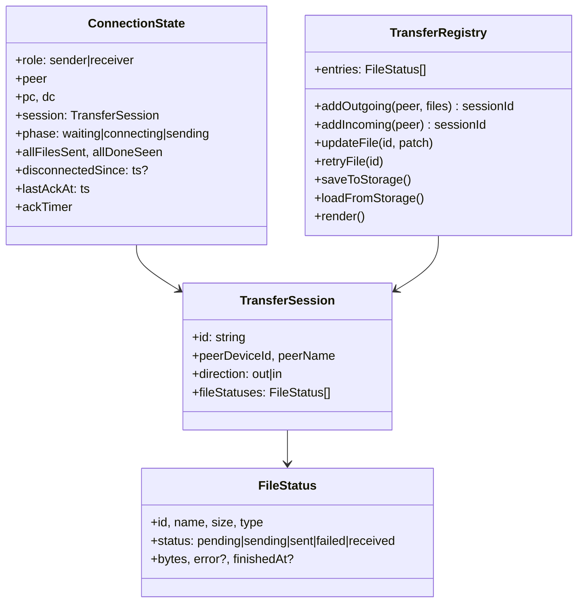
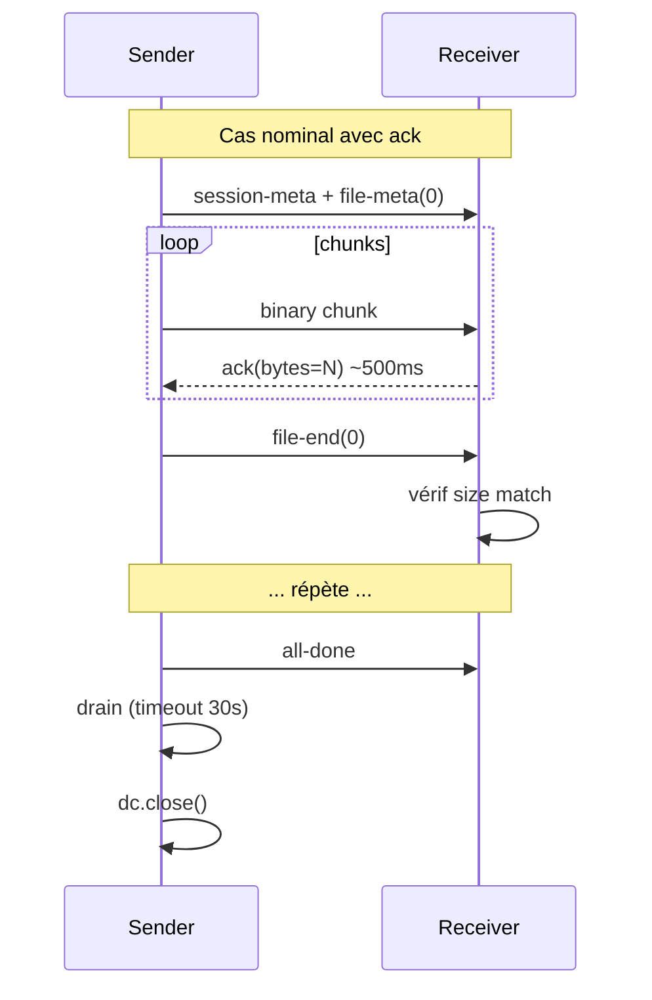
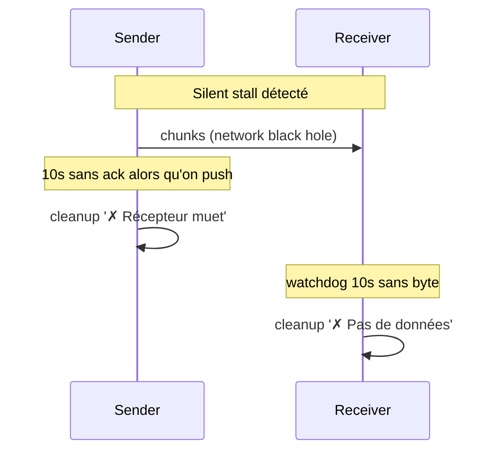
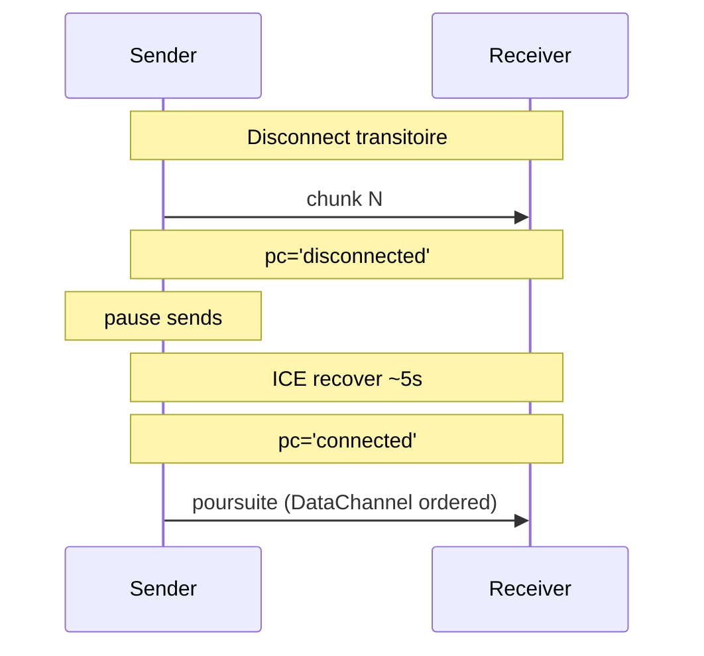

# Architecture — Sprint Web P2P V1.3

**Date :** 2026-05-02
**Statut :** ✅ Validée

---

## Refactor

`p2p.js` mélange aujourd'hui transport, session et UI. Pour V1.3 on
extrait une couche **TransferRegistry** comme source de vérité de
l'état des fichiers (survit au cleanup d'une connexion via
localStorage).

## Cas durcis (séquence)

## CONTRAT D'IMPLÉMENTATION

### Wave 1 — Robustesse (Lots 1 + 3 + 4)

#### Refactor structures
- [ ] `state.fileStatuses[]` array (par fichier)
- [ ] Map `conns` clé `${deviceId}:${role}` (Lot 4)
- [ ] `state.session` référence une TransferSession Registry

#### Lot 1 — Robustesse
- [ ] Watchdog receveur 10 s à `dc.onopen` : si `bytesReceived === 0`
      → cleanup `'✗ Pas de données'`
- [ ] `file-end` : compare `cur.received === cur.size`. Si KO →
      `failed` + pas de download
- [ ] Drain final : timeout 30 s côté émetteur
- [ ] `disconnected` : set `disconnectedSince`, timer 15 s → cleanup
      `'✗ Wi-Fi perdu'`. `connected` retour → clear timer
- [ ] `safeSend` : freeze si `disconnectedSince` set

#### Lot 3 — Ack
- [ ] Receveur : timer 500 ms, envoie `{kind:'ack', bytes: total}`
- [ ] Émetteur reçoit ack → `bytesAckedByReceiver` + `lastAckAt`
- [ ] Émetteur watchdog 1 s : `now - lastAckAt > 10_000` ET
      `bytesSent > bytesAcked` → cleanup `'✗ Récepteur muet'`
- [ ] `updateProgress` : sender utilise `bytesAckedByReceiver`

#### Lot 4 — Composite key
- [ ] Helper `connKey(deviceId, role)`
- [ ] `cleanup(deviceId, role)`, `conns.set/get/has/delete` partout
- [ ] `handleSignal` : offer→receiver, answer/ice/ack→sender
- [ ] `cancelOutgoing(deviceId)` → `(deviceId, sender)`
- [ ] `markCardSending` : superposer 2 indicateurs si bidirectionnel

### Wave 2 — Liste UI persistante (Lot 2)

#### TransferRegistry (NEW)
- [ ] Nouveau fichier `assets/web/js/transfer_registry.js`
- [ ] `entries: FileStatus[]` chronologique
- [ ] `addEntry`, `updateEntry`, `retryFile`
- [ ] `saveToStorage`, `loadFromStorage` (localStorage
      `ltr-p2p-history`, cap 100 entrées)
- [ ] Boot : entrées `pending`/`sending` → `failed reason='session_perdue'`
- [ ] `render()` injecte le HTML dans `#p2p-transfers-list`

#### UI Tabs
- [ ] `index.html` : tabs Host/P2P dans la footer transfers-bar
- [ ] `
` rendu par Registry
- [ ] Indicateur count par tab

#### Hooks p2p.js → Registry
- [ ] `startSendTo` → `addEntry(direction='out')` × N files
- [ ] À chaque transition (sending/sent/failed) → `updateEntry`
- [ ] Receveur : `file-meta` → `addEntry(direction='in')` ;
      `file-end` succès → `updateEntry(status='received')` ; échec
      → `updateEntry(status='failed', error)`

#### Notifications
- [ ] `notifyComplete` : toast + son (Audio base64 court) +
      `navigator.vibrate(200)`
- [ ] Appelé à chaque file `sent` ou `received`

#### Retry
- [ ] Click `failed` direction=out → si File référence encore en RAM
      ET peer visible → re-startSendTo. Sinon toast « Sélectionnez à
      nouveau »

### Fichiers à AJOUTER (1)
- [ ] `assets/web/js/transfer_registry.js`

### Fichiers à MODIFIER (6)
- [ ] `assets/web/js/p2p.js` — refactor state + ack + watchdog +
      composite key + hooks Registry
- [ ] `assets/web/html/index.html` — tabs Host/P2P + zone P2P list
- [ ] `assets/web/css/style.css` — styles tabs + entries + animations
- [ ] `assets/web/js/app.js` — init Registry après auth
- [ ] `CMakeLists.txt` — embed `transfer_registry.js`
- [ ] `src/web/routes/static_routes.cpp` — sert `/transfer_registry.js`

### Fichiers à SUPPRIMER : aucun

## Choix d'architecture

| Question | Choix | Raison |
|---|---|---|
| Persistance Blobs | NON, métadonnées only | Quota localStorage 5-10 MB |
| Module séparé Registry | OUI | Découple UI / transport |
| Format ack | `{kind:'ack', bytes:N}` | Sender connait l'ordre |
| Disconnect transitoire | Pause + timer 15 s | DataChannel ordered → reprise auto |
| Retry stale (refresh) | `failed reason='session_perdue'` | Honnêteté UX |
| Cap localStorage | 100 entrées | Évite quota |

UI_REQUIRED: true
