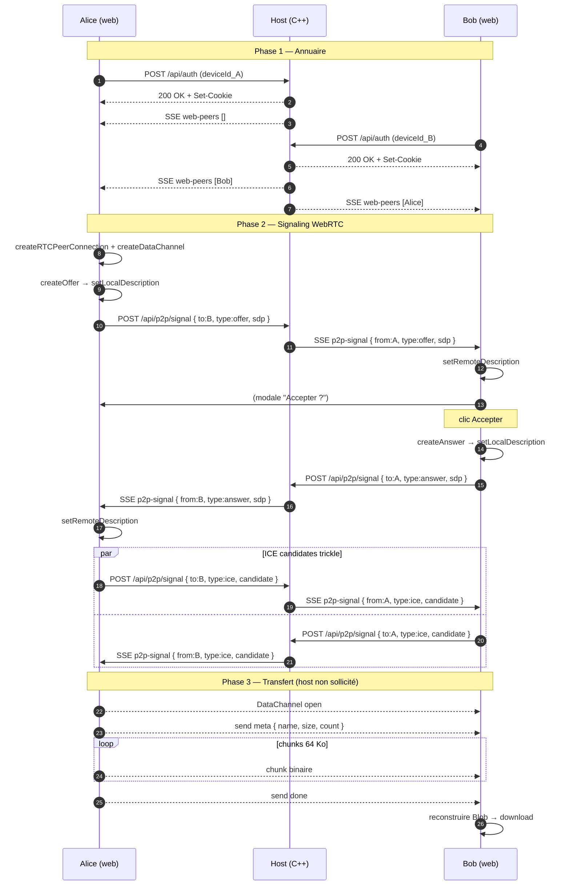
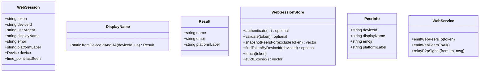

# Architecture — Sprint Web P2P (V1.2)

**Date :** 2026-05-01
**Statut :** ✅ Validée

---

## Vue d'ensemble

```
                    ┌─────────────────┐
                    │  Host (C++)     │
                    │                 │
        signal POST │  ┌──────────┐   │ SSE p2p-signal
        ┌──────────►│  │ /api/p2p │   │──────────┐
        │           │  │ /signal  │   │          │
        │           │  └──────────┘   │          │
        │           │  WebSessionStore│          │
        │           │  + DisplayName  │          │
        │           │                 │          ▼
   ┌────┴──┐                                  ┌──────┐
   │ Alice │═══════════════════════════════►  │ Bob  │
   │ web   │  WebRTC DataChannel (P2P)        │ web  │
   └───────┘  fichiers chunks 64 Ko           └──────┘
              ne passent pas par le host
```

Le host est **pur signaling + annuaire**. Une fois la connexion ICE
établie, les chunks transitent directement Alice ↔ Bob via
RTCDataChannel.

## Diagramme de séquence



## Diagramme de classes



## Lots

### Lot 1 — Identité & annuaire backend
Nouveaux : `display_name.hpp/.cpp`, `tests/test_display_name.cpp`.
Modifs : `WebSession`, `WebSessionStore` (PeerInfo + snapshotPeersFor +
findTokenByDeviceId), `auth_routes` (use DisplayName).

### Lot 2 — Diffusion `web-peers` SSE
Nouveau format SSE `event: web-peers\ndata: {"peers":[...]}\n\n`.
Émis sur auth/logout/eviction. Cible : tous les sessions actives.

### Lot 3 — Routes signaling
Nouveau : `p2p_routes.hpp/.cpp`, `test_p2p_signal_routes.cpp`.
Route `POST /api/p2p/signal { to, type, payload }` valide expéditeur
(cookie) + destinataire (deviceToToken_) puis relay via SseBroadcaster.

### Lot 4 — Frontend WebRTC + UI
Nouveaux : `peers.js`, `p2p.js`, section UI peers + modale réception +
progress. CSS pour les nouveaux composants.

### Lot 5 — Polish, tests, doc
ICE failed → message clair, TTL 60 s, perte SSE → cleanupAll, doc HTML +
docs-agents/WEB.md V1.2.

## CONTRAT D'IMPLÉMENTATION

### Fichiers à AJOUTER (8)
- [ ] `include/ltr/web/display_name.hpp`
- [ ] `src/web/display_name.cpp`
- [ ] `include/ltr/web/routes/p2p_routes.hpp`
- [ ] `src/web/routes/p2p_routes.cpp`
- [ ] `assets/web/js/peers.js`
- [ ] `assets/web/js/p2p.js`
- [ ] `tests/test_display_name.cpp`
- [ ] `tests/test_p2p_signal_routes.cpp`

### Fichiers à MODIFIER (12)
- [ ] `include/ltr/web/web_session.hpp` — displayName + emoji + platformLabel
- [ ] `include/ltr/web/web_session_store.hpp` — PeerInfo + snapshotPeersFor + findTokenByDeviceId
- [ ] `src/web/web_session_store.cpp`
- [ ] `include/ltr/web/web_service.hpp` — emitWebPeersTo/All + relayP2pSignal
- [ ] `src/web/web_service.cpp`
- [ ] `src/web/routes/auth_routes.cpp` — emit web-peers après auth
- [ ] `src/web/routes/logout_routes.cpp` — emit web-peers après logout
- [ ] `src/web/routes/route_registrar.cpp` — registerP2P
- [ ] `assets/web/html/index.html` — section peers + modale réception + progress
- [ ] `assets/web/css/style.css` — styles peer-card, p2p-modal, p2p-progress
- [ ] `assets/web/js/app.js` — handlers SSE web-peers + p2p-signal, cleanup
- [ ] `CMakeLists.txt` — embed peers.js + p2p.js + 2 nouveaux tests

### Fichiers à SUPPRIMER : aucun

## Plan de livraison en 3 vagues
- **Wave 1 — Backend annuaire** : DisplayName + WebSession ext +
  snapshotPeersFor + emit web-peers + test display_name. Smoke /api/me
  retourne displayName.
- **Wave 2 — Signaling + frontend annuaire** : routes p2p + peers.js +
  UI section + test p2p_signal_routes. 2 navigateurs voient l'autre.
- **Wave 3 — WebRTC + polish** : p2p.js + modale + progress + cleanup +
  ICE failed + doc. Test E2E manuel : transfert direct entre 2 onglets.

## Choix d'architecture (justifications)

| Question | Choix | Raison |
|---|---|---|
| Stockage signaling host | Aucun (transit) | Relay synchrone via SseBroadcaster |
| Validation expéditeur | `from` = device session du cookie | Empêche forge cross-session |
| Validation destinataire | `to` doit avoir un token dans `deviceToToken_` | Empêche signaling fantôme |
| ICE config V1 | `iceServers: []` | LAN-only ; host candidates suffisent |
| Format SSE p2p-signal | `event: p2p-signal\ndata: {...}\n\n` | Standard ; JS distingue avec `addEventListener` |
| Dispatcher SSE JS | Multi event handlers | Préserve compat `files-offer` |
| Chunk size DataChannel | 64 KB | Spec WebRTC max 65 535 |
| Backpressure | `bufferedAmount < 1 MB` avant send | Évite RAM explosive |

UI_REQUIRED: true
